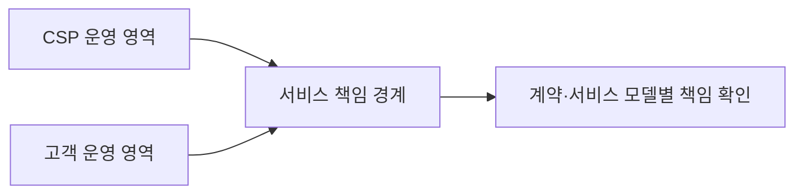
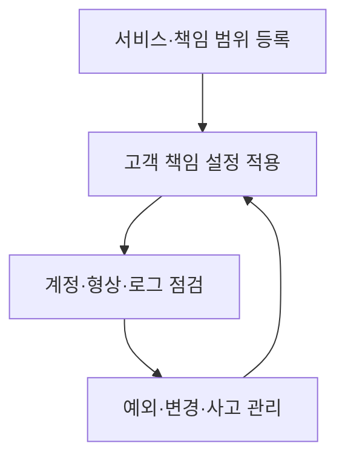

## 30초 인출

- **본질:** 클라우드 보안은 CSP와 고객이 나눠 맡는 클라우드 자원·데이터·접근을 보호하는 일이다.
- **메커니즘:** 서비스 모델과 계약으로 책임 경계를 확인하고, 고객이 맡은 설정·계정·데이터를 계속 통제한다.

핵심 용어

- **CSP(Cloud Service Provider)**: 클라우드 자원과 서비스를 제공·운영하는 사업자다.
- **책임공유모델**: CSP와 고객의 보안 책임을 서비스 구성과 계약에 따라 나누는 방식이다.
- **IaaS·PaaS·SaaS**: 고객이 관리하는 기술 계층과 CSP가 운영하는 계층이 서로 다른 클라우드 서비스 모델이다.
- **클라우드 형상 오류**: 접근·네트워크·저장소 설정이 의도한 보안정책과 다르게 구성된 상태다.

---

## 1교시 예상문제 (10점)

> 클라우드 보안의 개념과 책임공유모델의 역할을 설명하시오. (예상)

---

## 1교시 10점 답안

### 1. 정의·목적

정의: 클라우드 보안은 클라우드에서 처리·저장·전달되는 정보와 자원을 보호하는 관리·기술 통제다.
목적: 서비스 제공자와 이용자 각자의 책임을 실행해 침해와 서비스 중단 위험을 줄인다.

### 2. 책임 분담

| 주체 | 일반적 책임 예 |
|---|---|
| CSP | 데이터센터·기반시설·클라우드 서비스 운영 영역 |
| 고객 | 계정·접근권한·데이터·고객이 구성하는 자원 |
| 공동 확인 | 서비스 모델, 계약, 실제 설정에 따른 경계 |

제안: 도입 전 서비스별 책임표를 작성하고 고객 책임 항목의 담당자와 점검 증거를 지정한다.

---

## 2~4교시 예상문제 (25점)

> 클라우드 서비스 모델별 책임공유 범위와 주요 위험을 설명하고 안전한 운영·거버넌스 방안을 제시하시오. (예상)

---

## 2~4교시 25점 답안

### Ⅰ. 개요

정의: 클라우드 보안은 클라우드 서비스에서 사용하는 정보·계정·자원·운영환경을 보호하는 통제 활동이다.
목적: 위탁된 기반 환경과 고객이 운영하는 영역 사이의 책임 공백을 줄인다.

### Ⅱ. 서비스 모델과 책임 경계

| 관리 계층 | IaaS | PaaS | SaaS |
|---|---|---|---|
| 물리 시설·호스트 | CSP | CSP | CSP |
| 기반 플랫폼·런타임 | 대체로 고객 관리 | 대체로 CSP 관리 | CSP 관리 |
| 애플리케이션·데이터·이용자 접근 | 고객 책임 중심 | 고객 책임 중심 | 고객의 데이터·계정·이용 설정 중심 |

위 구분은 일반적인 방향이며, 실제 책임은 서비스 구성·계약·사업자별 기능에 따라 달라진다. 특정 서비스의 책임 자료와 적용 범위를 확인한다.

### Ⅲ. 주요 위험

| 위험 | 발생 원인 | 영향 |
|---|---|---|
| 권한 과다·계정 탈취 | 역할·자격증명 관리 미흡 | 자원 오용·정보 접근 |
| 형상 오류 | 공개 범위·네트워크·저장 설정 실수 | 비인가 접근·노출 |
| 가시성 부족 | 로그·책임 경계·자산 파악 부족 | 탐지·조사 지연 |
| 공급자 의존 | 서비스 중단·계약·이전 제약 | 업무 연속성 저하 |

### Ⅳ. 운영 통제와 거버넌스

운영 통제에는 최소 권한, 강한 인증, 중요 데이터 보호, 설정 변경관리, 로그 확보, 사고·복구 절차가 포함된다. NIST SP 800-144는 공용 클라우드로 데이터·애플리케이션·인프라를 위탁할 때 보안·개인정보 위험을 검토하도록 안내한다.

### Ⅴ. 기술사적 제언

| 문제 | 해결 방안 |
|---|---|
| 공동 책임은 계약서에 적혀 있어도 담당자·점검 증거와 연결되지 않으면 실제 운영에서 책임 공백이 남는다. | 중요 업무를 기준으로 서비스 모델·계약 책임·내부 담당자·검증 증거를 한 표에 연결하고, 소유자가 불분명한 통제부터 도입 승인 전에 해소한다. |

## 출제 이력 및 참고자료

- 본 문항은 주제에 맞춰 구성한 예상 문제이며, 특정 기출 문구를 인용하지 않았다.
- NIST, *Guidelines on Security and Privacy in Public Cloud Computing*, SP 800-144: https://csrc.nist.gov/pubs/sp/800/144/final
- NIST, *General Access Control Guidance for Cloud Systems*, SP 800-210: https://csrc.nist.gov/pubs/sp/800/210/final

## 연결 토픽

- 제로 트러스트
- 컨테이너·클라우드 네이티브 보안
- 정보보호 관리체계(ISMS)
