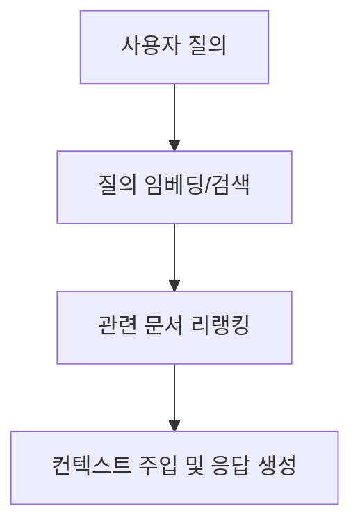

---
## 1교시 예상문제 (10점)
> RAG(Retrieval Augmented Generation)에 대해 설명하시오.

---
## 1교시 10점 답안

### 1. 정의·목적

- 정의: **RAG(검색 증강 생성)** 는 질문과 관련된 외부 자료를 검색해 생성 모델의 답변에 반영하는 방식이다.
- 목적: 모델의 기존 지식만으로 답할 때 생기는 최신성·근거 부족을 줄인다.

### 2. 핵심 구조

| 핵심 용어 | 역할·의미 |
|---|---|
| 청킹(Chunking) | 긴 문서를 의미적 일관성을 유지하도록 고정 길이 또는 구문 단위의 작은 조각으로 분할하는 기법 |
| 하이브리드 검색(Hybrid Search) | 의미적 유사도를 찾는 Dense(임베딩) 검색과 키워드 일치를 찾는 Sparse(BM25) 검색의 결합 |
| 리랭커(Re-ranker) | 1차 벡터 검색으로 추출된 후보 문서군에 대해 교차 어텐션(Cross-Encoder)을 적용해 질문 관련성 순위를 재배열하는 모듈 |

### 3. 제언

검색 결과의 관련성을 검증하고, 답변에 사용한 자료의 출처를 함께 제시한다.

---
## 2~4교시 예상문제 (25점)
> RAG(Retrieval Augmented Generation)의 개념, 핵심 구조 및 적용 시 고려사항을 설명하시오.

---
## 2~4교시 25점 답안

## Ⅰ. 개요와 핵심 용어

**RAG(검색 증강 생성)** 는 질문과 관련된 외부 자료를 검색해 생성 모델의 답변에 반영하는 방식이다. 답변의 품질은 검색된 자료의 관련성과 정확성에 영향을 받는다.

| 핵심 용어 | 역할·의미 |
|---|---|
| 청킹(Chunking) | 긴 문서를 의미적 일관성을 유지하도록 고정 길이 또는 구문 단위의 작은 조각으로 분할하는 기법 |
| 하이브리드 검색(Hybrid Search) | 의미적 유사도를 찾는 Dense(임베딩) 검색과 키워드 일치를 찾는 Sparse(BM25) 검색의 결합 |
| 리랭커(Re-ranker) | 1차 벡터 검색으로 추출된 후보 문서군에 대해 교차 어텐션(Cross-Encoder)을 적용해 질문 관련성 순위를 재배열하는 모듈 |

## Ⅱ. 핵심 구조와 작동

- 파인튜닝은 모델에 문체·어조·특정 태스크 형식을 학습시키는 데 최적이며, 팩트 기반 최신 지식 업데이트는 RAG가 압도적으로 효율적
- 단순히 Top-K 문서를 LLM에 많이 넣으면 Lost in the Middle 현상으로 문맥 중간의 핵심 정보를 무시하는 역효과 발생
- 질의 변환(Query Rewriting)과 리랭커는 검색 결과의 관련성을 높이는 데 사용한다.

- RAG vs 파인튜닝: RAG는 외부 문서를 동적으로 참조해 팩트 정확성을 높이는 방식 / 파인튜닝은 모델 파라미터 가중치를 직접 변경해 특정 도메인 스타일과 태스크 수행력을 내재화

## Ⅲ. 적용 문제와 대응

| 문제 | 원인 | 대응 |
|---|---|---|
| 무관한 청크 검색 | 의미 검색만으로 질문의 핵심어를 놓침 | 키워드·의미 검색을 결합하고 리랭킹 |
| 표·도표 정보 누락 | 문서 변환 때 구조가 평탄화됨 | 표 구조를 보존해 청킹·색인 |
| 근거와 다른 답변 | 생성 결과가 검색 자료와 어긋남 | 근거 범위를 명시하고 출처를 함께 제시 |

- 적용 상황: 사내 규정 Q&A 챗봇 구축 후 엉뚱한 부서 규정을 인용하는 답변 발생

## Ⅳ. 제언

| 문제 | 제언 |
|---|---|
| 검색된 청크가 질문과 무관하거나 출처가 불명확하면 답변의 신뢰도가 떨어짐 | 검색 결과의 관련성을 검증하고 답변에 사용한 자료의 출처를 함께 제시 |

## 출제 이력

- 제134회 1교시 13번: RAG(Retrieval Augmented Generation)
- 제139회 1교시 3번: Advanced RAG와 Modular RAG 비교
