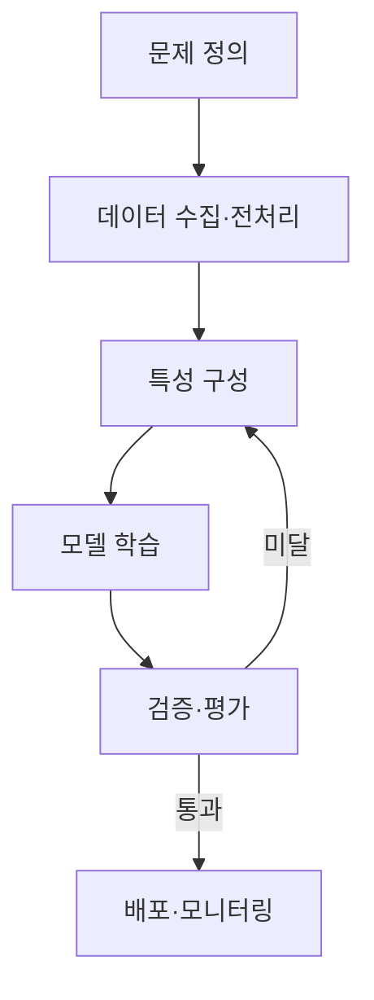
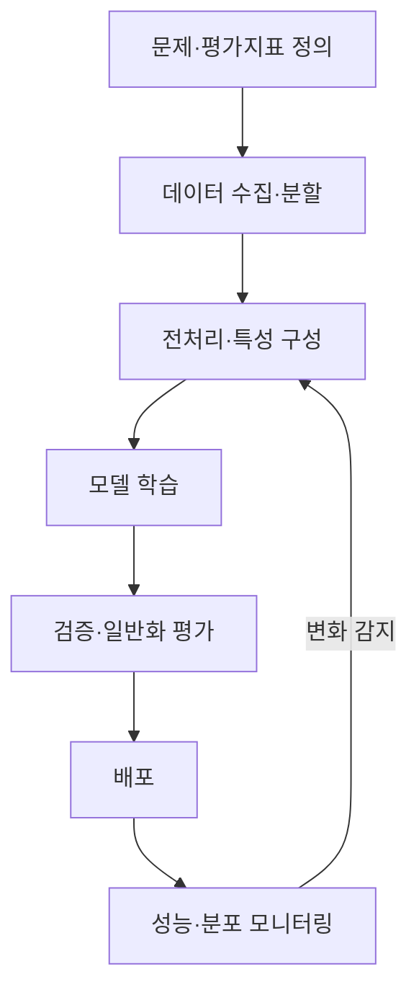

## 30초 인출

- 본질: 기계학습은 데이터에서 태스크 수행 규칙을 학습해 새 데이터의 결과를 예측하는 방법이다.
- 메커니즘: 문제·평가지표 정의 → 데이터 분할·전처리 → 학습 → 검증 → 배포 후 성능 관찰

핵심 용어

- **E-T-P(Tom Mitchell 정의)**: 경험 $E$로 태스크 $T$의 성능 지표 $P$가 개선되면 프로그램이 학습한다고 보는 정의
- **일반화(Generalization)**: 학습에 쓰지 않은 데이터에서도 학습한 관계를 적절히 예측하는 능력
- **데이터 누수(Data Leakage)**: 실제 예측 시점에 알 수 없는 정보가 학습 특성이나 전처리에 섞이는 현상

---
## 1교시 예상문제 (10점)

> 제131회 1교시 기출: “머신러닝 파이프라인의 구성 단계와 주요 활동을 설명하시오.”

---
## 1교시 10점 답안

### 1. 정의·목적

- 정의: 머신러닝 파이프라인은 문제 정의부터 데이터 처리, 학습, 평가, 배포와 운영 모니터링까지 모델의 전 과정을 연결한 절차다.
- 목적: 실험 결과를 재현하고 검증된 모델을 안정적으로 운영에 반영한다.

### 2. 핵심 흐름

### 3. 제언

전처리와 평가를 학습 데이터에만 맞춰 누수가 생기지 않도록 분리하고, 배포 후 성능 변화도 관찰한다.

---
## 2~4교시 예상문제 (25점)

> 기계학습의 개념과 학습 유형, 모델 개발 절차를 설명하고 데이터 누수·과적합·개념 드리프트의 원인과 대응 방안을 제시하시오. (예상)

---
## 2~4교시 25점 답안

## Ⅰ. 개념과 학습 유형

기계학습은 태스크를 수행한 경험으로 성능이 개선되도록 데이터에서 예측 규칙을 학습하는 방법이다.

| 유형 | 학습 신호 | 대표 과업 |
|---|---|---|
| 지도학습 | 정답 레이블 | 분류·회귀 |
| 비지도학습 | 레이블 없이 데이터 구조 탐색 | 군집화·차원 축소 |
| 강화학습 | 환경과 상호작용하며 받는 보상 | 순차적 행동 선택 |

## Ⅱ. 학습·운영 절차

## Ⅲ. 주요 위험과 대응

| 위험 | 발생 원인 | 대응 |
|---|---|---|
| 데이터 누수 | 학습 시점에 알 수 없는 정보가 특성에 포함됨 | 전처리·분할을 파이프라인으로 묶고 시점 기준으로 검증 |
| 과적합 | 모델이 학습 데이터의 잡음까지 학습함 | 검증 손실을 살피고 규제·조기 종료·데이터 확장을 적용 |
| 개념 드리프트 | 운영 환경에서 입력·정답 관계가 달라짐 | 운영 성능과 데이터 분포를 관찰하고 필요하면 재학습 |

## Ⅳ. 기술적 제언

| 문제 | 해결 |
|---|---|
| 실험·전처리·배포가 분리되어 재현성과 운영 성능을 확인하기 어려움 | 버전이 관리되는 학습·평가·배포 파이프라인을 구성하고, 배포 후 성능 및 데이터 변화를 모니터링 |

---
## 출제 이력과 검증 출처

- 제134회 1교시 3번: 머신러닝 성능지표
- 제131회 1교시: 머신러닝 파이프라인의 구성 단계와 주요 활동
