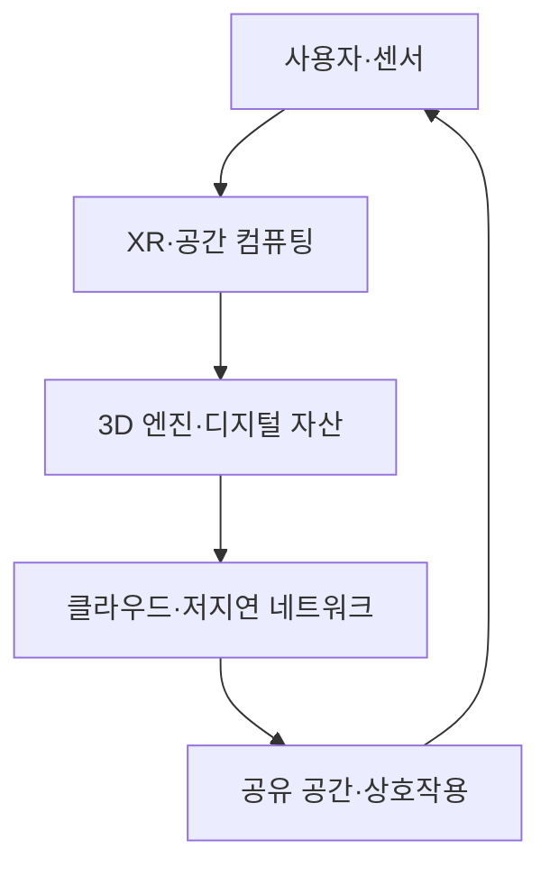

## 30초 인출

- 본질: 메타버스는 사용자가 디지털 공간에서 콘텐츠·다른 사용자와 상호작용하는 환경이다.
- 메커니즘: 사용자 입력·위치 추적 → 가상 공간 렌더링 → 네트워크 동기화 → 공동 활동

핵심 용어

- **ASF 4대 유형**: 메타버스 사례를 증강현실·라이프로깅·거울세계·가상세계로 구분한 분류
- **공간 컴퓨팅(Spatial Computing)**: 3차원 공간과 그 안의 객체를 인식·표현해 사용자와 상호작용하게 하는 컴퓨팅 방식
- **모션 투 포톤(MTP)**: 머리 움직임을 감지한 뒤 대응하는 화면 빛이 표시될 때까지의 지연시간; 지연을 줄이면 움직임 불일치와 멀미를 완화하는 데 유리함

---
## 1교시 예상문제 (10점)

> 제126회 1교시 기출: “메타버스의 4가지 유형(ASF 기준)을 제시하고 각 유형별 특징과 사례를 설명하시오.”

---
## 1교시 10점 답안

### 1. 정의·목적

- 정의: 메타버스는 사용자가 아바타 등으로 참여해 상호작용하고 활동하는 지속적인 디지털 공간이다.
- 목적: 현실과 디지털 공간을 연결해 몰입형 소통·협업과 새로운 활동 공간을 제공한다.

### 2. ASF 4대 유형

| 유형 | 핵심 특징 | 사례 |
|---|---|---|
| 증강현실 | 현실 공간에 디지털 정보를 겹쳐 표현 | 위치 기반 AR |
| 라이프로깅 | 개인의 활동·경험을 기록하고 공유 | SNS·활동 기록 |
| 거울세계 | 현실의 장소·정보를 디지털로 재현 | 지도·디지털 트윈 |
| 가상세계 | 독립된 3차원 공간에서 사회·경제 활동 | 온라인 가상공간 |

### 3. 제언

서비스 목적에 맞는 유형을 고르고, 몰입도와 이용자 안전·상호운용성을 함께 고려한다.

---
## 2~4교시 예상문제 (25점)

> 제123회 2교시 기출: “메타버스(Metaverse)의 개념과 기반 기술, 그리고 사회적·윤리적 문제점에 대하여 설명하시오.”

---
## 2~4교시 25점 답안

## Ⅰ. 개념과 특징

메타버스는 현실과 연결된 디지털 공간에서 사용자가 실시간으로 상호작용하며 활동하는 환경이다.

| 특징 | 설명 |
|---|---|
| 지속성 | 사용자가 접속하지 않아도 공간과 활동 상태가 이어짐 |
| 상호작용 | 사용자·콘텐츠·환경이 실시간으로 반응 |
| 몰입감 | XR 기기와 공간 컴퓨팅으로 3차원 경험을 제공 |

## Ⅱ. 기반 기술의 관계

## Ⅲ. 주요 문제와 대응

| 문제 | 대응 |
|---|---|
| 지연·기기 무게로 인한 피로와 멀미 | 지연을 줄이고 착용성·시각적 편안함을 시험 |
| 괴롭힘·사생활 침해 | 신고·차단과 개인 안전 경계, 명확한 운영 원칙 적용 |
| 플랫폼 간 자산 호환 부족 | 개방형 자산 형식과 상호운용 규격 검토 |

## Ⅳ. 기술적 제언

| 문제 | 해결 |
|---|---|
| 몰입 기능만 앞세우면 피로·안전·지속 이용 문제를 놓칠 수 있음 | 실제 이용 목적에 맞는 기능부터 제공하고, 지연·접근성·안전 지표를 이용자 시험으로 검증 |

---
## 출제 이력과 검증 출처

- 제126회 1교시: 메타버스의 4가지 유형(ASF 기준)과 유형별 특징·사례
- 제123회 2교시: 메타버스의 개념, 기반 기술, 사회적·윤리적 문제점
