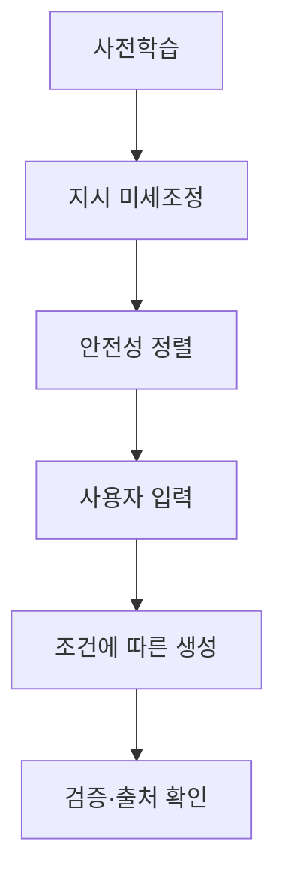

---
## 1교시 예상문제 (10점)

> 제140회 1교시 9번 기출: “Physical AI와 생성형 AI 비교.”

---
## 1교시 10점 답안

### 1. 정의·목적

- 정의: 생성형 AI는 학습한 데이터의 패턴을 바탕으로 텍스트·이미지·코드 등 새로운 콘텐츠를 생성하는 인공지능이다.
- 목적: 입력 조건에 맞는 콘텐츠 초안을 생성해 지식 작업과 창작을 지원한다.

### 2. 생성형 AI와 Physical AI

| 구분 | 생성형 AI | Physical AI |
|---|---|---|
| 주된 대상 | 디지털 콘텐츠·정보 | 물리적 환경과 객체 |
| 핵심 동작 | 조건에 맞는 콘텐츠 생성 | 환경을 인식하고 행동·운동 제어 |
| 주요 고려 | 사실성·출처·유해 출력 | 안전한 실시간 인식·제어 |

### 3. 제언

생성 결과를 사실로 간주하지 말고 근거를 확인하며, 적용 분야에 맞는 안전·저작권 검토를 둔다.

---
## 2~4교시 예상문제 (25점)

> 제136회 4교시 1번 기출: “국내 인공지능(AI) 윤리기준과 생성형 AI에 대하여 다음을 설명하시오.” 생성형 AI의 작동 특성과 윤리·신뢰성 문제 및 대응 방안을 설명하시오.

---
## 2~4교시 25점 답안

## Ⅰ. 개념과 작동 특성

생성형 AI는 대규모 학습 데이터의 패턴을 모델링해 입력 조건에 맞는 새로운 결과물을 생성한다.

| 특성 | 의미 |
|---|---|
| 확률적 생성 | 학습한 분포를 바탕으로 다음 출력 후보를 선택 |
| 다중 양식 | 텍스트·이미지·음성 등 여러 콘텐츠 유형을 다룸 |
| 검증 필요 | 자연스러운 출력이 사실성을 보장하지 않음 |

## Ⅱ. 생성 파이프라인

## Ⅲ. 윤리·신뢰성 문제와 대응

| 문제 | 대응 |
|---|---|
| 환각·오정보 | 신뢰할 수 있는 근거를 검색·인용하고 중요 결과를 검증 |
| 편향·유해 출력 | 대표성 있는 평가와 안전 필터·사람 검토 적용 |
| 개인정보·저작권 침해 | 데이터 권리와 민감정보를 점검하고 생성물 출처를 관리 |

## Ⅳ. 기술적 제언

| 문제 | 해결 |
|---|---|
| 생성 결과의 자연스러운 표현이 사실·권리 적합성으로 오인될 수 있음 | 사용 목적별 위험 검토를 두고 근거·출처 확인과 사람의 최종 검토를 고위험 업무에 적용 |

---
## 출제 이력과 검증 출처

- 제136회 4교시 1번: 국내 인공지능(AI) 윤리기준과 생성형 AI
- 제140회 1교시 9번: Physical AI와 생성형 AI 비교
