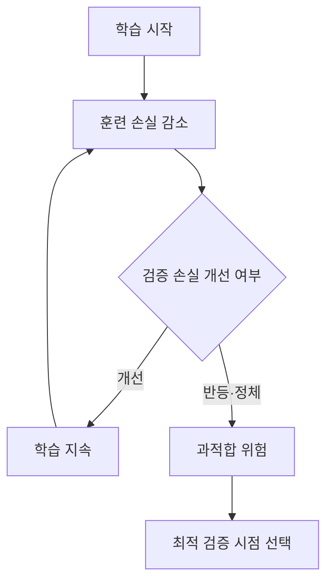

## 30초 인출

- 본질: 과적합은 모델이 학습 자료에 지나치게 맞춰져 새 데이터에서 성능이 떨어지는 상태다.
- 메커니즘: 학습 손실은 낮아지고 검증 손실은 나빠지는지 확인 → 복잡도·규제·학습 종료 시점 조정

핵심 용어

- **과적합(Overfitting)**: 학습 자료의 세부·잡음까지 맞춰 새 데이터에서 성능이 떨어지는 상태
- **조기 종료(Early Stopping)**: 검증 성능이 더 이상 개선되지 않을 때 학습을 멈춰 과도한 학습을 줄이는 방법
- **정규화(Regularization)**: 모델 복잡도에 제약을 주어 학습 자료에 지나치게 맞는 현상을 완화하는 기법

---
## 1교시 예상문제 (10점)

> 제139회 1교시 8번 기출: “과적합(Overfitting)과 과소적합(Underfitting)의 발생 원인과 해결 방안.”

---
## 1교시 10점 답안

### 1. 정의·목적

- 정의: 과적합은 학습 자료에 지나치게 맞춰져 새 자료에서 성능이 떨어지는 상태이며, 과소적합은 모델이 패턴을 충분히 학습하지 못한 상태다.
- 목적: 학습 성능과 새 자료에 대한 일반화 성능을 함께 살펴 두 상태를 구별한다.

### 2. 원인과 대응

| 상태 | 주된 원인 | 대응 |
|---|---|---|
| 과소적합 | 모델 표현력이 부족하거나 규제가 지나침 | 특성·모델 표현력 조정, 규제 완화 |
| 과적합 | 자료가 적거나 모델이 복잡해 잡음까지 학습 | 데이터 확장, 규제, 조기 종료 |

### 3. 제언

학습·검증 곡선을 함께 보고, 검증 자료를 학습과 조정 과정에서 분리한다.

---
## 2~4교시 예상문제 (25점)

> 과적합의 개념과 학습 곡선에서의 징후를 설명하고, 과소적합과 비교하여 원인별 개선 방안을 제시하시오. (예상)

---
## 2~4교시 25점 답안

## Ⅰ. 개념과 편향·분산 관계

과적합은 모델이 학습 표본의 잡음까지 학습해 일반화가 나빠지는 상태이며, 과소적합은 모델이 실제 패턴을 충분히 표현하지 못하는 상태다.

| 상태 | 편향·분산 경향 | 학습 결과 |
|---|---|---|
| 과소적합 | 편향 높음 | 학습·검증 성능 모두 낮음 |
| 적절한 적합 | 균형 | 학습·검증 성능이 함께 양호 |
| 과적합 | 분산 높음 | 학습 성능은 좋으나 검증 성능이 나빠짐 |

## Ⅱ. 탐지 메커니즘

## Ⅲ. 원인별 개선

| 원인 | 대응 |
|---|---|
| 훈련 표본 부족 | 데이터 수집·증강으로 표본 다양성 확대 |
| 모델 복잡도 과다 | 특성·모델 복잡도 조정과 L1/L2 규제 적용 |
| 학습을 지나치게 반복 | 검증 손실 기반 조기 종료 |
| 평가 자료 오염 | 학습·검증·시험 자료를 분리하고 전처리를 각 학습 분할 안에서 수행 |

## Ⅳ. 기술적 제언

| 문제 | 해결 |
|---|---|
| 학습 자료의 성능만으로 모델을 선택하면 새 자료에서의 과적합을 발견하기 어려움 | 데이터 분할을 고정하고 검증 곡선으로 복잡도·규제·종료 시점을 선택한 뒤, 최종 시험 자료는 마지막 평가에만 사용 |

---
## 출제 이력과 검증 출처

- 제139회 1교시 8번: 과적합과 과소적합의 발생 원인 및 해결 방안
