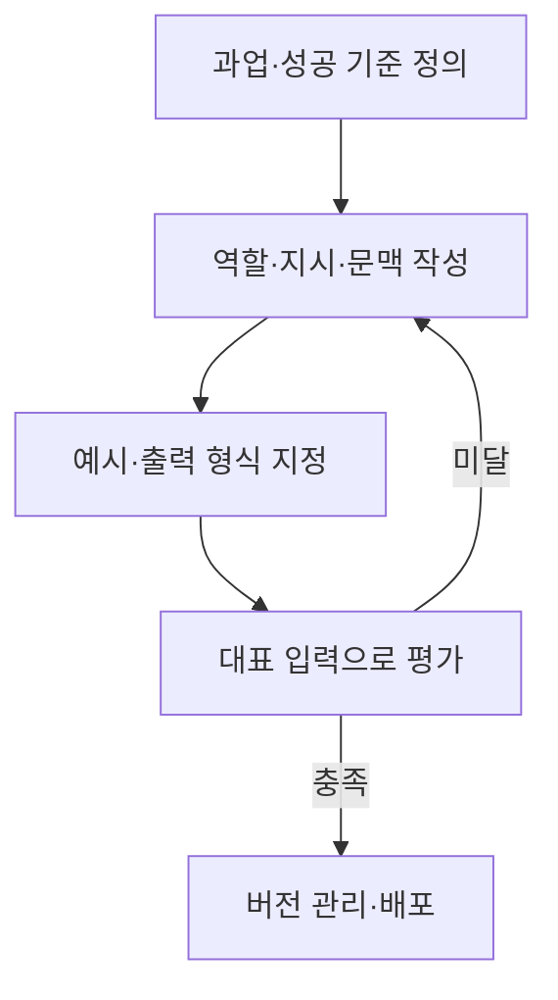

---
## 1교시 예상문제 (10점)

> 제140회 1교시 13번 기출: “프롬프트 엔지니어링(Prompt Engineering)과 하네스 엔지니어링(Harness Engineering)을 비교하시오.”

---
## 1교시 10점 답안

### 1. 정의·목적

- 정의: 프롬프트 엔지니어링은 모델 가중치를 바꾸지 않고 입력 지시와 문맥을 설계해 원하는 출력을 유도하는 방법이다.
- 목적: 같은 모델에서 과업에 맞는 결과 형식과 응답 품질을 얻는다.

### 2. 비교

| 구분 | 프롬프트 엔지니어링 | 하네스 엔지니어링 |
|---|---|---|
| 대상 | 입력 지시·예시·문맥 | 모델을 감싸는 실행 환경 |
| 주요 수단 | 역할, 지시, 예시, 출력 제약 | 도구 연동, 상태·권한 관리, 평가·검증 |
| 범위 | 단일 요청의 입력 설계 | 여러 단계의 실행·운영 통제 |

### 3. 제언

프롬프트는 명확한 입력 계약으로 관리하고, 도구 사용과 안전 통제는 실행 환경에서 별도로 검증한다.

---
## 2~4교시 예상문제 (25점)

> 제135회 3교시 2번 기출: “프롬프트 엔지니어링의 기술 요소와 활용 방안에 대하여 설명하시오.”

---
## 2~4교시 25점 답안

## Ⅰ. 개념과 입력 요소

프롬프트 엔지니어링은 자연어 지시와 문맥을 구성해 모델의 응답을 과업에 맞게 유도하는 설계 방법이다.

| 요소 | 역할 |
|---|---|
| 역할·지시 | 수행할 역할과 과업을 지정 |
| 문맥·입력 | 판단에 필요한 자료를 제공 |
| 예시·출력 제약 | 응답 양식과 기대 패턴을 안내 |

## Ⅱ. 설계·개선 흐름

## Ⅲ. 주요 기법과 위험

| 기법·위험 | 적용·대응 |
|---|---|
| Zero-shot·Few-shot | 예시 필요도에 따라 지시만 쓰거나 입력·출력 예시를 제공 |
| ReAct | 추론 단계와 도구 실행을 관찰 결과에 따라 연결 |
| 프롬프트 인젝션 | 외부 입력을 지시와 구분하고 권한·도구 호출을 제한 |
| 불안정한 출력 형식 | 스키마를 지정하고 파싱·회귀 시험 수행 |

## Ⅳ. 기술적 제언

| 문제 | 해결 |
|---|---|
| 모델 변경이나 입력 변형 뒤에도 프롬프트 품질을 보장하기 어려움 | 대표 질의와 기대 결과를 평가 세트로 관리하고 변경 때마다 회귀 검증 |

---
## 출제 이력과 검증 출처

- 제135회 3교시 2번: 프롬프트 엔지니어링의 기술 요소와 활용 방안
- 제140회 1교시 13번: 프롬프트 엔지니어링과 하네스 엔지니어링 비교
