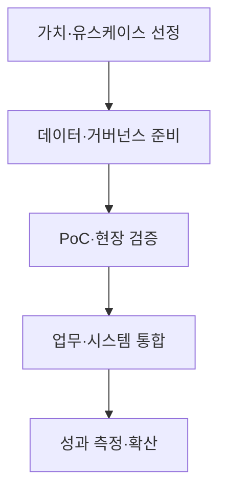
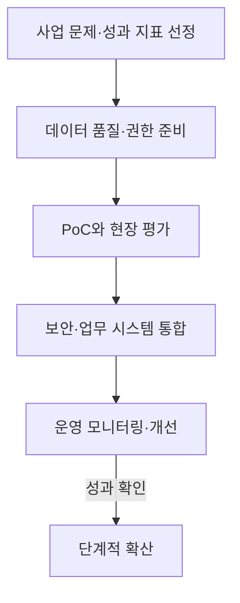

---
## 1교시 예상문제 (10점)

> AI 전환(AX)의 개념, 목적과 추진 방안을 설명하시오. (예상)

---
## 1교시 10점 답안

### 1. 정의·목적

- 정의: AI 전환(AX)은 인공지능을 업무와 의사결정 과정에 통합해 조직의 일하는 방식과 서비스를 바꾸는 전환이다.
- 목적: AI를 실제 업무 성과로 연결하고 새로운 제품·서비스와 운영 방식을 만든다.

### 2. 추진 흐름

### 3. 제언

기술 실증만으로 끝내지 말고, 업무 지표와 데이터 권리·보안 조건을 확인한 뒤 확산한다.

---
## 2~4교시 예상문제 (25점)

> 제136회 3교시 2번 기출: “최근 인공지능(AI)을 활용한 기업의 디지털 전환(AX, AI Transformation)이 다양한 산업 분야에서 빠르게 진행되고 있다. 이와 관련하여 다음을 설명하시오.” AX의 개념, DX와의 차이, 성공적인 추진 방안을 설명하시오.

---
## 2~4교시 25점 답안

## Ⅰ. 개념과 DX와의 차이

AX는 AI를 핵심 업무에 적용해 데이터 기반의 예측·판단을 업무 과정에 포함시키는 전환이다.

| 구분 | DX | AX |
|---|---|---|
| 중심 | 업무의 디지털화·연결 | 데이터와 AI를 이용한 예측·판단 지원 |
| 변화 | 기존 업무의 전산화·자동화 | 업무 흐름과 의사결정의 재설계 |
| 기반 | 디지털 시스템·데이터 | AI 활용 데이터·모델·운영 체계 |

## Ⅱ. 추진 과정

## Ⅲ. 성공 조건과 장애 대응

| 장애 | 대응 |
|---|---|
| PoC가 사업으로 이어지지 않음 | 측정 가능한 업무 성과를 정하고 현업과 함께 검증 |
| 데이터 사일로·품질 문제 | 데이터 소유권·품질 책임과 접근 통제를 마련 |
| 직원 수용성 부족 | 업무 영향을 설명하고 교육·재설계에 사용자를 참여 |

## Ⅳ. 기술적 제언

| 문제 | 해결 |
|---|---|
| 기술 시범이 현업 성과·운영 책임과 분리되면 지속 가능한 AX가 되기 어려움 | 업무 책임자와 성과 지표를 먼저 정하고, 데이터·보안 검증을 통과한 유스케이스만 단계적으로 확산 |

---
## 출제 이력과 검증 출처

- 제136회 3교시 2번: 기업의 디지털 전환(AX, AI Transformation) 추진 방안
- 제139회 2교시 2번: AX 추진을 위한 LLM 기반 AI 시스템 구축
