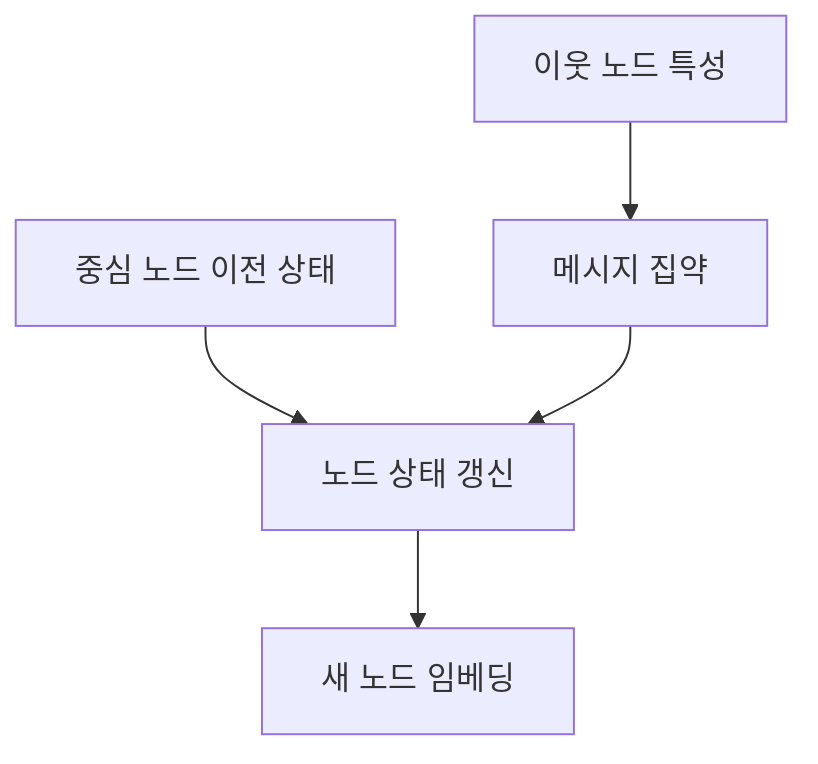
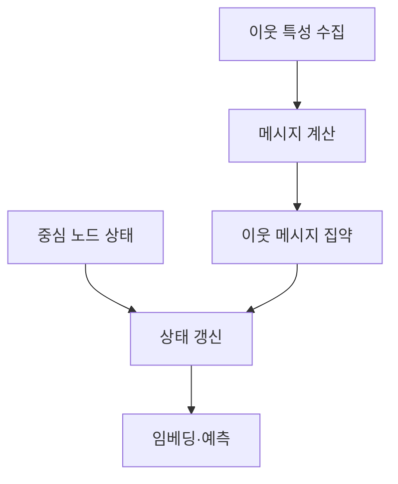

## 30초 인출

- 본질: GNN은 노드와 엣지로 표현된 관계 정보를 학습하는 그래프 신경망이다.
- 메커니즘: 이웃 정보 전달 → 메시지 집약 → 노드 표현 갱신 → 여러 층에서 반복

핵심 용어

- **메시지 패싱(Message Passing)**: 그래프에서 노드가 이웃의 정보를 모아 자신의 표현을 갱신하는 연산
- **오버스무딩(Over-smoothing)**: 그래프 신경망을 깊게 쌓는 과정에서 노드 표현 간 차이가 줄어 구별력이 떨어지는 현상
- **GAT(Graph Attention Network)**: 어텐션 가중치로 이웃별 정보의 중요도를 반영하는 그래프 신경망

---
## 1교시 예상문제 (10점)

> 제137회 1교시 5번 기출: “GNN(Graph Neural Network)을 설명하시오.”

---
## 1교시 10점 답안

### 1. 정의·목적

- 정의: GNN은 그래프의 노드와 엣지 및 이웃 관계를 이용해 노드·엣지·그래프의 표현을 학습하는 신경망이다.
- 목적: 표 형태로 다루기 어려운 네트워크의 관계 정보를 예측·분류에 활용한다.

### 2. 핵심 메커니즘

### 3. 제언

그래프 규모와 과업에 맞춰 이웃 샘플링·집약 방법을 선택하고, 깊은 층에서 표현이 비슷해지는지 확인한다.

---
## 2~4교시 예상문제 (25점)

> GNN의 개념과 메시지 패싱 절차를 설명하고, GCN·GAT·GraphSAGE의 특징 및 적용 시 고려사항을 제시하시오. (예상)

---
## 2~4교시 25점 답안

## Ⅰ. 개념과 구성

GNN은 그래프 구조를 따라 이웃 정보를 반복 집약해 관계를 반영한 임베딩을 학습한다.

| 구성 | 역할 |
|---|---|
| 노드·엣지 특성 | 개체와 관계의 입력 정보 |
| 이웃 집합 | 메시지를 주고받을 대상 |
| 집약·갱신 함수 | 주변 정보와 기존 상태를 새 표현으로 결합 |

## Ⅱ. 메시지 패싱 절차

## Ⅲ. 주요 모델과 고려사항

| 모델·문제 | 특징·대응 |
|---|---|
| GCN | 정규화된 이웃 정보로 노드 표현을 갱신 |
| GAT | 어텐션으로 이웃별 중요도를 반영 |
| GraphSAGE | 이웃을 샘플링해 큰 그래프에서 미니배치 학습 |
| 오버스무딩 | 층이 깊어지며 노드 표현 차이가 줄어들 수 있어 깊이·잔차 구조를 검증 |

## Ⅳ. 기술적 제언

| 문제 | 해결 |
|---|---|
| 그래프 크기와 깊이에 따라 메모리 사용량·노드 구별력이 달라짐 | 검증 데이터로 샘플 수와 층 수를 조정하고, 대규모 그래프는 샘플링 방식의 비용과 성능을 함께 측정 |

---
## 출제 이력과 검증 출처

- 제137회 1교시 5번: GNN(Graph Neural Network)
