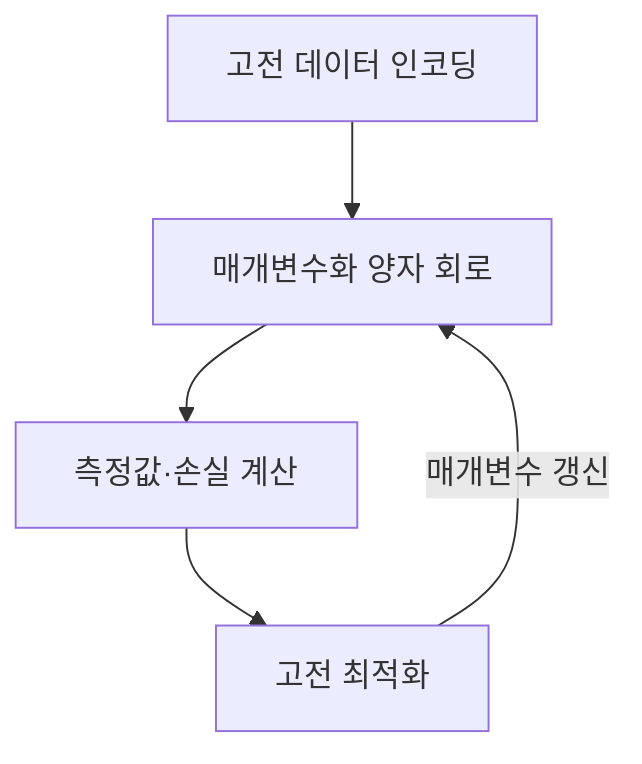
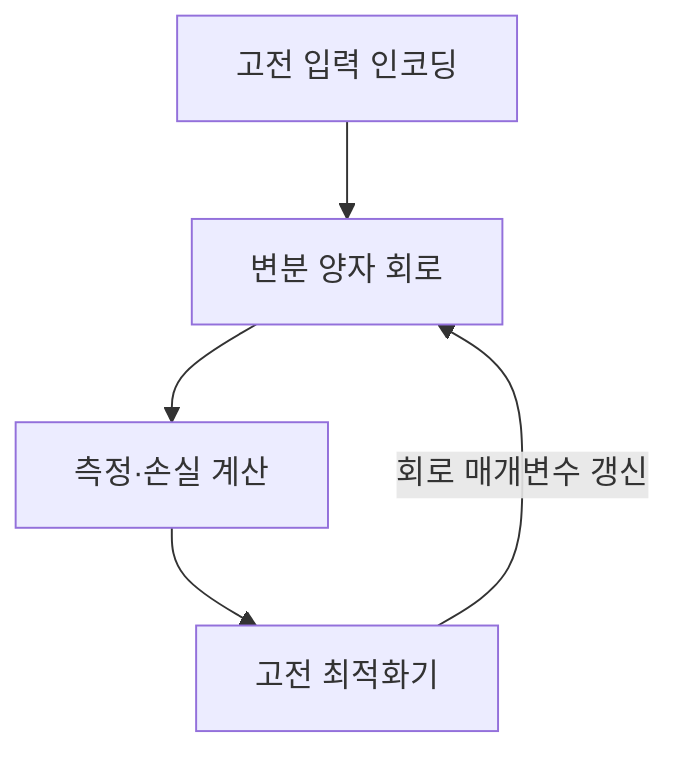

---
## 1교시 예상문제 (10점)

> 제139회 1교시 12번 기출: “양자머신러닝(QML, Quantum Machine Learning)을 설명하시오.”

---
## 1교시 10점 답안

### 1. 정의·목적

- 정의: 양자머신러닝은 양자 상태와 양자 회로를 머신러닝의 데이터 처리·모델 계산에 활용하는 방법이다.
- 목적: 특정 문제에서 양자 연산의 표현·계산 이점을 활용할 가능성을 탐색한다.

### 2. 핵심 구조

### 3. 제언

문제에 양자 우위가 있는지 검증하고, 인코딩·측정 비용과 하드웨어 잡음을 고전 기준선과 비교한다.

---
## 2~4교시 예상문제 (25점)

> 양자머신러닝의 개념과 하이브리드 학습 절차를 설명하고, NISQ 환경의 제약과 적용 시 고려사항을 제시하시오. (예상)

---
## 2~4교시 25점 답안

## Ⅰ. 개념과 기본 요소

양자머신러닝은 양자 상태와 회로 연산을 활용해 데이터 표현이나 모델 계산을 수행하는 접근이다.

| 요소 | 역할 |
|---|---|
| 큐비트 | 양자 상태를 표현하는 정보 단위 |
| 양자 회로 | 게이트 연산으로 상태를 변환 |
| 측정 | 회로 상태에서 고전적인 결과를 얻음 |

## Ⅱ. 하이브리드 학습 흐름

## Ⅲ. 제약과 대응

| 제약 | 고려사항 |
|---|---|
| 큐비트·게이트 잡음 | 회로 깊이를 제한하고 하드웨어 결과를 반복 측정 |
| 데이터 인코딩 비용 | 입력 차원과 상태 준비 비용을 포함해 비교 |
| 바렌 플래토 등 최적화 난점 | 회로 구조·비용함수·초깃값을 검증 |
| 양자 이점 불확실 | 고전 기준선과 동일한 데이터·평가 조건으로 비교 |

## Ⅳ. 기술적 제언

| 문제 | 해결 |
|---|---|
| 양자 회로의 성능만 비교하면 인코딩·측정·잡음 비용이 가려질 수 있음 | 전체 파이프라인 비용과 정확도를 고전 기준선에 맞춰 평가하고, 이점이 확인된 과업에 한해 제한적으로 적용 |

---
## 출제 이력과 검증 출처

- 제139회 1교시 12번: 양자머신러닝(QML, Quantum Machine Learning)
