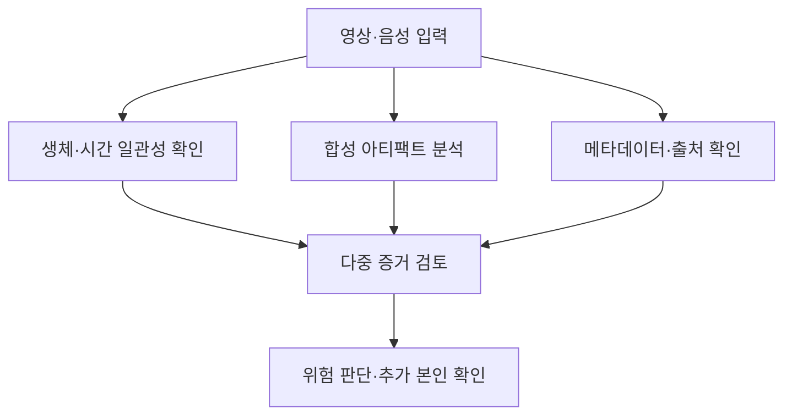

## 30초 인출

- 본질: 딥페이크는 딥러닝으로 실제 인물의 얼굴·음성 등 미디어를 합성하거나 바꾼 콘텐츠다.
- 메커니즘: 대상 특징 학습·추출 → 새 얼굴·음성 합성 → 생체 단서·아티팩트·출처를 교차 확인

핵심 용어

- **페이스 스왑(Face Swap)**: 한 사람의 얼굴을 다른 사람의 얼굴이나 표정으로 합성해 바꾸는 기법
- **원격 광용적맥파(rPPG)**: 영상에서 피부색의 미세한 변화를 분석해 맥박 등 생체 신호를 추정하는 방법
- **C2PA(Content Credentials)**: 콘텐츠의 생성·편집 이력을 서명된 매니페스트로 기록·검증하는 출처 기술 규격; 콘텐츠 내용이 사실임을 보증하지는 않음

---
## 1교시 예상문제 (10점)

> 제133회 1교시 10번 기출: “딥페이크(Deepfake)에 대하여 설명하시오.”

---
## 1교시 10점 답안

### 1. 정의·목적

- 정의: 딥페이크는 딥러닝 기반 생성 기법으로 실제 인물의 얼굴·음성 등 미디어를 합성하거나 변형한 콘텐츠다.
- 목적: 영상·음성 합성의 활용 가능성을 설명하고, 악용 위험과 진위 확인 필요성을 함께 다룬다.

### 2. 생성·탐지 관계

| 구분 | 핵심 내용 |
|---|---|
| 생성 | 학습된 생성 모델로 얼굴·음성 특징을 합성 |
| 탐지 | 영상의 생체·주파수 단서와 출처 정보를 검토 |
| 대응 | 라이브니스 확인, 다중 검증, 생성·편집 이력 표시 |

### 3. 제언

탐지 결과 하나에 의존하지 말고 이용 목적에 맞춰 생체 확인과 출처 검증을 함께 적용한다.

---
## 2~4교시 예상문제 (25점)

> 제135회 3교시 6번 기출: “딥페이크(Deepfake)에 대하여 다음을 설명하시오.” 생성 기법과 탐지·대응 방안을 설명하시오.

---
## 2~4교시 25점 답안

## Ⅰ. 개념과 생성 원리

딥페이크는 생성 모델을 이용해 실제 인물처럼 보이거나 들리는 합성 미디어를 만드는 기술이다.

| 요소 | 설명 |
|---|---|
| 입력 자료 | 대상의 얼굴·음성·표정 등 학습 자료 |
| 생성 모델 | GAN·오토인코더·확산 모델 등 |
| 결과 | 얼굴 교체·음성 복제 등 합성 콘텐츠 |

## Ⅱ. 탐지 메커니즘

## Ⅲ. 악용 위험과 대응

| 위험 | 대응 |
|---|---|
| 본인 사칭을 통한 금융 사기 | 라이브니스 검사와 별도 채널 승인 절차 적용 |
| 허위 영상의 확산 | 출처·편집 이력 확인과 플랫폼 신고·표시 절차 마련 |
| 탐지 모델의 우회 | 다양한 생성 유형으로 시험하고 여러 탐지 단서를 결합 |

## Ⅳ. 기술적 제언

| 문제 | 해결 |
|---|---|
| 생성 모델이 발전하면 특정 아티팩트 탐지에 의존하는 방어가 약해질 수 있음 | 탐지 모델을 정기 평가하고, 생체 확인·출처 증명·거래 승인 등 서로 다른 통제를 함께 둔다 |

---
## 출제 이력과 검증 출처

- 제133회 1교시 10번: 딥페이크(Deepfake)
- 제135회 3교시 6번: 딥페이크 생성 기법과 탐지·대응 방안
- C2PA, [Content Credentials Technical Specification 2.4](https://spec.c2pa.org/specifications/specifications/2.4/specs/ContentCredentials.html) 및 [Explainer 2.3](https://spec.c2pa.org/specifications/specifications/2.3/explainer/_attachments/Explainer.pdf): signed provenance manifest와 사실성 보증의 구분을 확인함.
