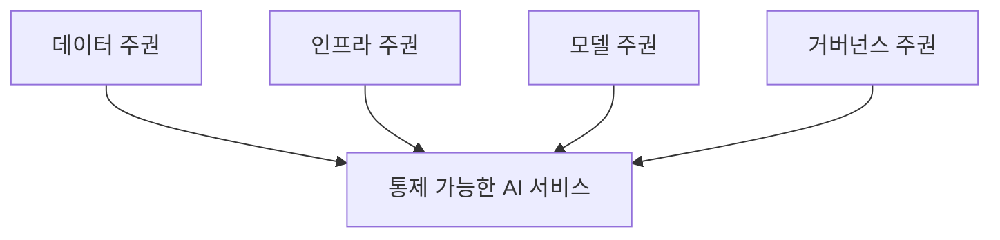

## 30초 인출

- 본질: 소버린 AI는 국가·조직이 데이터·인프라·모델·운영 규칙을 통제하려는 AI 역량 전략이다.
- 메커니즘: 필요한 통제 수준 정의 → 데이터·인프라·모델·거버넌스 준비 → 업무에 적용·운영

핵심 용어

- **데이터 주권(Data Sovereignty)**: 국가나 조직이 데이터의 접근·처리·이동을 정책과 관할에 따라 통제하려는 권한·원칙
- **오픈웨이트 모델(Open-weight Model)**: 모델 가중치를 이용 조건에 따라 내려받거나 조정할 수 있도록 공개한 모델; 학습 데이터나 전체 소스가 공개됐다는 뜻은 아님
- **NPU(Neural Processing Unit)**: 신경망 연산을 효율적으로 수행하도록 설계된 프로세서

---
## 1교시 예상문제 (10점)

> 소버린 AI(Sovereign AI)의 개념과 핵심 구성요소를 설명하시오. (예상)

---
## 1교시 10점 답안

### 1. 정의·목적

- 정의: 소버린 AI는 국가·조직이 데이터, 인프라, 모델과 운영 규칙에 대한 실질적 통제권을 확보하려는 AI 역량 전략이다.
- 목적: 외부 공급자 종속을 줄이고 자국의 언어·법·산업 수요에 맞는 AI를 운영한다.

### 2. 핵심 구성요소

| 축 | 핵심 자산 |
|---|---|
| 데이터 | 권한·품질이 관리되는 자국어·도메인 데이터 |
| 인프라 | 컴퓨팅·저장·네트워크 기반 |
| 모델 | 직접 개발하거나 통제 가능한 기반 모델 |
| 거버넌스 | 안전·접근·책임·운영 정책 |

### 3. 제언

필요한 통제 수준부터 정하고, 구축·운영 비용과 외부 의존도를 함께 비교한다.

---
## 2~4교시 예상문제 (25점)

> 소버린 AI의 대두 배경과 데이터·인프라·모델·거버넌스 측면의 구성요소를 설명하고, 현실적인 추진 방안과 한계를 제시하시오. (예상)

---
## 2~4교시 25점 답안

## Ⅰ. 대두 배경과 목표

소버린 AI는 AI 공급망과 데이터 활용에서 국가·조직의 선택권과 통제력을 확보하려는 전략이다.

| 배경 | 요구되는 통제 |
|---|---|
| 데이터의 국외 이전·사용 조건 우려 | 데이터 권한·저장·접근 통제 |
| 소수 공급자에 대한 의존 | 모델·인프라 선택권과 대체 경로 |
| 자국어·산업별 요구 반영 필요 | 지역·업무 맥락을 반영한 학습·평가 |

## Ⅱ. 네 가지 구성축

## Ⅲ. 추진 선택과 한계

| 선택 | 고려사항 |
|---|---|
| 자체 모델 개발 | 높은 학습·운영 비용과 전문 인력 필요 |
| 공개 가중치 모델의 조정 | 라이선스·보안·모델 역량에 대한 검토 필요 |
| 외부 서비스 활용 | 데이터 처리 조건, 공급자 종속, 대체 가능성 검토 |
| 인프라 자립 | 비용·성능·공급 안정성의 균형 필요 |

## Ⅳ. 기술적 제언

| 문제 | 해결 |
|---|---|
| 모든 구성요소를 자체 구축하면 비용과 운영 부담이 커지고, 외부 의존을 그대로 두면 통제 목적을 이루기 어려움 | 민감도와 중요도가 높은 업무부터 통제 수준을 정하고, 데이터·모델·인프라의 위험과 총비용을 비교해 단계적으로 확장 |

---
## 출제 이력과 검증 출처

- 원문 출제 이력 표기: 미출제.
