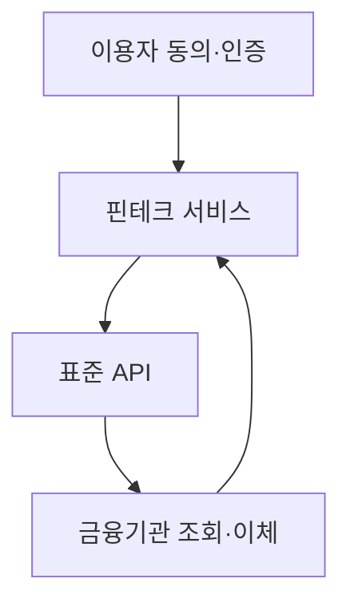
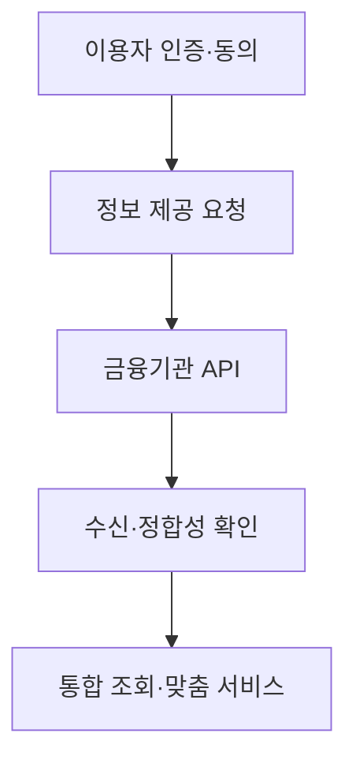

## 30초 인출

- 본질: 핀테크는 정보기술을 이용해 금융 서비스의 제공과 이용 방식을 바꾸는 영역이다.
- 메커니즘: 이용자 동의·인증 → 금융 API 연계 → 데이터·거래 처리 → 서비스 제공·감사

핵심 용어

- **오픈뱅킹(Open Banking)**: 이용자의 동의와 API 연계를 바탕으로 금융기관의 계좌·결제 기능을 외부 서비스와 연결하는 방식
- **금융 마이데이터**: 이용자의 동의에 따라 여러 기관에 흩어진 금융 정보를 모아 통합 조회·관리하도록 돕는 서비스
- **임베디드 금융(Embedded Finance)**: 비금융 서비스의 이용 흐름 안에서 결제·대출·보험 등 금융 기능을 제공하는 방식

---
## 1교시 예상문제 (10점)

> 제120회 1교시 기출: “오픈뱅킹(Open Banking)의 개념과 핀테크 활성화 관점에서의 기대효과를 설명하시오.”

---
## 1교시 10점 답안

### 1. 정의·목적

- 정의: 오픈뱅킹은 이용자 동의와 표준화된 API를 바탕으로 금융기관의 조회·이체 기능을 외부 서비스와 연계하는 체계다.
- 목적: 이용자가 여러 금융 서비스에서 금융 정보를 확인하고 거래를 이어갈 수 있게 한다.

### 2. 핵심 관계

표준 연계는 이용자가 여러 금융기관의 기능을 한 접점에서 이용하도록 해 편의와 서비스 선택폭을 높인다.

### 3. 제언

동의 범위와 API 권한을 최소화하고, 인증·접근 기록·이상 거래를 함께 점검한다.

---
## 2~4교시 예상문제 (25점)

> 제125회 2교시 기출: “마이데이터 기반 핀테크 서비스의 아키텍처와 보안 위협 대응 방안을 설명하시오.”

---
## 2~4교시 25점 답안

## Ⅰ. 개념과 서비스 구조

핀테크는 정보기술을 이용해 금융 서비스의 제공 방식과 이용 경험을 바꾸는 서비스 영역이다.

| 구성 | 역할 |
|---|---|
| 이용자 접점 | 동의·인증·조회·거래 화면 제공 |
| 핀테크 사업자 | 데이터 기반 분석과 서비스 제공 |
| 금융기관·API | 동의된 정보 조회·거래 연계 |

## Ⅱ. 마이데이터 처리 흐름

## Ⅲ. 주요 보안 위험과 대응

| 위험 | 대응 |
|---|---|
| 동의 없는 정보 이용 | 목적·범위가 분명한 동의와 철회 절차 제공 |
| 자격증명·토큰 탈취 | 강한 인증, 짧은 권한, 안전한 토큰 보관 적용 |
| 과도한 API 호출·정보 노출 | 최소 권한, 호출 제한, 감사 기록과 이상 징후 감시 |

## Ⅳ. 기술적 제언

| 문제 | 해결 |
|---|---|
| 금융 데이터 연계는 편의성을 높이지만 토큰·동의 범위가 넓으면 침해 영향도 커짐 | 동의한 목적·범위에 한해 최소 권한 토큰을 발급하고, 철회·만료·호출 기록을 점검 |

---
## 출제 이력과 검증 출처

- 제120회 1교시: 오픈뱅킹의 개념과 핀테크 활성화 효과
- 제125회 2교시: 마이데이터 기반 핀테크 서비스 아키텍처와 보안 위협 대응
