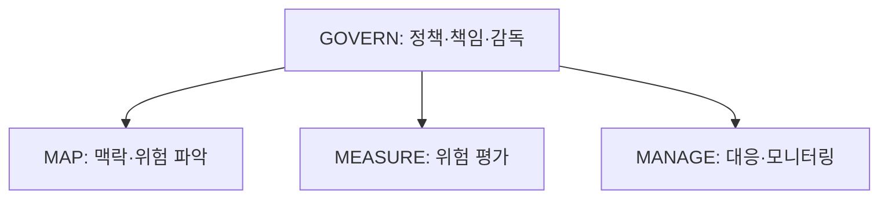

## 30초 인출

- 본질: AI 리스크는 AI의 설계·운영·사용이 사람·조직·사회에 미칠 수 있는 부정적 영향이다.
- 메커니즘: 거버넌스 아래 맥락·위험 파악 → 측정 → 우선순위별 관리 → 생애주기 전반에서 재평가

핵심 용어

- **데이터 포이즈닝(Data Poisoning)**: 학습 데이터에 악의적이거나 잘못된 자료를 섞어 모델의 동작을 왜곡하려는 공격
- **NIST AI RMF**: AI 위험의 거버넌스·맥락 파악·측정·관리를 돕는 자발적 위험관리 프레임워크
- **AI 거버넌스(AI Governance)**: AI의 책임·정책·감독·위험관리를 조직의 의사결정과 운영에 연결하는 체계

---
## 1교시 예상문제 (10점)

> AI 리스크의 개념과 주요 유형을 설명하시오. (예상)

---
## 1교시 10점 답안

### 1. 정의·목적

- 정의: AI 리스크는 AI 시스템의 설계·개발·운영·사용으로 사람·조직·사회에 발생할 수 있는 부정적 영향을 말한다.
- 목적: 위험을 사용 맥락에 맞게 식별·평가하고 수용 가능한 수준으로 관리한다.

### 2. 주요 유형

| 유형 | 예 |
|---|---|
| 기술 | 환각, 적대적 공격, 보안 취약점 |
| 윤리·사회 | 편향, 차별, 프라이버시 침해 |
| 법·규제 | 저작권, 책임, 준수 의무 |

화살표는 GOVERN이 나머지 기능을 조직적으로 뒷받침함을 나타내며, 세 기능 사이의 고정 순서를 뜻하지 않는다.

### 3. 제언

모델 성능뿐 아니라 사용 맥락과 영향받는 사람을 기준으로 위험을 평가한다.

---
## 2~4교시 예상문제 (25점)

> 제139회 2교시 1번 기출: “인공지능(AI) 기술의 급속한 발전은 혁신적 변화와 함께 다양한 리스크(Risk)를 수반한다. AI 리스크에 대하여 다음을 설명하시오.” 위험 유형과 전 생애주기 관리 방안을 설명하시오.

---
## 2~4교시 25점 답안

## Ⅰ. 위험의 범위와 유형

AI 리스크는 모델만의 오류에 그치지 않고 데이터·기술·사용 맥락이 사람과 조직에 미치는 영향을 포함한다.

| 관점 | 예시 |
|---|---|
| 기술 | 환각, 견고성 부족, 적대적 입력 |
| 윤리·사회 | 편향, 차별, 개인정보 노출 |
| 법·운영 | 권리 침해, 책임 공백, 운영 실패 |

## Ⅱ. 위험관리 절차

| NIST AI RMF 기능 | 역할 |
|---|---|
| GOVERN | 조직의 정책·책임·감독 기반을 마련하고 나머지 기능을 뒷받침한다. |
| MAP | 사용 맥락과 이해관계자, 잠재 영향을 파악한다. |
| MEASURE | 식별한 위험을 분석·평가하고 근거를 기록한다. |
| MANAGE | 우선순위에 따라 대응하고 위험을 모니터링한다. |

화살표는 GOVERN이 나머지 기능을 뒷받침한다는 뜻이다. MAP·MEASURE·MANAGE는 고정 순서가 아니라 생애주기 전반에서 맥락에 맞게 반복·연계한다.

## Ⅲ. 통제와 운영

| 통제 시점 | 예시 |
|---|---|
| 설계·데이터 | 목적·영향 분석, 데이터 권리·품질 점검 |
| 시험·배포 | 편향·보안·견고성 시험, 운영 승인 |
| 운영·변경 | 사고 보고, 성능·위험 모니터링, 변경 재평가 |

## Ⅳ. 기술적 제언

| 문제 | 해결 |
|---|---|
| 위험 평가는 한 번의 출시 점검으로 끝나지 않으며, 맥락 변화로 새로운 위해가 나타날 수 있음 | 책임자를 지정하고 Govern·Map·Measure·Manage 활동을 생애주기 전반에 반복해, 위험과 대응 기록을 갱신 |

---
## 출제 이력과 검증 출처

- 제134회 4교시 3번: AI 시스템의 법적·윤리적·기술적 문제와 해결방안
- 제139회 2교시 1번: AI 리스크의 개념과 유형별 대응 전략
- NIST, [AI Risk Management Framework 1.0, §5](https://airc.nist.gov/airmf-resources/airmf/5-sec-core/): Govern, Map, Measure, Manage 기능 및 거버넌스의 교차 적용을 확인함.
