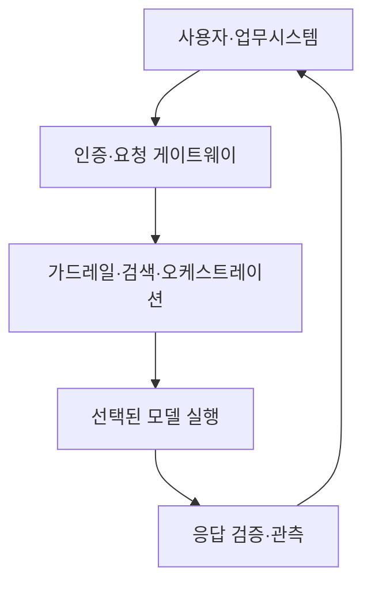
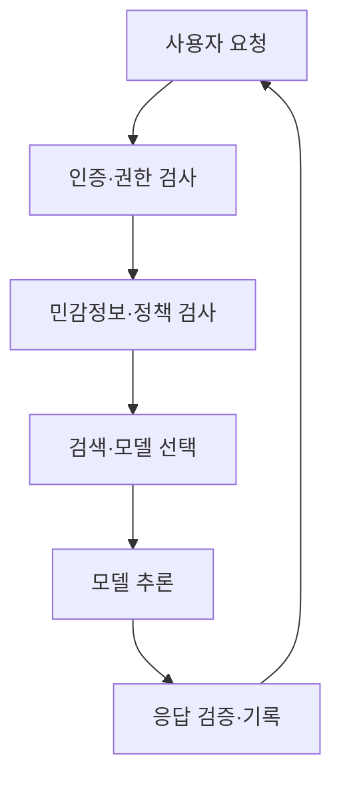

## 30초 인출

- 본질: LLM 도입 아키텍처는 요청·데이터·보안·모델 실행을 연결해 업무용 언어모델 서비스를 운영하는 구조다.
- 메커니즘: 인증·정책 검사 → 지식 검색·모델 선택 → 추론 → 응답 검증·운영 관찰

핵심 용어

- **TTFT(Time To First Token)**: 요청을 보낸 뒤 첫 응답 토큰이 나오기까지 걸린 시간
- **시맨틱 캐싱(Semantic Caching)**: 의미가 유사한 요청에 기존 결과를 재사용하는 캐시 방식; 재사용 전 결과의 적합성을 확인해야 함
- **가드레일(Guardrail)**: 모델 입력·출력과 도구 사용에 정책 검사를 적용하는 통제 장치

---
## 1교시 예상문제 (10점)

> LLM 도입 아키텍처의 주요 구성요소와 고려사항을 설명하시오. (예상)

---
## 1교시 10점 답안

### 1. 정의·목적

- 정의: LLM 도입 아키텍처는 사용자 요청부터 모델 응답까지 데이터·보안·검색·모델 실행을 연결하는 서비스 구조다.
- 목적: 업무 요구에 맞는 모델을 안전하고 지속 가능하게 운영한다.

### 2. 핵심 구조

### 3. 제언

민감도와 과업 난도에 맞춰 모델을 선택하고 입력·출력의 접근과 비용을 함께 관리한다.

---
## 2~4교시 예상문제 (25점)

> 제135회 2교시 5번 기출: “공공기관 LLM 도입 아키텍처 및 고려사항.” 계층별 아키텍처와 보안·비용·운영 고려사항을 설명하시오.

---
## 2~4교시 25점 답안

## Ⅰ. 아키텍처 구성

LLM 서비스는 요청 통제, 지식 연계, 모델 실행과 결과 관찰을 분리해 구성한다.

| 계층 | 역할 |
|---|---|
| 접점·게이트웨이 | 사용자 인증, 요청 제한, 모델 접근 통제 |
| 안전·검색 | 민감정보 처리, 정책 검사, 검색 증강·도구 연결 |
| 모델 실행 | 과업에 맞는 외부·내부 모델 호출 |
| 운영·관측 | 품질·지연·비용·오류 기록 |

## Ⅱ. 요청 처리 흐름

## Ⅲ. 도입 고려사항

| 고려사항 | 설계 대응 |
|---|---|
| 기밀·개인정보 | 입력 제한·마스킹, 저장·전송 통제, 외부 호출 정책 수립 |
| 비용·지연 | 사용량 계측, 캐시·모델 선택 기준, 용량 계획 |
| 신뢰성 | 지식 출처·응답 품질 평가, 오류 대응·사람 검토 |
| 운영 책임 | 모델·프롬프트 버전 기록, 변경 승인, 감사 로그 |

## Ⅳ. 기술적 제언

| 문제 | 해결 |
|---|---|
| 단일 모델 직접 호출은 권한·비용·응답 품질을 일관되게 통제하기 어려움 | 게이트웨이에서 인증·정책·라우팅을 적용하고, 모델별 품질·지연·비용을 기록해 도입 효과를 검증 |

---
## 출제 이력과 검증 출처

- 제135회 2교시 5번: 공공기관 LLM 도입 아키텍처 및 고려사항
- 제139회 2교시 2번: 엔터프라이즈 LLM 구축 파이프라인
