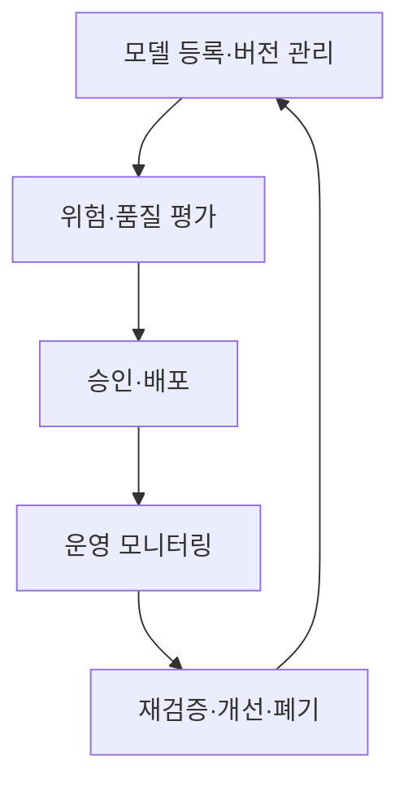

## 30초 인출

- 본질: ModelOps는 조직의 모델을 등록·검증·배포·감사하며 전 생애주기를 관리하는 접근이다.
- 메커니즘: 모델 등록·버전 관리 → 위험·품질 평가 → 승인·배포 → 모니터링 → 개선·폐기

핵심 용어

- **모델 레지스트리(Model Registry)**: 모델 버전·소유자·용도·평가·승인 상태를 기록하는 저장소
- **모델 드리프트(Model Drift)**: 운영 데이터나 업무 맥락 변화로 모델의 입력 특성 또는 예측 성능이 달라지는 현상
- **챔피언-챌린저(Champion-Challenger)**: 기존 운영 모델과 후보 모델을 비교 평가해 교체 여부를 판단하는 방식

---
## 1교시 예상문제 (10점)

> 제121회 1교시 기출: “MLOps와 ModelOps의 개념을 비교 설명하시오.”

---
## 1교시 10점 답안

### 1. 정의·목적

- 정의: MLOps는 머신러닝 모델의 개발·배포 과정을 자동화하고, ModelOps는 조직의 모델 자산과 전 생애주기 운영·거버넌스를 관리하는 접근이다.
- 목적: 모델의 변경·승인·운영 상태를 추적해 품질과 책임성을 지속적으로 관리한다.

### 2. 비교

| 구분 | MLOps | ModelOps |
|---|---|---|
| 관리 대상 | 주로 ML 모델과 파이프라인 | 조직 내 AI·통계·규칙 모델 등 |
| 초점 | 학습·시험·배포 자동화 | 등록·승인·운영·감사와 책임 |
| 범위 | 모델 엔지니어링 | 전사 모델 거버넌스 |

### 3. 제언

공통 모델 목록·책임자·승인 기록을 두고 위험도에 따라 검증 수준을 정한다.

---
## 2~4교시 예상문제 (25점)

> 제128회 2교시 기출: “엔터프라이즈 환경에서 인공지능 모델의 라이프사이클 관리를 위한 ModelOps 프레임워크를 설명하시오.”

---
## 2~4교시 25점 답안

## Ⅰ. 개념과 MLOps와의 관계

ModelOps는 조직이 사용하는 모델의 등록부터 운영·폐기까지를 거버넌스 아래 관리하는 접근이다.

| 관리 관점 | 주요 내용 |
|---|---|
| 엔지니어링 | 모델 버전·의존성·학습 및 평가 기록 |
| 조직 거버넌스 | 소유자·위험 분류·승인·감사 |
| 운영 성과 | 품질·비용·업무 지표·변화 감시 |

## Ⅱ. 생애주기 흐름

## Ⅲ. 운영 통제

| 통제 항목 | 적용 내용 |
|---|---|
| 모델 레지스트리 | 버전, 소유자, 용도, 평가 결과 기록 |
| 승인·변경 | 배포 전 위험도별 검토와 변경 이력 유지 |
| 운영 모니터링 | 성능·데이터 변화 감지 후 재평가 |
| 감사 가능성 | 데이터·모델 계보와 의사결정 근거 추적 |

## Ⅳ. 기술적 제언

| 문제 | 해결 |
|---|---|
| 부서별 운영 모델이 등록·변경·감사 절차 없이 늘면 책임과 위험 상태를 파악하기 어려움 | 모델 소유자와 용도를 등록하고 위험 기반 승인·모니터링·폐기 절차를 전사 공통으로 운영 |

---
## 출제 이력과 검증 출처

- 제121회 1교시: MLOps와 ModelOps의 개념 비교
- 제128회 2교시: 엔터프라이즈 ModelOps 프레임워크
