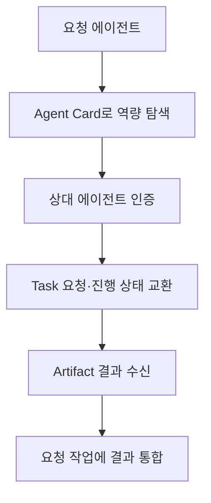

## 30초 인출

- 본질: A2A는 독립된 에이전트가 역량을 발견하고 작업·결과를 주고받도록 하는 통신 프로토콜이다.
- 메커니즘: Agent Card 탐색 → 인증 → Task·Message 교환 → Artifact 수신·통합

핵심 용어

- **Agent Card**: 에이전트의 이름·역량·접속 방식·인증 요구 등을 소개하는 정보 문서
- **Task**: A2A 요청과 진행 상태를 추적하는 작업 단위
- **Artifact**: 에이전트가 Task 수행 결과로 반환하는 문서·파일·구조화 데이터 등의 결과물

---
## 1교시 예상문제 (10점)

> Agent-to-Agent(A2A) 프로토콜의 개념과 핵심 구성요소를 설명하시오. (예상)

---
## 1교시 10점 답안

### 1. 정의·목적

- 정의: A2A는 서로 다른 AI 에이전트가 역량을 발견하고 작업을 주고받도록 하는 에이전트 간 통신 프로토콜이다.
- 목적: 에이전트가 각자 구현을 유지하면서 협업할 수 있도록 공통 상호작용 방식을 제공한다.

### 2. 핵심 구성요소

| 요소 | 역할 |
|---|---|
| Agent Card | 에이전트의 역량·엔드포인트·인증 정보를 알림 |
| Task | 요청된 작업과 진행 상태를 관리 |
| Message·Artifact | 대화·상태 전달과 작업 결과물 표현 |

### 3. 제언

에이전트 발견 정보를 검증하고 작업별 인증·권한·시간 제한을 적용한다.

---
## 2~4교시 예상문제 (25점)

> A2A의 에이전트 발견과 Task 기반 상호작용 구조를 설명하고, 분산 작업에서 발생할 수 있는 권한·루프·실패 위험의 대응 방안을 제시하시오. (예상)

---
## 2~4교시 25점 답안

## Ⅰ. 개념과 프로토콜 요소

A2A는 독립된 에이전트 사이의 역량 탐색, 작업 요청, 상태 전달과 결과 교환을 위한 개방형 프로토콜이다.

| 요소 | 의미 |
|---|---|
| Agent Card | 상대 에이전트의 기능·접속 방식·인증 요구 정보 |
| Message | 지시·질문·상태 등 상호작용 내용 |
| Task | 상태를 가진 작업 단위 |
| Artifact | Task의 결과로 생성된 파일·텍스트·구조화 데이터 |

## Ⅱ. 작업 흐름

## Ⅲ. 주요 위험과 대응

| 위험 | 대응 |
|---|---|
| 위임 경로에서 과도한 권한 사용 | 에이전트 신원 확인과 작업별 최소 권한 적용 |
| 반복 호출·무한 작업 | 시간 제한·호출 한도·종료 조건 설정 |
| 일부 에이전트의 실패·응답 지연 | 타임아웃, 재시도 범위와 부분 실패 처리 정의 |

## Ⅳ. 기술적 제언

| 문제 | 해결 |
|---|---|
| 자율 위임은 호출 경로와 실패 전파를 복잡하게 만들 수 있음 | 작업 ID·호출 추적을 남기고, 최소 권한·호출 한도·타임아웃을 실행 경계마다 적용 |

---
## 출제 이력과 검증 출처

- 원문 출제 이력 표기: 미출제.
- A2A Project, [Protocol Specification 1.0.0](https://a2a-protocol.org/v1.0.0/specification/): Agent Card, Task, Message, Artifact 개념을 확인함.
