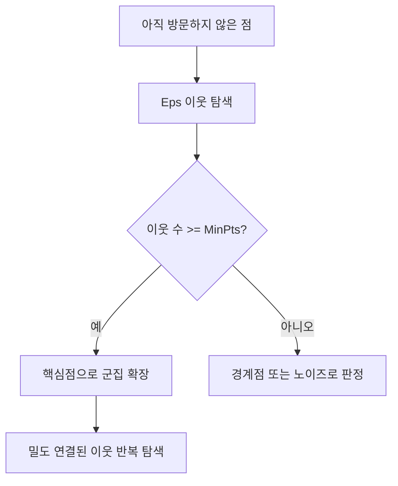

## 30초 인출

- 본질: DBSCAN은 점 주변의 밀도를 기준으로 군집을 만들고 밀도가 낮은 점을 노이즈로 구분하는 알고리즘이다.
- 메커니즘: Eps 이웃 조사 → MinPts로 핵심점 판정 → 밀도 연결 영역 확장 → 경계점·노이즈 분류

핵심 용어

- **Eps($\epsilon$)**: 각 점 주변 이웃을 확인하는 거리 반경
- **MinPts**: 점이 핵심점이 되기 위해 Eps 이웃 안에 필요한 최소 점 수
- **밀도 연결성(Density-Connected)**: 핵심점의 이웃 관계를 거쳐 두 점이 같은 밀도 기반 군집으로 이어지는 성질

---
## 1교시 예상문제 (10점)

> 제129회 1교시 기출: “DBSCAN(Density-Based Spatial Clustering of Applications with Noise)의 개념과 특징을 설명하시오.”

---
## 1교시 10점 답안

### 1. 정의·목적

- 정의: DBSCAN은 각 점 주변의 밀도를 기준으로 군집을 확장하고 밀도가 낮은 점을 노이즈로 구분하는 군집화 알고리즘이다.
- 목적: 군집 수를 미리 지정하지 않고 임의 형태의 고밀도 영역과 이상점을 찾는다.

### 2. 핵심 용어

| 용어 | 의미 |
|---|---|
| Eps($\epsilon$) | 이웃 탐색 반경 |
| MinPts | 핵심점이 되기 위해 반경 안에 필요한 최소 점 수 |
| 핵심점·경계점·노이즈 | 밀도 조건 충족, 핵심점 이웃, 그 외의 점 구분 |

### 3. 제언

거리 척도와 데이터 스케일을 맞춘 뒤 Eps·MinPts를 검증 자료로 조정한다.

---
## 2~4교시 예상문제 (25점)

> 제130회 2교시 기출: “군집 분석 알고리즘인 K-Means와 DBSCAN을 비교 설명하시오.”

---
## 2~4교시 25점 답안

## Ⅰ. 개념과 밀도 기반 접근

DBSCAN은 각 점의 Eps 이웃 수로 핵심점을 찾고, 밀도 연결된 영역을 확장해 군집을 만든다.

| 점 유형 | 판정 |
|---|---|
| 핵심점 | Eps 이웃 수가 MinPts 이상 |
| 경계점 | 자체 이웃 수는 부족하지만 핵심점 이웃에 속함 |
| 노이즈점 | 핵심점도 그 경계 이웃도 아님 |

## Ⅱ. 군집 확장 절차

## Ⅲ. K-Means와 비교

| 비교 항목 | K-Means | DBSCAN |
|---|---|---|
| 군집 수 | $K$를 사전 지정 | 사전 지정 불필요 |
| 군집 형태 | 중심점 기반, 대체로 구형 군집에 적합 | 밀도 연결에 따른 임의 형태 가능 |
| 이상점 | 모든 점을 군집에 배정 | 낮은 밀도의 점을 노이즈로 구분 가능 |
| 주요 민감도 | 초기 중심·$K$·거리 | Eps·MinPts·밀도 차이 |

## Ⅳ. 기술적 제언

| 문제 | 해결 |
|---|---|
| 단일 밀도 기준은 영역별 밀도 차가 크거나 차원이 높을 때 군집을 잘못 나눌 수 있음 | 특성 스케일·거리 척도·파라미터 민감도를 검증하고, 밀도 차가 큰 자료에는 계층적 대안을 비교 |

---
## 출제 이력과 검증 출처

- 제129회 1교시: DBSCAN 개념과 특징
- 제130회 2교시: K-Means와 DBSCAN 비교
