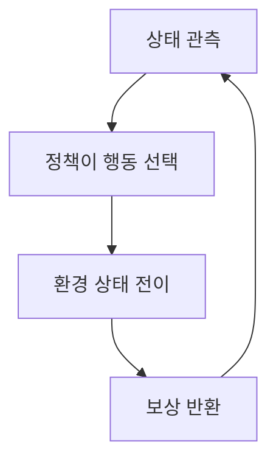
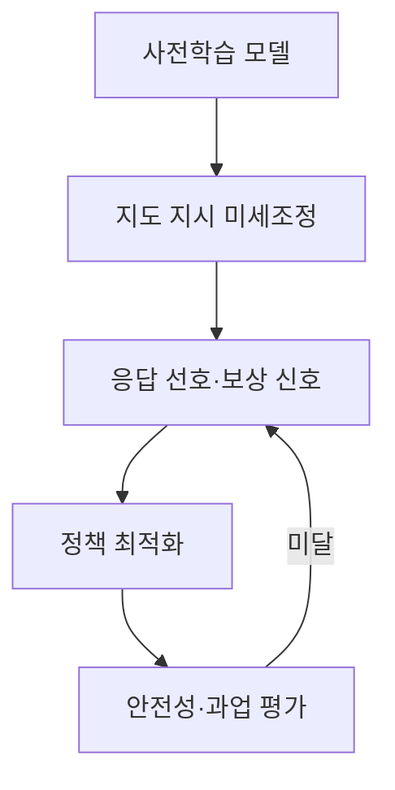

## 30초 인출

- 본질: 강화학습은 에이전트가 환경에서 행동하고 받은 보상으로 정책을 개선하는 학습 방법이다.
- 메커니즘: 상태 관측 → 행동 선택 → 상태 전이·보상 수신 → 정책 갱신

핵심 용어

- **MDP(Markov Decision Process)**: 상태·행동·전이·보상으로 순차적 의사결정 문제를 표현하는 수학적 모형
- **벨만 방정식(Bellman Equation)**: 상태 가치나 행동 가치를 즉시 보상과 다음 상태의 할인된 가치로 재귀적으로 나타내는 식
- **탐험과 활용(Exploration vs. Exploitation)**: 더 나은 행동을 찾으려는 시도와 현재 보상이 좋은 행동을 선택하는 것 사이의 균형

---
## 1교시 예상문제 (10점)

> 강화학습의 개념과 핵심 요소를 설명하시오. (예상)

---
## 1교시 10점 답안

### 1. 정의·목적

- 정의: 강화학습은 에이전트가 환경과 상호작용하며 보상을 바탕으로 행동 정책을 학습하는 방법이다.
- 목적: 연속된 행동의 결과를 고려해 장기 보상을 높이는 정책을 찾는다.

### 2. 핵심 구조

### 3. 제언

보상 기준을 실제 목표와 맞추고, 시뮬레이션과 안전 제약으로 위험한 탐험을 제한한다.

---
## 2~4교시 예상문제 (25점)

> 제139회 2교시 2번 기출: “A기업은 AI 전환 추진을 위해 LLM 기반 AI 시스템을 구축하고자 한다. 다음을 설명하시오.” LLM 학습 파이프라인과 강화학습 기반 미세조정 방안을 설명하시오.

---
## 2~4교시 25점 답안

## Ⅰ. 강화학습의 개념과 요소

강화학습은 에이전트가 상태에 따라 행동하고, 환경에서 받은 보상을 이용해 정책을 개선하는 학습 방법이다.

| 요소 | 역할 |
|---|---|
| 상태·행동 | 현재 상황과 에이전트의 선택 |
| 정책 | 상태에서 행동을 선택하는 규칙 |
| 보상 | 행동 결과의 바람직함을 나타내는 신호 |
| 가치 | 상태·행동이 가져올 장기 보상의 추정 |

## Ⅱ. LLM 미세조정 흐름

## Ⅲ. 지도 미세조정과 강화학습 비교

| 구분 | 지도 미세조정 | 강화학습 기반 조정 |
|---|---|---|
| 학습 신호 | 입력과 모범 답안 | 응답에 대한 보상·선호 신호 |
| 학습 목표 | 정답 예시를 모방 | 보상 기준에 맞는 응답 확률을 높임 |
| 고려사항 | 예시 품질·범위 | 보상 편향·불안정한 최적화·평가 신뢰성 |

## Ⅳ. 기술적 제언

| 문제 | 해결 |
|---|---|
| 강화학습을 적용해도 지도 미세조정 대비 개선이 필요한지 불분명함 | 검증 가능한 보상 신호가 있는 과업부터 지도 미세조정 기준선과 비교하고, 개선이 확인된 과업에 한해 적용한다. |

---
## 출제 이력과 검증 출처

- 제139회 2교시 2번: LLM 학습 파이프라인 및 강화학습 적용
