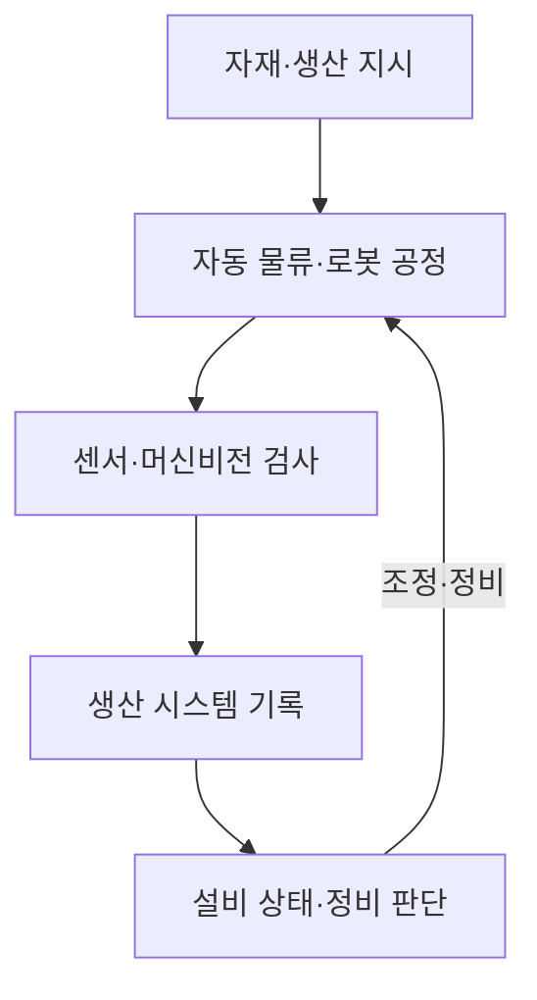

## 30초 인출

- 본질: 다크팩토리는 현장 작업자 상주를 줄이고 자동화 설비로 생산을 이어가는 제조 운영 방식이다.
- 메커니즘: 자재 이동·공정 자동화 → 품질 검사 → 설비 감시·정비 → 생산 조정

핵심 용어

- **Lights-out Manufacturing**: 작업자 상주 없이 자동화 설비가 생산을 이어가도록 설계한 제조 방식; 실제로 조명을 끄는 것이 필수 조건은 아님
- **AMR(Autonomous Mobile Robot)**: 주변을 감지하고 경로를 계획해 작업 공간을 이동하는 자율이동로봇
- **예지정비(PdM, Predictive Maintenance)**: 설비 상태 자료를 분석해 고장 위험이나 정비 시점을 미리 추정하는 방법

---
## 1교시 예상문제 (10점)

> 제140회 1교시 2번 기출: “다크 팩토리(Dark Factory)에 대하여 설명하시오.”

---
## 1교시 10점 답안

### 1. 정의·목적

- 정의: 다크팩토리는 작업자의 상주를 최소화하고 설비·로봇·시스템이 생산을 이어가도록 자동화한 제조 운영 방식이다.
- 목적: 반복 생산의 효율과 안전성을 높이고, 무인 운영이 가능한 공정 범위를 넓힌다.

### 2. 핵심 구조

| 계층 | 역할 |
|---|---|
| 생산 설비 | 로봇·기계가 공정을 수행 |
| 물류·검사 | 자재 이동과 품질 검사 자동화 |
| 연결·제어 | 설비 상태와 생산 정보를 연계 |
| 운영 지능 | 일정·이상·정비 정보를 분석해 조치 |

### 3. 제언

무인화 전에 설비 복구·안전정지·OT 보안 절차와 원격 대응 체계를 검증한다.

---
## 2~4교시 예상문제 (25점)

> 다크팩토리의 개념과 스마트팩토리와의 차이를 설명하고, 무인 운영의 구성요소·위험·대응 방안을 제시하시오. (예상)

---
## 2~4교시 25점 답안

## Ⅰ. 개념과 스마트팩토리와의 차이

다크팩토리는 사람의 상시 현장 개입을 줄이고 자동화된 설비와 시스템으로 생산을 운영하는 제조 방식이다.

| 구분 | 스마트팩토리 | 다크팩토리 |
|---|---|---|
| 작업자 역할 | 데이터 기반으로 공정을 감독·조정 | 현장 상주를 최소화하고 원격·자동 운영 확대 |
| 핵심 목표 | 가시성·연결성·생산 유연성 | 무인 가동 범위와 자율 운영 확대 |
| 전제 | 공정 정보화와 자동화 | 높은 공정 안정성·복구·보안 역량 |

## Ⅱ. 운영 흐름

## Ⅲ. 위험과 통제

| 위험 | 통제 |
|---|---|
| 고장 시 현장 인력 부재로 정지 장기화 | 상태 감시, 예비 설비·부품, 원격·현장 복구 절차 |
| 자동화 설비의 안전 사고 | 안전 인터록, 비상정지, 정비 작업자 접근 통제 |
| OT 네트워크 침해 | IT·OT 구역 분리, 접근 통제, 사고 대응 훈련 |

## Ⅳ. 기술적 제언

| 문제 | 해결 |
|---|---|
| 생산 자동화만 앞서면 고장·안전·보안 사고에서 복구가 어려움 | 공정별로 무인 운영 적합성을 평가하고, 안전정지·수동 복구·OT 사고 대응을 시험한 뒤 단계적으로 확대 |

---
## 출제 이력과 검증 출처

- 제140회 1교시 2번: 다크 팩토리(Dark Factory)
