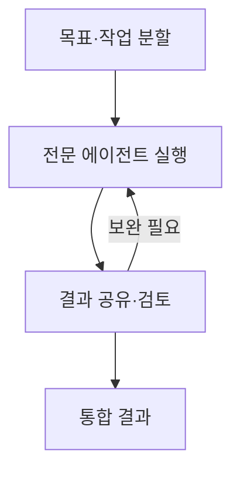
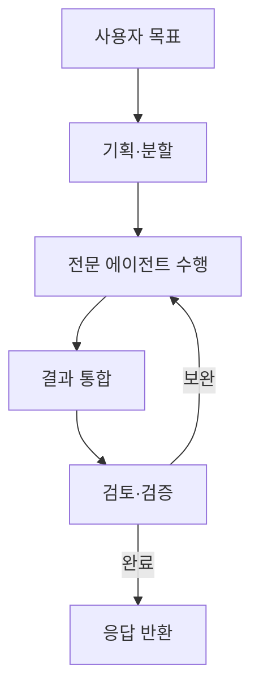

## 30초 인출

- 본질: 멀티에이전트 시스템은 여러 자율 에이전트가 역할을 나누어 공동 목표를 수행하는 구조다.
- 메커니즘: 목표 분할 → 에이전트별 수행·정보 공유 → 결과 통합·검토 → 완료 또는 보완

핵심 용어

- **분산 문제 해결(DPS, Distributed Problem Solving)**: 복잡한 목표를 하위 과업으로 나눠 여러 행위자가 협력해 해결하는 방식
- **비평가(Critic) 에이전트**: 다른 에이전트의 결과를 정해진 기준으로 검토하고 보완점을 제시하는 역할의 에이전트
- **블랙보드 패턴(Blackboard Pattern)**: 여러 에이전트가 공유 작업공간에 중간 결과와 상태를 기록하고 참조하는 협업 방식

---
## 1교시 예상문제 (10점)

> 멀티에이전트 시스템의 개념과 주요 구성요소를 설명하시오. (예상)

---
## 1교시 10점 답안

### 1. 정의·목적

- 정의: 멀티에이전트 시스템은 여러 자율 에이전트가 역할과 정보를 나누어 공동 목표를 수행하는 시스템이다.
- 목적: 복합 과업을 분할하고 전문 기능을 조합해 협력적으로 해결한다.

### 2. 핵심 구조

### 3. 제언

역할·종료 조건·도구 권한을 정하고 결과를 독립적으로 검증한다.

---
## 2~4교시 예상문제 (25점)

> 제139회 3교시 1번 기출: “기업의 업무구조를 바꾸는 다중 에이전트 시스템(MAS)에 대하여 설명하시오.”

---
## 2~4교시 25점 답안

## Ⅰ. 개념과 구성

멀티에이전트 시스템은 여러 에이전트가 자율적으로 상호작용하며 분산된 과업을 해결하는 구조다.

| 구성 | 역할 |
|---|---|
| 에이전트 | 목표·도구·역할에 따라 하위 작업 수행 |
| 오케스트레이션 | 작업 분배, 순서·상태·종료 조건 관리 |
| 통신·공유 상태 | 작업 내용과 중간 결과 전달 |
| 검증 | 결과의 정확성·정책 준수 확인 |

## Ⅱ. 협업 흐름

## Ⅲ. 운영 위험과 대응

| 위험 | 대응 |
|---|---|
| 오류가 다른 에이전트 결과로 전파 | 근거 확인과 독립 검증 단계 추가 |
| 작업이 반복되거나 종료되지 않음 | 최대 호출·시간 제한과 명확한 종료 조건 설정 |
| 도구 권한이 불필요하게 확대 | 에이전트·작업별 최소 권한과 감사 기록 적용 |

## Ⅳ. 기술적 제언

| 문제 | 해결 |
|---|---|
| 자율 협업을 무제한 허용하면 오류 전파·반복 호출·권한 남용을 통제하기 어려움 | 상태 전이와 종료 조건을 명시하고, 역할별 권한을 제한하며, 중간·최종 결과를 검증 |

---
## 출제 이력과 검증 출처

- 제139회 3교시 1번: 기업의 업무구조를 바꾸는 다중 에이전트 시스템(MAS)
