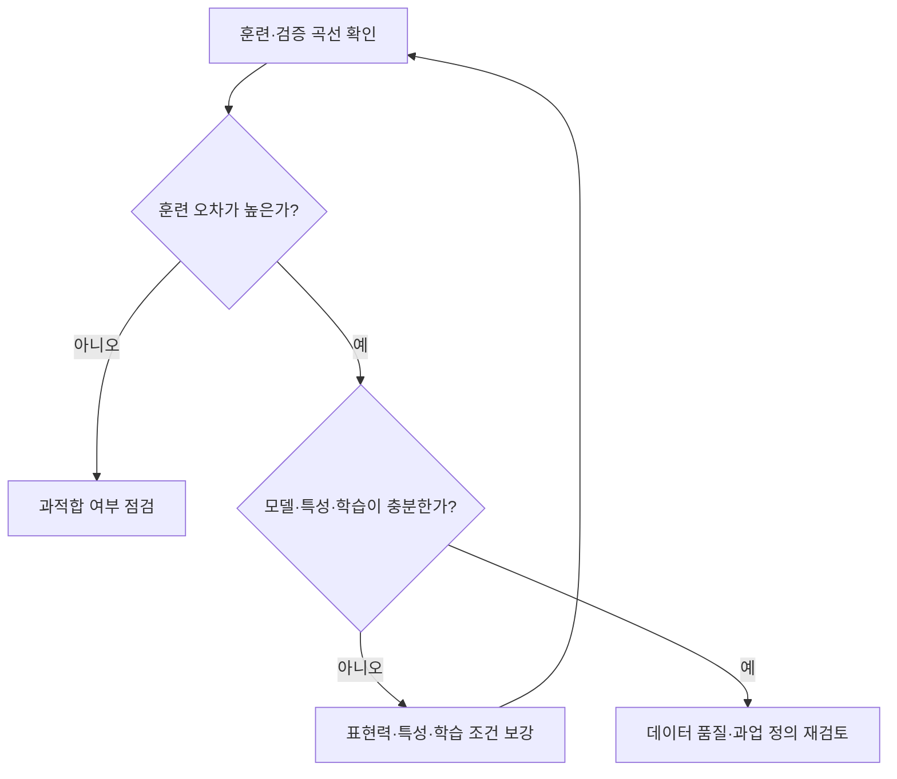

## 30초 인출

- 본질: 과소적합은 모델이 데이터의 관계를 충분히 학습하지 못해 학습 자료에서도 오차가 큰 상태다.
- 메커니즘: 훈련·검증 곡선 확인 → 모델 표현력·특성·학습 조건 점검 → 단계별 조정·재평가

핵심 용어

- **고편향(High Bias)**: 모델의 단순한 가정 때문에 실제 관계를 충분히 설명하지 못해 생기는 오차 경향
- **모델 표현력(Expressive Power)**: 모델이 표현·근사할 수 있는 관계의 복잡도
- **특성 공학(Feature Engineering)**: 원자료를 변환하거나 조합해 과업에 유용한 입력 특성을 만드는 과정

---
## 1교시 예상문제 (10점)

> 과소적합의 개념과 주요 원인·해결 방안을 설명하시오. (예상)

---
## 1교시 10점 답안

### 1. 정의·목적

- 정의: 과소적합은 모델이 데이터의 관계를 충분히 학습하지 못해 학습 자료에서도 오차가 큰 상태다.
- 목적: 학습·검증 성능으로 과소적합을 진단해 표현력과 학습 조건을 개선한다.

### 2. 원인과 대응

| 원인 | 대응 |
|---|---|
| 모델 표현력 부족 | 모델·특성 표현력 보강 |
| 핵심 특성 누락 | 도메인에 맞는 입력 특성 추가 |
| 규제·학습 조건이 부적절 | 규제 강도와 학습 설정을 검증 자료로 조정 |

### 3. 제언

훈련 손실이 높게 정체되는지 확인한 뒤 표현력·특성·규제를 순서대로 조정한다.

---
## 2~4교시 예상문제 (25점)

> 과소적합의 개념과 학습 곡선에서의 징후를 설명하고, 주요 원인별 진단·개선 방안을 제시하시오. (예상)

---
## 2~4교시 25점 답안

## Ⅰ. 개념과 편향 관계

과소적합은 모델이 지나치게 단순하거나 학습이 충분하지 않아 실제 패턴을 포착하지 못하는 상태다.

| 비교 | 과소적합 | 적절한 적합 | 과적합 |
|---|---|---|---|
| 훈련 오차 | 높음 | 낮음 | 낮음 |
| 검증 오차 | 높음 | 낮음 | 훈련보다 높아짐 |
| 경향 | 편향 높음 | 균형 | 분산 높음 |

## Ⅱ. 진단 메커니즘

## Ⅲ. 원인별 개선

| 원인 | 개선 |
|---|---|
| 모델이 과업 관계를 표현하기에 너무 단순 | 복잡도·모델 계열 조정 후 검증 |
| 입력에 유용한 설명 변수가 없음 | 도메인 특성 추가·변환 검토 |
| 규제가 지나치거나 학습이 부족 | 규제 완화·학습 횟수 및 최적화 조건 조정 |
| 데이터·라벨 품질 문제 | 대표성·라벨 오류와 전처리 점검 |

## Ⅳ. 기술적 제언

| 문제 | 해결 |
|---|---|
| 성능이 낮다고 무조건 모델을 키우면 과적합·운영 비용이 커질 수 있음 | 학습·검증 곡선으로 과소적합 여부를 확인한 뒤 모델 표현력·특성·규제를 단계적으로 조정하고 별도 시험 자료로 최종 평가 |

---
## 출제 이력과 검증 출처

- 제139회 1교시 8번: 과적합과 과소적합의 발생 원인 및 해결 방안
