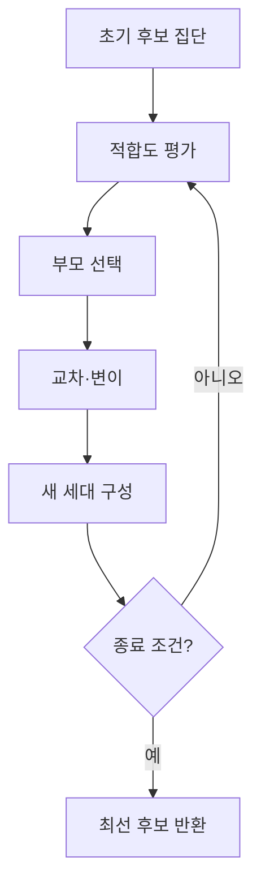
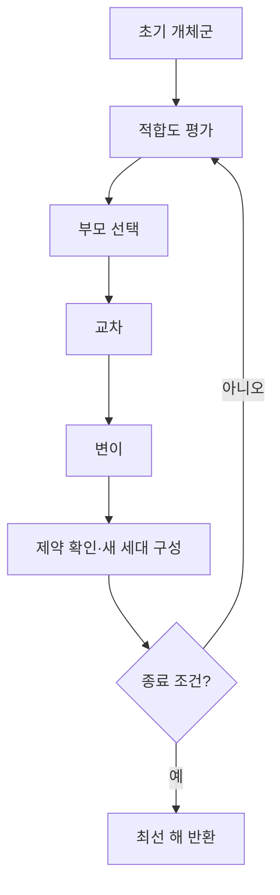

## 30초 인출

유전자 알고리즘(GA)은 후보 해 집단을 선택·교차·변이하며 개선하는 확률적 최적화 기법이다.

핵심 용어

- 염색체: 문제의 후보 해를 비트열, 실수 벡터, 순열 등으로 표현한 개체의 유전자열이다.
- 적합도 함수: 후보 해가 목적에 얼마나 맞는지 점수로 평가한다.
- 교차·변이: 부모 해의 정보를 조합하거나 일부 유전자를 바꿔 후보를 생성한다.

## 1교시 예상문제 (10점)

---

유전자 알고리즘의 정의와 기본 수행 절차를 설명하시오. (예상)

---

## 1교시 10점 답안

### 1. 정의·목적
- 정의: 후보 해 집단을 선택·교차·변이해 더 나은 해를 찾는 최적화 기법이다.
- 목적: 복잡한 탐색 공간에서 좋은 해를 찾는다.

### 2. 절차

### 3. 주요 연산
| 연산 | 기능 |
|---|---|
| 선택 | 적합도에 따라 부모 후보를 고른다. |
| 교차 | 부모 후보의 정보를 조합한다. |
| 변이 | 일부 유전자를 바꿔 탐색 범위를 넓힌다. |

### 4. 적용 시 유의점
염색체 표현과 연산자는 문제 제약에 맞아야 한다. 경로 순서가 중요한 문제는 유효한 순열을 보존하는 연산자를 사용한다. 변이가 너무 적으면 다양성이 줄고, 지나치게 많으면 선택에 따른 개선이 약해질 수 있다.

**제언:** 제약을 보존하는 표현과 연산자를 정하고 세대별 적합도와 다양성을 점검한다.

---

## 2~4교시 예상문제 (25점)

---

유전자 알고리즘(Genetic Algorithm)에 대하여 설명하시오.

---

## 2~4교시 25점 답안

### Ⅰ. 개념과 구성
유전자 알고리즘은 후보 해 집단을 반복 개선하는 확률적 탐색 기법이다. 여러 후보를 유지해 탐색하되 전역 최적해를 보장하지는 않는다.

| 구성 | 역할 |
|---|---|
| 염색체·개체군 | 후보 해와 후보 해 집합을 표현 |
| 적합도 | 목적 함수와 제약 충족 정도를 평가 |
| 세대 | 선택·생성·평가를 마친 한 집단 |

### Ⅱ. 진화 반복 과정

선택은 좋은 해를 활용하고, 교차·변이는 새로운 조합을 탐색한다. 엘리티즘은 상위 후보 일부를 다음 세대에 보존해 최선 해가 사라질 가능성을 낮춘다.

### Ⅲ. 문제 적용과 평가
| 단계 | 설계 |
|---|---|
| 표현 | 경로 문제는 유효한 순열, 수치 최적화는 실수 벡터 등으로 부호화 |
| 평가 | 목적 함수와 제약 위반을 반영해 적합도 계산 |
| 연산 | 표현과 문제 제약에 맞는 교차·변이 선택 |
| 종료·비교 | 계산 예산과 종료 조건을 두고 여러 실행 결과를 비교 |

실행마다 결과가 달라질 수 있으므로 기준 알고리즘과 비교하고, 제약 위반과 계산 비용도 평가한다.

### Ⅳ. 기술적 제언
| 문제 | 해결 방안 |
|---|---|
| 연산 뒤 유효하지 않은 해가 생성됨 | 제약 보존 연산자를 사용하고 필요한 경우 복구 절차를 둔다. |
| 조기 수렴 또는 과도한 계산량 | 개체군 다양성·적합도 추이를 살피고 실행 예산과 종료 조건을 설정한다. |

---

## 출제 이력과 검증 출처

- 137회 4교시 5번: 유전자 알고리즘에 대해 설명하시오.
