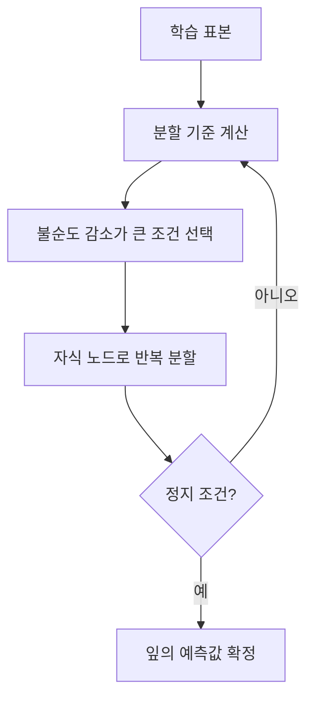
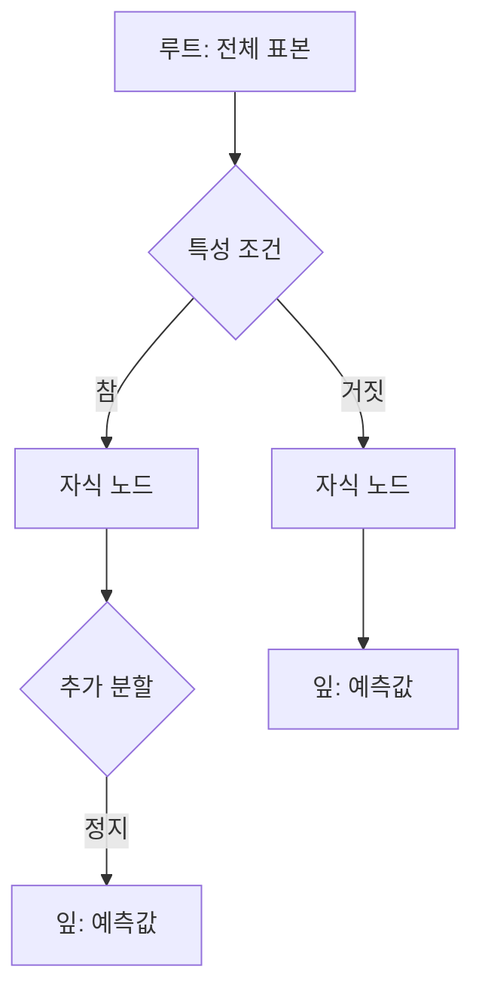

## 30초 인출

의사결정나무는 입력 특성을 조건으로 나누어 예측하는 지도학습 모델이다. 노드에서 불순도를 낮추는 분할을 선택하고 잎의 값이나 클래스로 예측한다.

핵심 용어

- 지니 불순도: 노드 내 클래스가 섞인 정도로, $1-\sum p_i^2$로 계산한다.
- 엔트로피: 클래스 분포의 불확실성으로, 분할 전후 차이를 정보 이득으로 평가한다.
- 가지치기: 과도한 하위 가지를 줄여 과적합을 완화하는 방법이다.

## 1교시 예상문제 (10점)

---

의사결정나무의 분할 기준인 엔트로피와 지니 불순도를 비교 설명하시오.

---

## 1교시 10점 답안

### 1. 정의·목적
- 정의: 의사결정나무는 특성 조건으로 데이터를 재귀 분할해 예측하는 지도학습 모델이다.
- 목적: 분류·회귀 결과와 판단 경로를 이해하기 쉽게 제시한다.

### 2. 불순도와 분할
| 기준 | 의미·계산 | 선택 방향 |
|---|---|---|
| 엔트로피 | $-\sum p_i\log_2 p_i$, 클래스 불확실성 | 자식의 가중 엔트로피를 줄임 |
| 지니 불순도 | $1-\sum p_i^2$, 클래스 혼합 정도 | 자식의 가중 지니 불순도를 줄임 |

두 기준 모두 불순도를 낮추는 분할을 선호하며, 어느 하나가 항상 우월하다고 단정할 수 없다.

### 3. 학습 흐름

### 4. 주의점
트리가 지나치게 깊으면 과적합할 수 있다. 최대 깊이·최소 표본 수 제한이나 가지치기를 검토한다.

**제언:** 검증 자료로 분할 기준과 트리 복잡도를 함께 조정한다.

---

## 2~4교시 예상문제 (25점)

---

의사결정나무(Decision Tree)의 분할 기준과 가지치기(Pruning) 방법을 설명하시오.

---

## 2~4교시 25점 답안

### Ⅰ. 구조와 예측 원리
의사결정나무는 루트에서 시작해 특성 조건으로 표본을 나누고 말단 잎에서 예측하는 트리형 모델이다.

분류는 클래스 불순도를, 회귀는 예측 오차를 줄이는 분할을 선택한다.

### Ⅱ. 분할 기준과 학습
| 기준 | 계산·의미 | 적용 |
|---|---|---|
| 엔트로피 | $-\sum p_i\log_2p_i$, 정보량 | 분류 |
| 지니 불순도 | $1-\sum p_i^2$ | 분류 |
| 회귀 오차 | 분산 또는 제곱 오차 감소 | 회귀 |

가능한 특성·분할점을 평가해 표본을 나누고, 정지 조건에 이를 때까지 자식 노드에서 반복한다.

### Ⅲ. 과적합 제어와 평가
| 방법 | 시점 | 내용 |
|---|---|---|
| 사전 가지치기 | 학습 중 | 깊이·분할 표본 수·잎 표본 수 제한 |
| 사후 가지치기 | 학습 후 | 검증 성능과 복잡도를 고려해 하위 가지 제거 |
| 평가 | 모델 선택 | 교차 검증으로 일반화 성능과 복잡도 비교 |

단일 트리는 설명하기 쉽지만 표본 변화에 민감할 수 있으므로 검증 자료에서 성능과 안정성을 확인한다.

### Ⅳ. 기술적 제언
| 문제 | 해결 방안 |
|---|---|
| 예측 성능만 최적화하면 트리의 설명 가능성이 떨어질 수 있음 | 의사결정에 필요한 설명 수준을 먼저 정하고, 이해 가능한 깊이와 검증 성능을 함께 만족하는 트리를 선택한다. |

---

## 출제 이력과 검증 출처

- 126회 1교시: 엔트로피와 지니 지수 비교 문항.
- 130회 2교시: 의사결정나무의 분할 기준과 가지치기 방법 문항.
