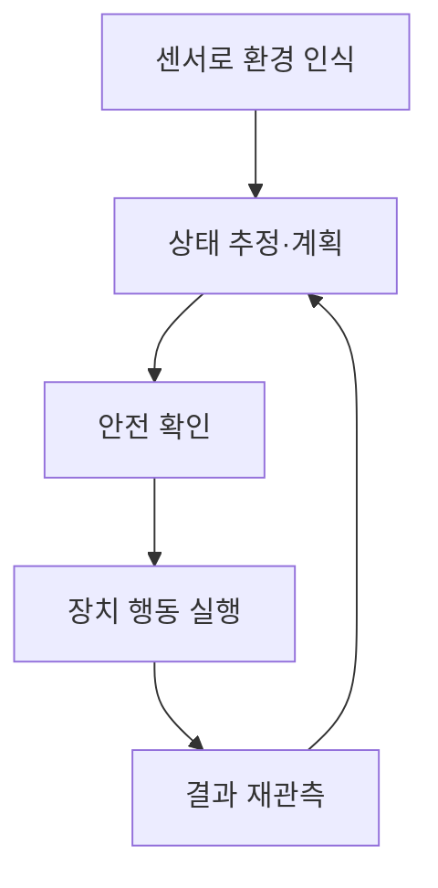
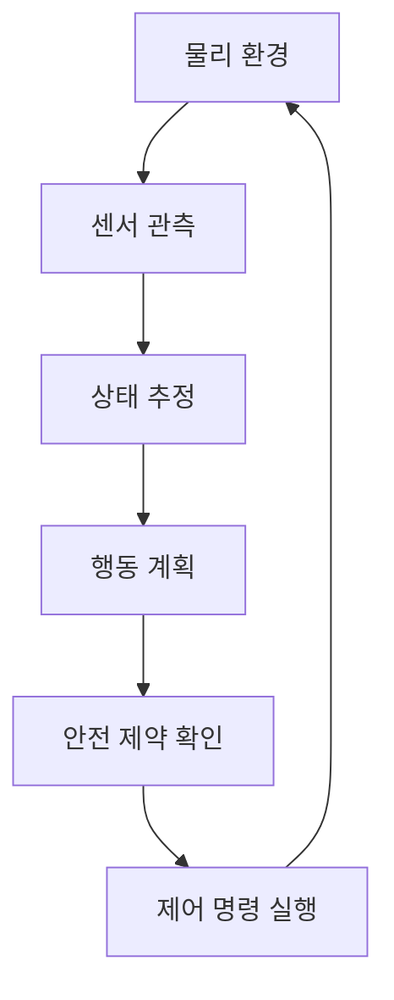

## 30초 인출

피지컬 AI는 센서로 물리 환경을 인식하고 로봇 등 장치로 행동하는 인공지능이다. 실행 결과를 다시 감지해 행동을 조정하는 폐루프가 핵심이다.

핵심 용어

- 체화된 지능(Embodied AI): 몸체와 센서로 환경과 상호작용하며 행동하는 인공지능이다.
- VLA: 시각·언어 입력을 로봇 행동과 연결하는 비전-언어-행동 모델이다.
- Sim2Real: 시뮬레이션에서 학습·검증한 정책을 실제 환경에 적용하는 과정이다.

## 1교시 예상문제 (10점)

---

피지컬 AI와 생성형 AI의 차이를 비교하시오.

---

## 1교시 10점 답안

### 1. 정의·목적
- 정의: 피지컬 AI는 물리 환경을 인식하고 장치를 제어해 실제 행동을 수행하는 AI다.
- 목적: 로봇·자율 시스템이 환경 변화에 맞춰 작업하도록 한다.

### 2. 비교
| 구분 | 생성형 AI | 피지컬 AI |
|---|---|---|
| 입력·출력 | 데이터에서 콘텐츠 생성 | 센서 입력에 따라 물리 행동 |
| 작동 환경 | 주로 디지털 정보 환경 | 물리 환경과 장치 |
| 오류 영향 | 잘못된 정보·콘텐츠 | 충돌·장치 손상 등 가능 |

### 3. 폐루프 동작

### 4. 유의점
물리 환경에는 지연, 불확실한 센서, 접촉·충돌 변수가 있다. 학습 성능만으로 실제 안전성을 판단하지 말고 제한된 시험과 안전 장치를 둔다.

**제언:** 시뮬레이션과 실제 환경에서 단계적으로 검증하고 위험 행동을 제한한다.

---

## 2~4교시 예상문제 (25점)

---

피지컬 AI의 구성과 폐루프 제어를 설명하고, 시뮬레이션에서 실제 환경으로 적용할 때의 안전 고려사항을 기술하시오. (예상)

---

## 2~4교시 25점 답안

### Ⅰ. 개념과 구성
피지컬 AI는 인식·판단·행동을 물리 장치에 연결해 실제 환경에서 작업하는 시스템이다.

| 구성 | 역할 |
|---|---|
| 센서 | 카메라·거리·힘 센서 등으로 상태 관측 |
| 인식·계획 모델 | 관측 해석과 목표 행동 결정 |
| 제어기·구동기 | 계획을 장치 명령으로 바꾸어 실행 |
| 안전 계층 | 운용 한계와 비상 정지 조건 적용 |

### Ⅱ. 폐루프 제어

실행 뒤 관측으로 상태를 갱신하므로 정해진 경로만 재생하는 개방 루프와 다르다. 고수준 계획과 저수준 제어를 분리하면 지연·부정확한 추론이 즉시 구동 명령으로 이어지는 위험을 줄일 수 있다.

### Ⅲ. Sim2Real과 검증
| 단계 | 확인 사항 |
|---|---|
| 시뮬레이션 | 물리 조건·센서 오차·작업 변화를 시험 |
| 제한 실물 시험 | 저위험 조건에서 시뮬레이터와 차이 측정 |
| 운용 전환 | 실패 감지·안전 정지·사람 개입 확인 |
| 지속 점검 | 환경 변화와 이상 동작 기록·재검증 |

시뮬레이션 성능만으로 실제 안전을 보장할 수 없다. 현실과 시뮬레이터의 차이, 센서 오류, 통신·계산 지연을 포함해 검증한다.

### Ⅳ. 기술적 제언
| 문제 | 해결 방안 |
|---|---|
| 실물 적용 범위가 넓어지며 검증되지 않은 환경에 모델이 투입될 수 있음 | 작동 환경과 허용 조건을 먼저 문서화하고, 검증된 조건부터 제한 운용을 시작해 범위를 단계적으로 확장한다. |

---

## 출제 이력과 검증 출처

- 140회 1교시 9번: 피지컬 AI와 생성형 AI 비교 문항.
