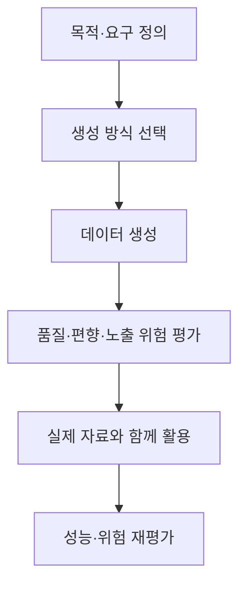
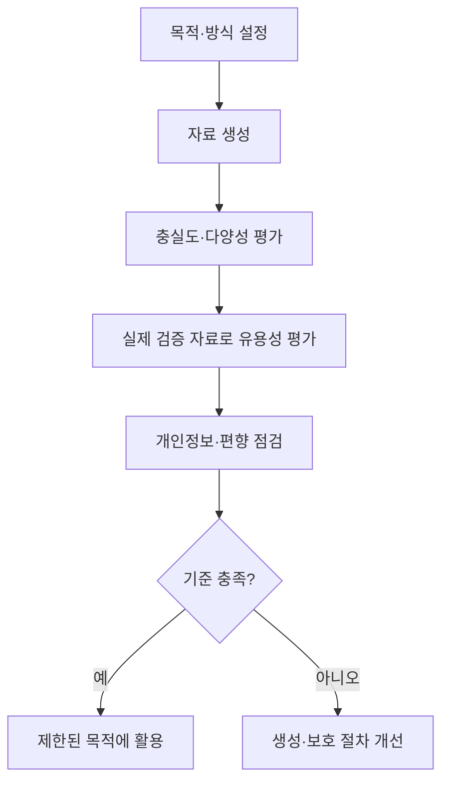

## 30초 인출

합성 데이터는 모델·규칙·시뮬레이션으로 생성한 데이터다. 부족한 학습 유형을 보완하지만 품질과 개인정보 노출 가능성을 별도로 검증해야 한다.

핵심 용어

- 충실도(Fidelity): 합성 데이터가 실제 데이터의 관련 분포와 관계를 얼마나 잘 재현하는지 나타낸다.
- 다양성(Diversity): 합성 데이터가 다양한 유형과 드문 사례를 포함하는 정도다.
- 모델 붕괴(Model Collapse): 생성 데이터에 반복 의존해 학습 분포의 다양성과 성능이 떨어지는 현상이다.

## 1교시 예상문제 (10점)

---

합성 데이터의 개념과 활용 시 유의사항을 설명하시오. (예상)

---

## 1교시 10점 답안

### 1. 정의·목적
- 정의: 합성 데이터는 모델·규칙·시뮬레이터로 생성한 인공 데이터다.
- 목적: 부족하거나 수집하기 어려운 학습·시험 사례를 보완한다.

### 2. 생성·활용

### 3. 평가 기준
| 기준 | 확인 내용 |
|---|---|
| 충실도 | 필요한 통계 특성과 관계를 재현하는가 |
| 다양성 | 희귀 유형과 의미 있는 변이를 포함하는가 |
| 유용성 | 실제 검증 자료에서 모델 성능에 도움이 되는가 |
| 개인정보 위험 | 원본 정보를 기억·노출할 가능성이 있는가 |

### 4. 유의점
합성 데이터라고 개인정보 위험이 자동으로 사라지지는 않는다. 원본 재현·기억 가능성과 모델 성능을 평가하고, 중요한 결과는 독립된 실제 자료로 확인한다.

**제언:** 실제 자료 기반 검증과 개인정보 위험 평가를 통과한 데이터를 목적에 맞게 사용한다.

---

## 2~4교시 예상문제 (25점)

---

합성 데이터(Synthetic Data)의 배경, 생성 기술, 품질 평가 및 한계를 설명하시오.

---

## 2~4교시 25점 답안

### Ⅰ. 개념과 필요성
합성 데이터는 실제 자료를 직접 복제하지 않고 생성 모델·규칙·시뮬레이션으로 만든 인공 데이터다. 수집 비용, 희귀 사례 부족, 민감 자료 접근 제약을 보완하는 데 활용된다.

| 필요성 | 예 |
|---|---|
| 드문 사례 보완 | 고장·재난 등 빈도가 낮은 조건의 시험 자료 |
| 개발 자료 확충 | 수집이 어렵거나 비용이 큰 자료의 보완 |
| 민감 자료 제약 | 접근 통제된 업무에서 대체·보완 자료 검토 |

합성 자료가 실데이터의 대표성을 자동으로 갖지는 않으며, 원본을 기억하거나 편향을 재현할 수도 있다.

### Ⅱ. 생성 방식과 평가
| 방식 | 설명 | 주의점 |
|---|---|---|
| 통계·규칙 기반 | 분포와 제약을 정해 표본 생성 | 설정한 가정의 적절성을 확인 |
| 생성 모델 기반 | GAN·VAE·확산 모델·언어 모델 등 사용 | 과적합·원본 기억·편향 가능성 |
| 시뮬레이션 기반 | 가상 환경에서 조건별 관측 생성 | 시뮬레이터와 현실의 차이 확인 |

### Ⅲ. 적용과 거버넌스
| 점검 영역 | 적용 방안 |
|---|---|
| 통계 품질 | 업무에 필요한 변수 관계와 분포 비교 |
| 활용성 | 별도 실제 자료에서 모델 성능 측정 |
| 개인정보 보호 | 원본 재식별·기억 가능성 평가, 접근·보유 통제 |
| 편향·이력 | 집단별 성능과 희귀 사례 점검, 생성 이력 기록 |

합성 여부만으로 익명성이나 규제상 면책을 단정할 수 없다. 목적과 민감도에 따라 위험을 검토하고 실·합성 자료의 비율과 출처를 관리한다. 생성 자료를 반복 학습에 쓰면 분포 편향과 다양성 감소도 관찰한다.

### Ⅳ. 기술적 제언
| 문제 | 해결 방안 |
|---|---|
| 통계적 유사성이 업무 성능으로 이어지지 않음 | 별도 실제 검증 자료에서 다운스트림 성능과 희귀 사례를 확인한다. |
| 생성물이 민감한 원본 정보를 기억·노출할 수 있음 | 노출 위험을 평가하고 접근과 이용 목적을 제한한다. |
| 반복 학습으로 자료 다양성이 낮아질 수 있음 | 실·합성 자료의 계보를 관리하고 분포 변화를 측정한다. |

---

## 출제 이력과 검증 출처

- 140회 3교시 3번: 대규모 학습 자료와 개인정보 보호 제약에 대응하는 합성 데이터의 배경·생성 기술·품질 평가·한계 문항.
