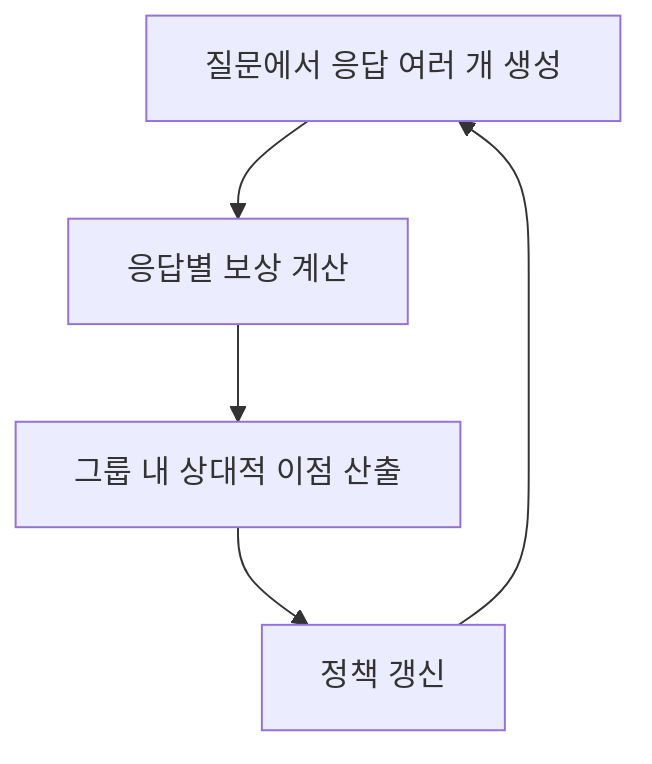
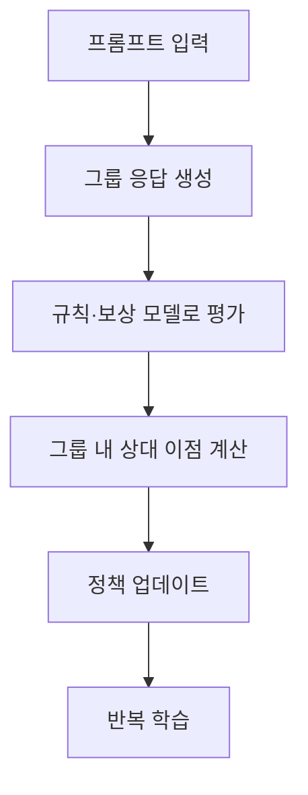

## 30초 인출

DeepSeek-R1은 강화학습으로 추론 성능을 높인 언어 모델 계열이다. R1-Zero는 지도 미세조정 없이 GRPO로 학습했고, R1은 콜드스타트 자료와 다단계 학습을 결합했다.

핵심 용어

- GRPO: 동일 질문에 대한 여러 응답의 상대적 보상을 이용해 정책을 갱신하는 강화학습 방법이다.
- 규칙 기반 보상: 수학 정답이나 코드 실행처럼 판정 가능한 결과를 기준으로 응답을 채점한다.
- 지식 증류: 큰 교사 모델의 응답이나 추론 예시를 이용해 작은 학생 모델을 학습하는 방법이다.

## 1교시 예상문제 (10점)

---

DeepSeek-R1의 추론 학습 특징과 GRPO의 개념을 설명하시오. (예상)

---

## 1교시 10점 답안

### 1. 정의·목적
- 정의: DeepSeek-R1은 강화학습과 지도학습을 조합해 추론 능력을 높인 언어 모델 계열이다.
- 목적: 수학·코드처럼 결과를 검증할 수 있는 문제에서 다단계 추론을 개선한다.

### 2. R1과 R1-Zero
| 모델 | 학습 특징 |
|---|---|
| R1-Zero | 지도 미세조정 없이 대규모 강화학습을 적용해 추론 행동을 학습 |
| R1 | 콜드스타트 자료와 강화학습 등 여러 단계를 결합해 응답 품질을 개선 |

### 3. GRPO

GRPO는 그룹 내 응답의 상대 점수로 정책을 조정하며, PPO의 별도 가치 모델을 두지 않는 구성이 특징이다.

### 4. 적용 한계
규칙으로 채점하기 어려운 창작·주관형 과제에는 보상 설계가 어렵다. 학습 데이터와 평가 과제의 범위를 구분해 성능을 검증한다.

**제언:** 판정 가능한 보상을 먼저 적용하고, 주관형 응답은 별도의 사람 평가와 안전 검토를 병행한다.

---

## 2~4교시 예상문제 (25점)

---

DeepSeek-R1의 학습 파이프라인과 GRPO의 정책 최적화 원리를 설명하고, 강화학습 적용 시 기대효과와 한계를 기술하시오. (예상)

---

## 2~4교시 25점 답안

### Ⅰ. 학습 배경과 목표
DeepSeek-R1은 검증 가능한 추론 문제에서 강화학습을 활용해 모델의 풀이 행동을 개선한 모델 계열이다. R1-Zero의 결과는 순수 강화학습의 가능성을 보였고, 최종 R1은 응답 품질을 위해 지도 자료와 강화학습을 조합했다.

| 구분 | 핵심 |
|---|---|
| R1-Zero | 지도 미세조정 없이 GRPO 기반 강화학습을 수행 |
| R1 | 콜드스타트 데이터, 강화학습, 거절 샘플링·지도 미세조정 등을 조합 |

### Ⅱ. GRPO 학습 흐름

그룹의 보상 차이로 응답을 비교해 정책을 업데이트한다. PPO처럼 별도 가치 모델을 두지 않는 방식으로 메모리 부담을 줄일 수 있으나, 보상 구성과 학습 설정에 따른 비용은 남는다.

### Ⅲ. 보상·평가와 한계
| 영역 | 설계·확인 |
|---|---|
| 보상 | 정답, 형식 준수, 실행 결과 등 판정 가능한 기준을 사용 |
| 평가 | 학습에 쓰지 않은 수학·코드 문제와 오류 유형으로 확인 |
| 한계 | 주관적 답변의 정답 기준 부족, 보상 해킹, 긴 응답·반복 생성 가능성 |
| 배포 | 지식 증류 모델은 별도 품질·안전 평가 후 활용 |

규칙 기반 채점은 판정 가능한 작업에서 유용하지만 모든 오류를 막지는 못한다. 연구 결과를 일반 분야 성능으로 확대 해석하지 말고 별도 검증한다.

### Ⅳ. 기술적 제언
| 문제 | 해결 방안 |
|---|---|
| 보상이 실제 사용자 가치와 맞지 않음 | 과제별 평가 기준을 정의하고 사람 평가와 자동 평가를 함께 사용한다. |
| 보상 해킹이나 반복 출력 | 적대적 평가 사례와 응답 길이·반복 지표를 점검한다. |

---

## 출제 이력과 검증 출처

- 원문에 미출제로 기록되어 있어 예상 문항으로 구성함.
- [DeepSeek-R1 논문](https://arxiv.org/abs/2501.12948)
