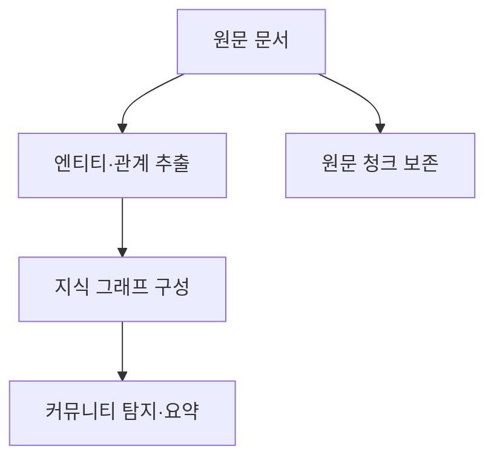
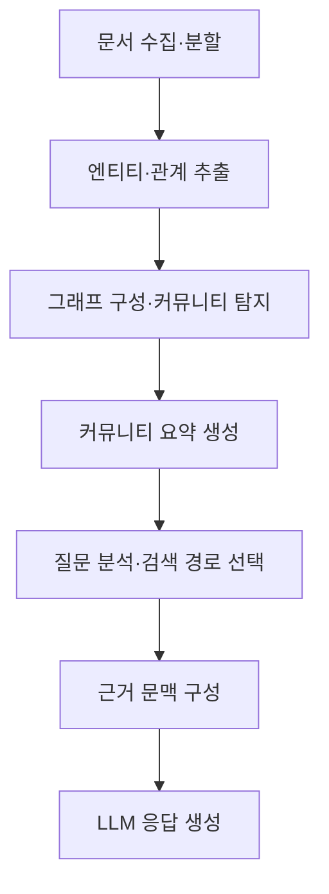

## 30초 인출

GraphRAG는 검색 증강 생성에 지식 그래프와 커뮤니티 요약을 활용하는 접근이다. 관계가 있는 특정 항목을 찾거나 문서 집합 전체에 관한 질문을 처리한다.

핵심 용어

- 지식 그래프: 엔티티를 노드, 관계를 간선으로 표현한 구조화 지식이다.
- 커뮤니티 요약: 그래프에서 밀접한 엔티티 집단을 요약한 검색 자료다.
- Global Search: 커뮤니티 요약을 종합해 코퍼스 전반에 관한 질문에 답하는 검색 방식이다.
- Local Search: 질문과 관련된 엔티티·관계와 원문 자료를 이용하는 검색 방식이다.

## 1교시 예상문제 (10점)

---

GraphRAG의 개념과 인덱싱·검색 흐름을 설명하시오. (예상)

---

## 1교시 10점 답안

### 1. 정의·목적
- 정의: GraphRAG는 지식 그래프와 문서 검색을 결합해 검색 문맥을 구성하는 RAG 접근이다.
- 목적: 엔티티 관계와 문서 집합의 전반 주제를 검색·응답에 반영한다.

### 2. 인덱싱 흐름

### 3. 질의 방식
| 방식 | 활용 |
|---|---|
| Local Search | 질문 관련 엔티티·이웃 관계와 원문 청크를 조회 |
| Global Search | 커뮤니티 요약을 종합해 전체 코퍼스 질문에 응답 |

### 4. 고려점
인덱싱과 요약 생성에는 모델 호출·검증 비용이 들며, 추출된 관계의 오류가 응답에 전파될 수 있다.

**제언:** 그래프 품질과 검색 정확도를 표본 점검하고 인덱싱 비용을 측정한다.

---

## 2~4교시 예상문제 (25점)

---

GraphRAG의 인덱싱 구조와 Global Search·Local Search의 동작을 설명하고, 도입 시 고려사항을 기술하시오. (예상)

---

## 2~4교시 25점 답안

### Ⅰ. 구조와 목적
GraphRAG는 문서의 엔티티·관계를 그래프로 구조화하고, 원문 청크 및 그래프 요약을 검색에 활용하는 RAG 접근이다.

| 구성 | 역할 |
|---|---|
| 추출기 | 문서에서 엔티티·관계·주요 정보를 추출 |
| 지식 그래프 | 항목과 관계를 연결해 저장 |
| 커뮤니티 요약 | 그래프 집단별 요약을 검색 자료로 제공 |
| 원문 청크 | 근거가 되는 비정형 원문을 보존 |

### Ⅱ. 인덱싱·질의 흐름

### Ⅲ. 검색 방식과 운영
| 검색 방식 | 문맥 구성 | 적합한 질문 |
|---|---|---|
| Local | 관련 엔티티·이웃 관계와 원문 청크 | 특정 인물·제품의 관계나 세부 사실 |
| Global | 관련 커뮤니티 보고서를 종합 | 코퍼스 전반의 주제·경향 요약 |

GraphRAG 구현은 인덱싱과 질의 방식이 버전·설정에 따라 달라질 수 있다. 그래프 추출 오류, 오래된 요약, 질의 유형 오선택을 점검하고, 업데이트 시 재색인 비용과 근거 추적성을 고려한다.

### Ⅳ. 기술적 제언
| 문제 | 해결 방안 |
|---|---|
| 그래프 추출 오류가 답변 근거로 이어짐 | 중요 관계를 원문과 대조하고 근거 청크를 응답에 연결한다. |
| 모든 질문에 그래프 인덱싱을 적용해 비용이 커짐 | 질문 유형과 효과를 평가해 필요한 코퍼스·검색 경로에 한정한다. |

---

## 출제 이력과 검증 출처

- 원문에 미출제로 기록되어 있어 예상 문항으로 구성함.
- [Microsoft GraphRAG 개요](https://microsoft.github.io/graphrag/)
- [GraphRAG 검색 방식](https://microsoft.github.io/graphrag/query/overview/)
