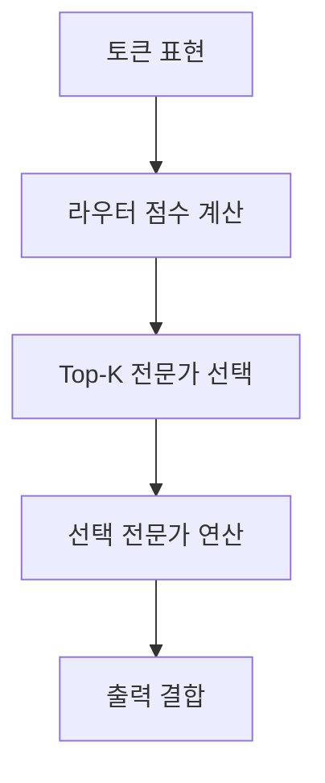
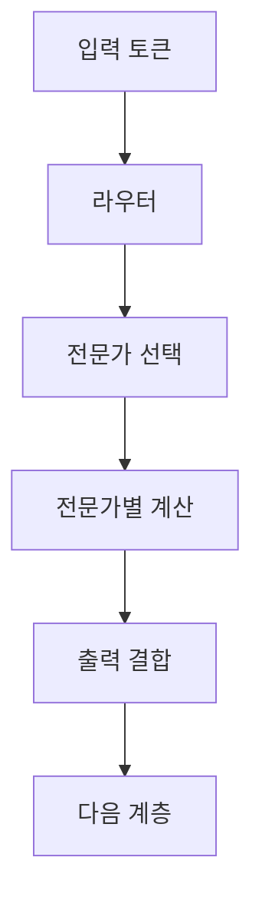

## 30초 인출

MoE는 라우터가 입력별 전문가를 골라 일부 전문가만 활성화하는 신경망 구조다. 전체 파라미터 용량과 토큰당 연산량을 분리할 수 있지만, 라우팅·통신·메모리 부담을 함께 고려해야 한다.

핵심 용어

- 전문가(Expert): 입력의 일부를 처리하도록 학습된 신경망 하위 모듈이다.
- 라우터(Router): 입력 토큰을 처리할 전문가에 할당하는 구성요소다.
- 희소 활성화: 토큰마다 일부 전문가만 실행하는 방식이다.
- 부하 균형: 토큰이 전문가에 고르게 배분되도록 라우팅을 조정하는 일이다.

## 1교시 예상문제 (10점)

---

트랜스포머와 MoE(Mixture of Experts)를 설명하시오.

---

## 1교시 10점 답안

### 1. 정의·목적
- 정의: 트랜스포머는 어텐션으로 토큰 간 관계를 처리하는 신경망 구조이며, MoE는 일부 전문가를 선택적으로 활성화하는 구조다.
- 목적: MoE는 토큰당 계산을 제한하면서 전문가 파라미터를 확장한다.

### 2. 구조 비교
| 구조 | 핵심 구성 |
|---|---|
| 트랜스포머 | 어텐션과 피드포워드 계층을 반복 |
| MoE 계층 | 라우터, 여러 전문가, 선택된 전문가의 출력 결합 |

### 3. 라우팅 흐름

### 4. 고려점
전문가 선택이 한쪽에 몰리면 처리 병목이 생길 수 있다. 분산 배치에서는 전문가 간 통신과 메모리도 비용에 포함한다.

**제언:** 정확도와 함께 전문가 부하·통신량·메모리 사용량을 측정한다.

---

## 2~4교시 예상문제 (25점)

---

MoE의 구성과 토큰 라우팅·희소 활성화 원리를 설명하고, 대규모 분산 학습·추론 시의 주요 고려사항을 기술하시오. (예상)

---

## 2~4교시 25점 답안

### Ⅰ. 개념과 구조
MoE는 여러 전문가와 라우터로 구성된 조건부 계산 구조다. 라우터는 입력에 따라 전문가를 선택하고, 선택된 전문가의 출력으로 다음 계층을 계산한다.

| 구성 | 기능 |
|---|---|
| 라우터 | 토큰별 전문가 점수 산출·할당 |
| 전문가 | 할당된 토큰의 표현을 처리 |
| 결합 단계 | 선택된 전문가 출력의 가중 결합 |

### Ⅱ. 토큰 처리

희소 라우팅은 모든 전문가를 매 토큰마다 계산하는 방식보다 활성 연산을 줄일 수 있다. 실제 지연과 메모리 사용은 모델 배치, 장치 간 통신, 구현에 따라 달라진다.

### Ⅲ. 확장과 운영상 고려
| 고려 영역 | 내용 |
|---|---|
| 부하 균형 | 특정 전문가로 토큰이 몰리는지 확인 |
| 통신 | 분산 전문가 간 토큰 이동과 All-to-All 비용 측정 |
| 메모리 | 비활성 전문가도 적재·분산·오프로딩 방식에 따라 메모리 요구가 생김 |
| 품질 | 라우팅 안정성, 토큰 용량 제한, 드롭 여부를 평가 |

부하 균형 보조 손실은 흔한 기법이나 모든 MoE가 동일하게 사용하지는 않는다. 성능 비교는 토큰당 연산량만이 아니라 실제 시스템 처리량과 지연을 기준으로 한다.

### Ⅳ. 기술적 제언
| 문제 | 해결 방안 |
|---|---|
| 토큰 쏠림으로 일부 전문가가 병목이 됨 | 라우팅 통계를 모니터링하고 모델에 적합한 부하 분산 기법을 적용한다. |
| 분산 통신이 연산 절감 효과를 상쇄함 | 전문가 배치와 통신 토폴로지를 조정하고 실측 지연으로 구성안을 비교한다. |

---

## 출제 이력과 검증 출처

- 137회 1교시 7번: 트랜스포머(Transformer)와 MoE(Mixture of Experts)를 설명하시오.
- [Switch Transformer 논문](https://arxiv.org/abs/2101.03961)
