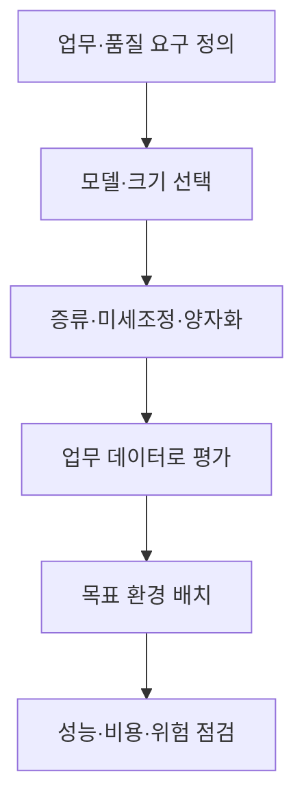
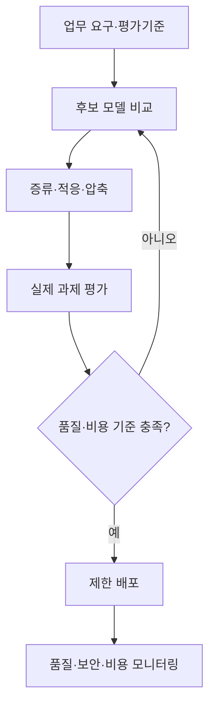

## 30초 인출

소형 언어 모델(sLM)은 상대적으로 적은 자원으로 실행하도록 구성한 언어 모델이다. 업무 범위를 좁히고 증류·양자화·검색 결합을 활용해 배치 비용과 지연을 관리한다.

핵심 용어

- 지식 증류: 큰 교사 모델의 출력·중간 표현을 활용해 학생 모델을 학습하는 방법이다.
- 양자화: 가중치·활성값 표현 정밀도를 낮춰 메모리·연산 부담을 줄이는 방법이다.
- PEFT: 모델 전체 대신 일부 추가 파라미터를 학습해 미세조정 비용을 낮추는 기법군이다.

## 1교시 예상문제 (10점)

---

소형 언어 모델의 개념과 도입 시 고려사항을 설명하시오. (예상)

---

## 1교시 10점 답안

### 1. 정의·목적
- 정의: sLM은 제한된 계산·메모리 환경에서도 사용할 수 있도록 설계·선택된 소형 언어 모델이다.
- 목적: 비용·지연·배치 제약이 있는 업무에 필요한 언어 처리를 제공한다.

### 2. 경량화 방법
| 방법 | 역할 |
|---|---|
| 지식 증류 | 교사 모델 출력 등을 이용해 학생 모델을 학습 |
| 양자화 | 수치 정밀도를 낮춰 메모리·연산 부담 완화 |
| PEFT | 일부 파라미터만 학습해 업무 적응 비용 완화 |

### 3. 활용 흐름

### 4. 고려점
작은 모델이 모든 업무에서 큰 모델보다 빠르거나 저렴하다고 단정할 수 없다. 목표 장치에서 품질·지연·운영비를 함께 측정한다.

**제언:** 실제 업무 평가와 배치 환경 측정을 거쳐 필요한 모델 크기와 기법을 정한다.

---

## 2~4교시 예상문제 (25점)

---

소형 언어 모델의 도입 배경과 경량화 기술을 설명하고, 업무에 적용하기 위한 모델 선정·평가·운영 방안을 기술하시오. (예상)

---

## 2~4교시 25점 답안

### Ⅰ. 개념과 적용 배경
sLM은 자원 제약과 특정 업무 요구를 고려해 선정·구성하는 언어 모델이다. 모델 크기 자체만으로 품질·비용 우위가 결정되지는 않으므로 실제 과제 기준으로 비교해야 한다.

| 적용 요인 | 검토 내용 |
|---|---|
| 비용·지연 | 요청량, 하드웨어, 지연 목표 |
| 배치·보안 | 클라우드·온프레미스·단말 요건 |
| 업무 범위 | 정형 응답, 도메인 지식, 다단계 추론 요구 |

### Ⅱ. 경량화·적응 기술
| 기술 | 원리 | 유의점 |
|---|---|---|
| 지식 증류 | 교사 출력을 활용해 학생 모델 학습 | 교사 오류가 전이될 수 있음 |
| 양자화 | 수치 표현 정밀도를 낮춰 모델을 압축 | 품질 저하·하드웨어 호환성 확인 |
| PEFT·LoRA | 일부 추가 파라미터를 학습 | 데이터 품질과 과적합 점검 |
| RAG | 외부 자료를 검색해 응답 문맥에 제공 | 검색 근거·최신성·접근 권한 관리 |

### Ⅲ. 선정과 운영 평가

평가는 실제 질의, 실패 사례, 지연과 자원 사용량을 포함한다. RAG를 결합해도 근거 검색과 생성의 오류 가능성은 남으므로 근거성·권한 검사를 별도로 둔다.

### Ⅳ. 기술적 제언
| 문제 | 해결 방안 |
|---|---|
| 모든 요청을 같은 크기의 모델이 처리하면 단순 업무에도 비용이 들고 복합 업무는 품질이 모자랄 수 있음 | 과업 난도와 품질 기준에 따라 SLM의 직접 응답과 상위 모델 이관 경로를 나누고 실제 요청군에서 비교한다. |

---

## 출제 이력과 검증 출처

- 원문에 미출제로 기록되어 있어 예상 문항으로 구성함.
- [Knowledge Distillation 논문](https://arxiv.org/abs/1503.02531)
