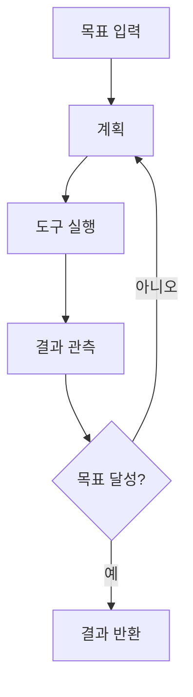
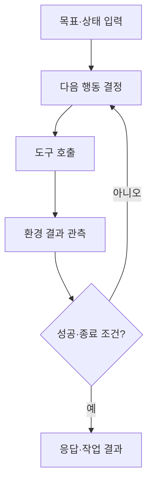

## 30초 인출

에이전틱 AI는 목표를 받아 계획을 세우고 도구를 실행해 결과를 얻는 AI 시스템이다. 실행 결과를 확인해 계획을 갱신하며, 권한과 반복 횟수를 통제한다.

핵심 용어

- 에이전트: 관측을 바탕으로 목표 달성을 위한 행동을 선택하는 시스템이다.
- ReAct: 추론과 도구 행동을 번갈아 수행하고 결과 관측을 다음 단계에 반영하는 패턴이다.
- 도구 호출: 모델이 정해진 인터페이스에 따라 외부 API·검색기 등의 기능을 요청하는 동작이다.
- 인간 개입(HITL): 중요한 단계에서 사람이 검토·승인하거나 작업을 인계받는 방식이다.

## 1교시 예상문제 (10점)

---

에이전틱 AI(Agentic AI)에 대하여 설명하시오.

---

## 1교시 10점 답안

### 1. 정의·목적
- 정의: 에이전틱 AI는 목표에 맞춰 계획을 수립하고 도구를 호출해 여러 단계를 수행하는 시스템이다.
- 목적: 단발성 응답을 넘어 복합 과업의 실행을 지원한다.

### 2. 구성
| 구성 | 기능 |
|---|---|
| 모델·계획기 | 목표를 하위 단계와 행동으로 변환 |
| 상태·메모리 | 진행 상황과 필요한 맥락을 관리 |
| 도구 | 검색·계산·업무 API 등 외부 기능 수행 |
| 제어기 | 실행·관측·재계획과 종료를 관리 |

### 3. 동작

### 4. 통제
실행 루프에는 최대 단계, 시간 제한, 권한 범위, 실패 처리와 감사 기록을 둔다. 파괴적·외부 영향이 큰 작업은 사람 승인으로 넘긴다.

**제언:** 도구 권한을 최소화하고 고위험 작업에는 승인·중단 경로를 둔다.

---

## 2~4교시 예상문제 (25점)

---

에이전틱 AI의 구성과 ReAct 기반 동작 절차를 설명하고, 업무 적용 시 안전한 도구 실행을 위한 통제 방안을 기술하시오. (예상)

---

## 2~4교시 25점 답안

### Ⅰ. 개념과 구성
에이전틱 AI는 모델의 판단을 계획기·상태 관리·도구 실행과 결합해 목표 지향 작업을 수행하는 시스템이다. 자율성은 모델 단독 속성이라기보다 실행 권한과 제어 구조에 좌우된다.

| 구성 | 역할 |
|---|---|
| 모델·계획기 | 목표 해석, 단계 분해, 다음 행동 제안 |
| 상태·메모리 | 입력·관측·작업 진행 상황 유지 |
| 도구·환경 | 검색, 계산, 업무 시스템 등과 상호작용 |
| 실행 제어기 | 권한 검사, 제한, 승인, 종료를 적용 |

### Ⅱ. ReAct 실행 루프

관측 결과는 다음 계획에 반영된다. 도구 오류나 목표 미달 때 재시도할 수 있으나, 호출 결과가 불확실하면 추가 실행보다 중단·사람 인계를 선택해야 한다.

### Ⅲ. 업무 적용 통제
| 위험 | 통제 |
|---|---|
| 반복 호출·비용 증가 | 최대 단계·시간·예산 제한, 반복 감지 |
| 권한 초과·부작용 | 최소 권한, 입력 검증, 도구별 허용 목록 |
| 외부 상태 변경 | 실행 전 승인, 멱등성·롤백 설계 |
| 결과 오류 누적 | 근거 확인, 중요 결과의 독립 검증, 감사 로그 |

### Ⅳ. 기술적 제언
| 문제 | 해결 방안 |
|---|---|
| 에이전트 도입 범위가 읽기·쓰기 작업을 구분하지 않고 넓어질 수 있음 | 읽기 전용 업무부터 시작하고, 되돌릴 수 있는 작업과 외부 상태 변경 작업을 구분해 승인 수준을 단계적으로 정한다. |

---

## 출제 이력과 검증 출처

- 136회 1교시 3번: 에이전틱 AI(Agentic AI).
- [ReAct 논문](https://arxiv.org/abs/2210.03629)
