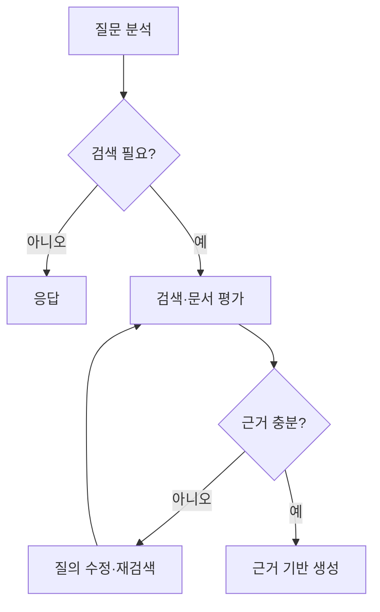
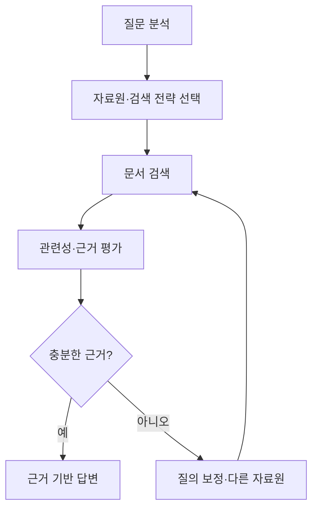

## 30초 인출

에이전틱 RAG는 질문에 따라 검색 여부·자료원·검색 반복을 조정하는 검색 증강 생성 방식이다. 검색 결과를 평가하고 부족하면 질의를 고치거나 다른 자료원을 찾는다.

핵심 용어

- 검색 라우터: 질문에 따라 검색 도구나 자료원을 선택한다.
- 질의 재작성: 검색에 적합하도록 질문 표현을 바꾸거나 하위 질문으로 나눈다.
- 검색 평가기: 가져온 문서가 질문에 관련되고 답변 근거로 쓸 수 있는지 평가한다.
- CRAG: 검색 품질 평가에 따라 보정 행동을 취하는 연구 접근이다.

## 1교시 예상문제 (10점)

---

에이전틱 RAG의 개념과 검색 제어 흐름을 설명하시오. (예상)

---

## 1교시 10점 답안

### 1. 정의·목적
- 정의: 에이전틱 RAG는 에이전트가 검색 전략과 반복 여부를 조정하는 RAG 구조다.
- 목적: 복합·모호한 질문에서 검색 문맥을 개선한다.

### 2. 흐름

### 3. 주요 구성
| 구성 | 역할 |
|---|---|
| 라우터 | 검색 여부와 자료원 선택 |
| 재작성기 | 검색어 수정·질문 분해 |
| 검색기·평가기 | 후보 문서 회수와 적합성 확인 |
| 생성기 | 근거를 이용해 응답 작성 |

### 4. 고려점
반복 검색은 지연과 비용을 높일 수 있고, 관련성 평가가 틀리면 검색 루프가 개선되지 않는다.

**제언:** 재시도 한도와 근거 충분성 기준을 정하고 질문별 성능을 평가한다.

---

## 2~4교시 예상문제 (25점)

---

기존 단순 RAG와 비교하여 에이전틱 RAG의 구조와 검색 보정 절차를 설명하고, 품질·비용 통제 방안을 기술하시오. (예상)

---

## 2~4교시 25점 답안

### Ⅰ. 개념과 필요성
단순 RAG는 고정된 검색 단계를 거쳐 검색 결과를 생성 모델에 제공한다. 에이전틱 RAG는 질문과 검색 결과에 따라 검색 경로를 바꾸거나 재시도한다.

| 구분 | 단순 RAG | 에이전틱 RAG |
|---|---|---|
| 흐름 | 고정 검색 후 생성 | 질문·결과에 따라 분기·반복 |
| 검색 제어 | 사전에 정한 검색기 | 라우팅·재작성·보정 포함 가능 |
| 운영 부담 | 상대적으로 단순 | 추가 모델 호출·정책 관리 필요 |

### Ⅱ. 검색·보정 절차

보정 방식에는 하위 질문 분해, 질의 재작성, 다른 검색원 이용 등이 있다. CRAG는 검색 문서의 품질 평가에 따라 보정 동작을 선택하는 연구 방식이며, 모든 에이전틱 RAG 구현의 필수 구성은 아니다.

### Ⅲ. 품질·비용 통제
| 지표·통제 | 확인 내용 |
|---|---|
| 검색 품질 | 관련 문서 회수, 근거 정확성, 누락 |
| 답변 품질 | 근거 충실도, 응답 정확성, 불확실성 표현 |
| 운영 비용 | 검색 횟수, 토큰·외부 호출, 응답 지연 |
| 보안 | 자료원별 권한, 검색 문서의 신뢰성, 민감정보 처리 |

### Ⅳ. 기술적 제언
| 문제 | 해결 방안 |
|---|---|
| 검색을 반복해도 관련 근거가 늘지 않음 | 최대 재시도와 종료 기준을 두고 근거 부족 시 보류·추가 확인으로 전환한다. |
| 라우팅이 권한 밖 문서를 선택함 | 사용자 권한을 검색 단계에 전달하고 응답 근거와 접근 정책을 검증한다. |

---

## 출제 이력과 검증 출처

- 원문에 미출제로 기록되어 있어 예상 문항으로 구성함.
- [Corrective RAG 논문](https://arxiv.org/abs/2401.15884)
