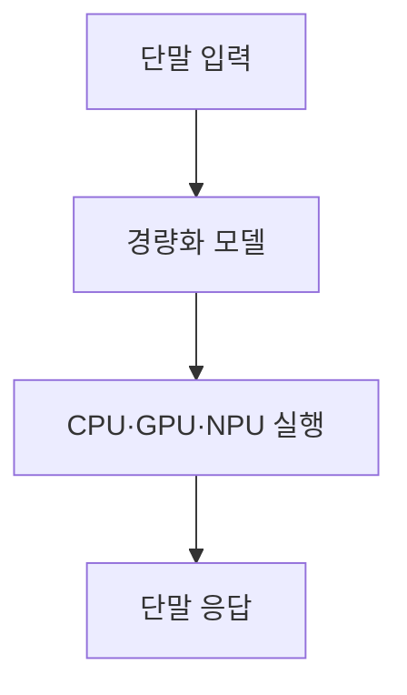
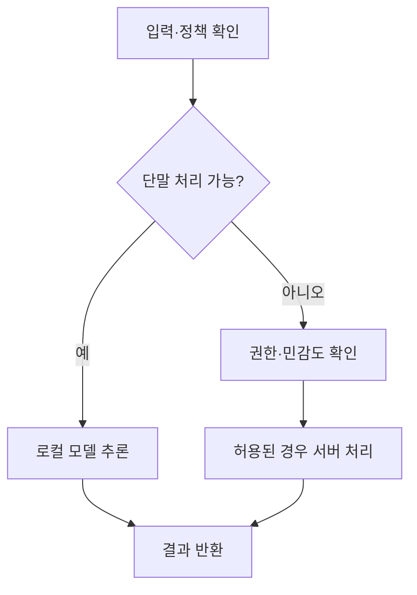

## 30초 인출

온디바이스 AI는 최종 사용자 기기에서 AI 추론을 수행하는 배치 방식이다. 네트워크 의존도를 줄일 수 있지만 기기의 연산·메모리·전력 한계 안에서 모델을 운영해야 한다.

핵심 용어

- 온디바이스 AI: 스마트폰·PC·차량 등 사용자 기기에서 AI 처리를 수행하는 방식이다.
- NPU: 신경망 연산에 맞춘 병렬 계산을 지원하는 프로세서다.
- 양자화: 가중치나 활성값의 수치 정밀도를 낮춰 메모리·연산 부담을 줄인다.
- 하이브리드 AI: 단말과 클라우드의 역할을 나눠 작업을 처리한다.

## 1교시 예상문제 (10점)

---

온디바이스 AI의 개념과 핵심 기술을 설명하시오. (예상)

---

## 1교시 10점 답안

### 1. 정의·목적
- 정의: 온디바이스 AI는 사용자 단말 안에서 모델 추론을 실행하는 방식이다.
- 목적: 네트워크 연결이 불안정한 상황에서도 응답하고 단말 내 처리를 활용한다.

### 2. 구조와 처리

### 3. 핵심 기술
| 기술 | 역할 |
|---|---|
| 양자화·가지치기 | 모델 메모리·연산 요구를 줄이는 방법 |
| NPU·런타임 최적화 | 단말 하드웨어에 맞춰 추론 수행 |
| 증류·PEFT | 모델 경량화나 업무 적응을 지원 |

### 4. 제약
로컬 처리만으로 모든 프라이버시 위험이 없어지는 것은 아니며, 기기 분실·앱 권한·로그 저장도 고려해야 한다. 모델 성능과 배터리·발열을 목표 장치에서 시험한다.

**제언:** 기기별 품질·지연·전력 사용을 측정하고 민감정보 처리 경계를 명확히 한다.

---

## 2~4교시 예상문제 (25점)

---

온디바이스 AI의 개념·필요성·핵심 기술·적용 분야를 설명하시오.

---

## 2~4교시 25점 답안

### Ⅰ. 개념과 필요성
온디바이스 AI는 추론을 최종 단말에서 실행하는 구조다. 통신 왕복 없이 처리할 수 있어 지연·연결성 측면의 이점이 있지만, 결과는 하드웨어와 모델 구성에 좌우된다.

| 필요성 | 효과와 조건 |
|---|---|
| 응답 지연 관리 | 네트워크 왕복을 줄이나 기기 자체 계산 시간은 발생 |
| 연결성 | 오프라인 기능을 제공할 수 있음 |
| 데이터 관리 | 외부 전송을 줄일 수 있으나 단말 내 보안 관리가 필요 |

### Ⅱ. 구조와 핵심 기술
| 기술 | 작동 |
|---|---|
| 양자화 | 저정밀 표현으로 모델 저장·계산 부담 완화 |
| 가지치기·증류 | 중요도가 낮은 연결 제거 또는 학생 모델 학습 |
| 가속기·런타임 | CPU·GPU·NPU와 모델 실행 환경을 조정 |
| 하이브리드 처리 | 단말 처리와 서버 처리를 과제별로 분담 |

### Ⅲ. 적용 분야와 평가
| 분야 | 적용 예 | 평가 항목 |
|---|---|---|
| 모바일 | 음성 입력·번역·사진 분류 | 지연, 정확도, 전력 |
| 차량·산업 | 센서 기반 인식·경보 | 안전성, 견고성, 응답 시간 |
| 웨어러블·가전 | 음성·상태 인식 | 메모리, 배터리, 개인정보 처리 |

단말 처리는 전송 위험을 줄일 수 있지만 개인정보 보호를 자동 보장하지 않는다. 데이터 저장·접근, 앱 권한, 업데이트와 모델 배포를 함께 관리한다.

### Ⅳ. 기술적 제언
| 문제 | 해결 방안 |
|---|---|
| 모델 압축으로 품질이 저하되거나 기기별 성능이 다름 | 실제 대상 기기에서 정확도·지연·전력·발열을 평가해 지원 범위를 정한다. |
| 서버 전환 시 민감 정보가 과도하게 전송됨 | 최소 정보 전송과 권한 정책을 적용하고 사용자에게 처리 경로를 알린다. |

---

## 출제 이력과 검증 출처

- 127회 2교시 4번: 온디바이스 AI의 개념·필요성·핵심 기술·적용 분야를 설명하는 문항.
