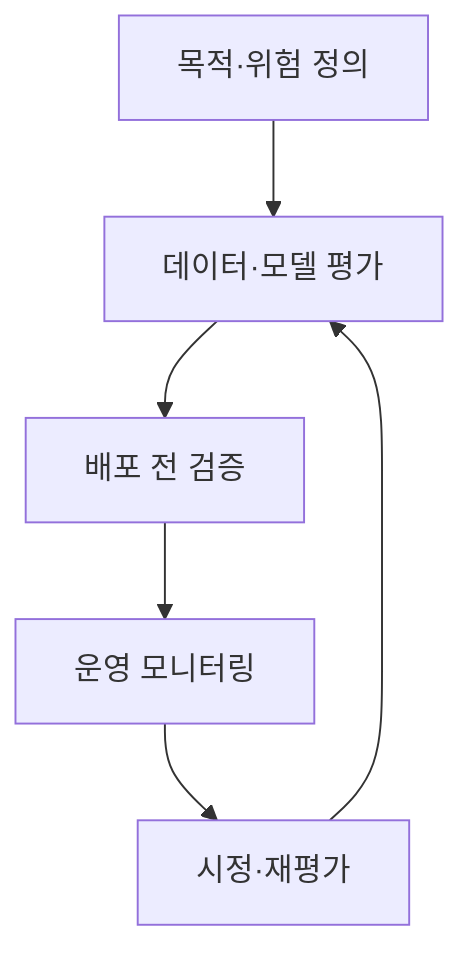
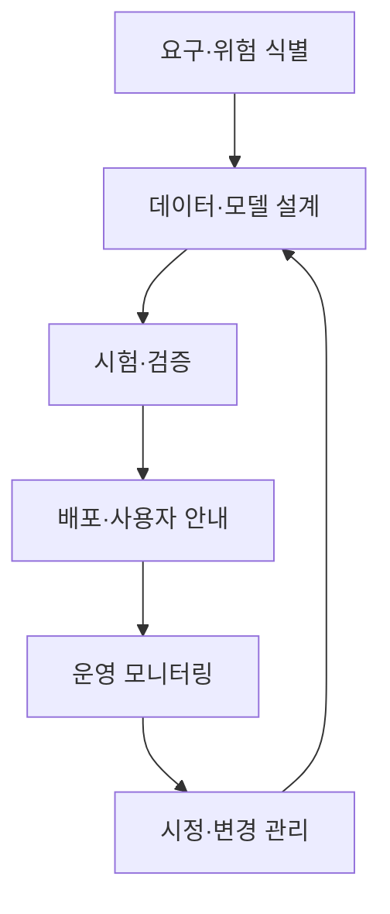

## 30초 인출

인공지능 신뢰성은 AI 시스템이 의도한 환경에서 안전하고 공정하며 견고하게 동작하는지 평가하는 성질과 관리 활동이다. 설계부터 운영까지 위험을 식별·검증하고 근거를 남긴다.

핵심 용어

- 견고성: 입력 변동·오류가 있어도 성능과 동작이 허용 수준을 유지하는 성질이다.
- 설명가능성: 모델 결과의 근거를 사용자·운영자가 이해할 수 있게 하는 정도다.
- 공정성: 집단별 차별적 불이익을 식별하고 줄이기 위해 평가하는 기준이다.
- CAT: TTA가 운영하는 민간 자율 AI 신뢰성 검·인증 제도다.

## 1교시 예상문제 (10점)

---

인공지능 신뢰성의 개념과 핵심 속성을 설명하시오.

---

## 1교시 10점 답안

### 1. 정의·목적
- 정의: 인공지능 신뢰성은 AI가 의도한 용도와 환경에서 신뢰할 만하게 동작하도록 위험을 관리·평가하는 성질과 과정이다.
- 목적: 사용자·사회에 미치는 위해를 줄이고 책임 있는 사용을 뒷받침한다.

### 2. 핵심 속성
| 속성 | 확인 내용 |
|---|---|
| 안전성 | 오작동·위해 가능성과 보호 조치 |
| 견고성 | 입력 변화·오류 상황에서의 안정성 |
| 공정성 | 집단별 성능 차이와 편향 |
| 투명성·설명가능성 | 처리·결과의 근거와 한계 전달 |
| 책임성·보안·개인정보 | 책임 주체, 공격 대응, 자료 보호 |

### 3. 생애주기 점검

### 4. 유의점
속성 간에는 상충이 생길 수 있어 용도와 위험에 맞춰 평가 기준을 구체화한다. 한 번의 시험이나 단일 지표만으로 신뢰성을 확정할 수 없다.

**제언:** 사용 맥락별 위험과 측정 기준을 정하고 전 생애주기에서 재평가한다.

---

## 2~4교시 예상문제 (25점)

---

인공지능 신뢰성의 핵심 속성과 생애주기 관리 방안을 설명하고, TTA의 CAT 검·인증 제도의 역할과 적용 시 유의사항을 기술하시오. (예상)

---

## 2~4교시 25점 답안

### Ⅰ. 신뢰성 개념·속성
신뢰성은 AI 시스템이 의도된 사용 조건에서 요구되는 성능과 안전성을 갖추도록 위험을 식별·평가·관리하는 접근이다.

| 속성 | 평가 예 |
|---|---|
| 안전성·견고성 | 오류·공격·분포 변화에서 위해와 성능 저하 확인 |
| 공정성 | 집단별 결과 차이와 데이터 대표성 확인 |
| 투명성·설명가능성 | 사용 범위·한계·결정 근거 전달 |
| 책임성·보안·개인정보 | 책임 주체와 보안·자료 관리 절차 확인 |

### Ⅱ. 생애주기 관리

시험 지표는 용도·사용자·영향에 따라 정한다. 데이터·모델이 바뀌거나 운용 환경이 달라지면 재평가한다.

### Ⅲ. CAT 제도와 적용
| 항목 | 설명 |
|---|---|
| 제도 성격 | TTA의 민간 자율 AI 신뢰성 검·인증 제도 |
| 평가 방향 | 참조 표준과 정해진 요구사항에 따라 시스템·운영 증거를 확인 |
| 활용 | 제품·서비스의 신뢰성 활동을 점검하고 개선 근거로 활용 |
| 한계 | 인증은 특정 기준·범위의 평가이며 모든 상황의 무위험을 보장하지 않음 |

TTA는 2025년 CAT 2.0 운영을 시작했다고 안내한다. 적용 신청 시점의 최신 모델과 요구사항을 확인하며, CAT를 법정 의무 인증이나 성능 보증으로 확대 해석하지 않는다.

### Ⅳ. 기술적 제언
| 문제 | 해결 방안 |
|---|---|
| 인증 통과를 전체 운용 환경의 안전 보증으로 오해함 | 인증 범위·기준·버전을 확인하고 기관 자체의 운영 모니터링을 병행한다. |
| 모델·데이터 변경 뒤 기존 평가가 유효하다고 간주됨 | 변경 영향에 따라 재시험하고 근거·시정 이력을 관리한다. |

---

## 출제 이력과 검증 출처

- 133회 1교시 8번: 인공지능 신뢰성의 개념과 핵심 속성.
- 137회 1교시 8번: AI 신뢰성 검인증 제도(CAT).
- [TTA CAT 2.0 운영 안내](https://www.tta.kr/tta/selectBbsNttView.do?bbsNo=107&integrDeptCode=&key=76&nttNo=14212&pageIndex=3&searchCnd=all&searchCtgry=&searchKrwd=)
- [TTA 인공지능 신뢰성 인증 가이드](https://tta-trustworthy-ai.gitbook.io/cat)
