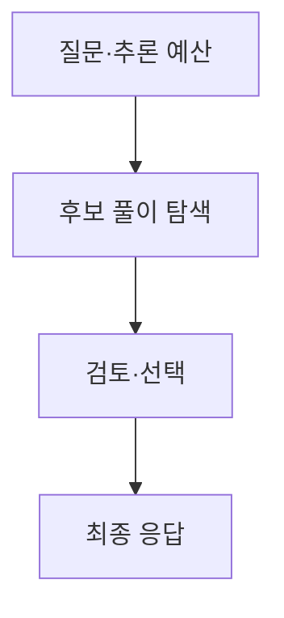
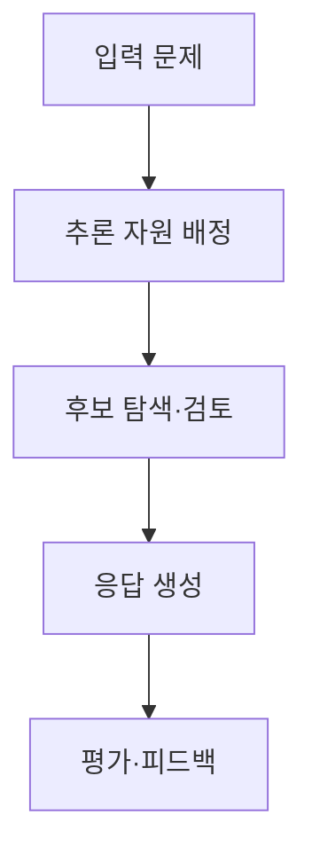

## 30초 인출

추론 모델은 어려운 질문에 더 많은 추론 계산을 배정해 답변을 만드는 언어 모델이다. 계산량 증가는 일부 추론 과제의 성능을 높일 수 있지만 지연·비용이 늘며, 정답을 보장하지 않는다.

핵심 용어

- 테스트 타임 컴퓨트: 학습이 끝난 모델이 응답을 생성할 때 사용하는 계산량이다.
- 추론 노력: 모델이 응답 전 더 많은 계산을 수행하도록 조정하는 설정·정책이다.
- 검증기: 결과가 정답·형식·실행 조건을 만족하는지 평가하는 구성요소다.

## 1교시 예상문제 (10점)

---

추론 모델의 개념과 테스트 타임 컴퓨트의 의미를 설명하시오. (예상)

---

## 1교시 10점 답안

### 1. 정의·목적
- 정의: 추론 모델은 문제 난도에 따라 응답 생성 중 추가 계산을 활용해 다단계 문제를 해결하는 언어 모델이다.
- 목적: 복합 수학·코딩 등에서 답변 전 검토와 탐색을 지원한다.

### 2. 동작

### 3. 트레이드오프
| 계산량 증가 | 기대할 수 있는 점 | 비용 |
|---|---|---|
| 추론 단계·후보 계산 확대 | 특정 과제에서 정확도 향상 가능 | 응답 지연·계산 비용 증가 |

### 4. 한계
추가 계산은 잘못된 전제나 지식 부족을 자동으로 해결하지 않으며, 문제에 따라 효과가 다르다.

**제언:** 추론 예산은 과제별 평가를 통해 정하고, 근거·정확성을 독립적으로 확인한다.

---

## 2~4교시 예상문제 (25점)

---

추론 모델의 테스트 타임 컴퓨트 원리와 일반 언어 모델과의 차이를 설명하고, 도입 시 품질·비용 평가 방안을 기술하시오. (예상)

---

## 2~4교시 25점 답안

### Ⅰ. 개념과 작동 원리
추론 모델은 응답 전에 탐색·검토 등에 추가 계산을 사용할 수 있는 언어 모델이다. 모델 내부의 구체적 추론 구조는 제품마다 다르며, 외부에서 관찰 가능한 응답 시간·설정만으로 내부 절차를 단정하지 않는다.

| 항목 | 일반적인 생성 설정 | 추론 중심 설정 |
|---|---|---|
| 계산 배분 | 짧은 응답을 우선할 수 있음 | 난도에 따라 더 많은 계산을 할 수 있음 |
| 주요 이점 | 빠른 응답 | 복합 문제에서 성능 향상 가능 |
| 주요 비용 | 비교적 낮은 추론 비용 | 지연·계산 자원 증가 가능 |

### Ⅱ. 테스트 타임 컴퓨트

일부 모델과 평가에서는 추론 시 계산을 늘릴수록 성능이 향상될 수 있다. 모든 과제에서 일정한 증가율이나 정답 보장을 의미하지 않는다.

### Ⅲ. 도입 평가
| 평가 항목 | 확인 방법 |
|---|---|
| 정확도 | 실제 과제와 홀드아웃 평가셋 비교 |
| 지연·비용 | 평균·상위 지연, 토큰·GPU 사용량 측정 |
| 적합성 | 쉬운 과제에서 일반 모델과 비교 |
| 신뢰성 | 실패 유형, 근거 오류, 민감 과제의 사람 검토 |

### Ⅳ. 기술적 제언
| 문제 | 해결 방안 |
|---|---|
| 추론 모델의 추가 계산이 필요한 요청과 일반 요청을 구분하지 못함 | 저비용 기준 모델로 시작하고, 품질 기준에 미달한 요청에만 추론 예산을 늘리는 라우팅을 평가한다. |

---

## 출제 이력과 검증 출처

- 원문에 미출제로 기록되어 있어 예상 문항으로 구성함.
- [OpenAI: Learning to reason with LLMs](https://openai.com/index/learning-to-reason-with-llms/)
