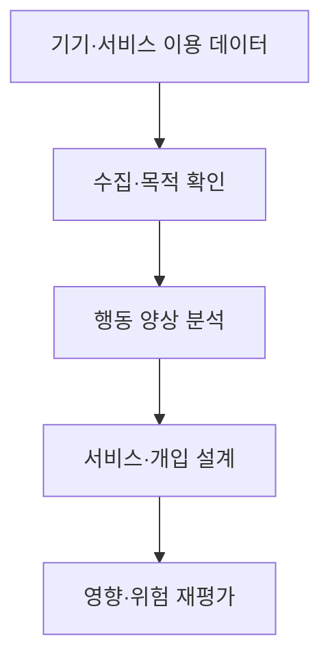
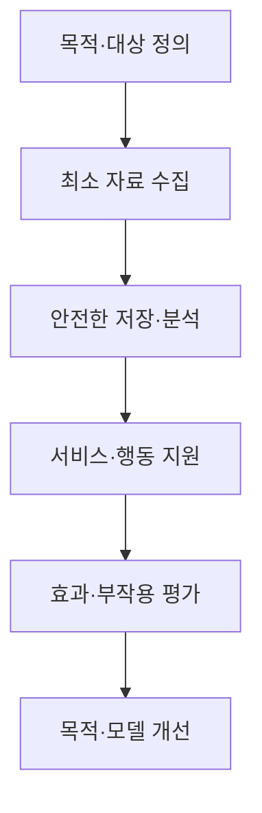

## 30초 인출

행동인터넷(IoB)은 디지털 기기와 서비스에서 얻은 데이터를 이용해 사람의 행동 양상을 분석하고 서비스나 개입에 반영하는 접근이다. 데이터 수집·추론·행동 유도의 편익과 자율성·프라이버시 위험을 함께 다룬다.

핵심 용어

- 디지털 흔적: 서비스 이용 과정에서 생성되는 위치·클릭·이용 기록 등의 데이터다.
- 행동 분석: 수집된 자료에서 반복 양상이나 관련 특성을 찾는 분석이다.
- 넛지: 선택을 금지하지 않고 선택 환경을 설계해 특정 행동의 가능성을 높이는 개입이다.
- IoT와 IoB: IoT는 기기·사물의 연결과 상태 정보가 중심이고, IoB는 사람의 행동 분석·개입까지 다룬다.

## 1교시 예상문제 (10점)

---

행동인터넷(IoB)의 개념과 활용 시 고려사항을 설명하시오. (예상)

---

## 1교시 10점 답안

### 1. 정의·목적
- 정의: IoB는 여러 디지털 접점에서 얻은 행동 데이터를 분석해 서비스·의사결정에 활용하는 접근이다.
- 목적: 사용 맥락에 맞는 서비스 개선이나 행동 지원을 제공한다.

### 2. 처리 흐름

### 3. 활용과 위험
| 활용 예 | 고려 위험 |
|---|---|
| 운전 습관 기반 안전 알림 | 과도한 감시·목적 외 이용 |
| 운동·건강 습관 지원 | 민감정보 유출·부당한 추론 |
| 서비스 이용 패턴 개선 | 조작적 설계·자율성 침해 |

### 4. 보호 원칙
자료의 목적·범위·보유기간을 알리고, 필요한 자료만 수집하며, 사용자 통제와 보안을 제공한다.

**제언:** 목적 제한·투명성·이용자 선택권을 데이터 처리 전 과정에 반영한다.

---

## 2~4교시 예상문제 (25점)

---

행동인터넷(IoB, Internet of Behavior)의 개념, 주요 기술, 활용 사례 및 고려사항을 설명하시오.

---

## 2~4교시 25점 답안

### Ⅰ. 개념과 구성
IoB는 연결 기기와 디지털 서비스의 데이터를 분석해 인간 행동을 이해하고 서비스나 개입에 반영하는 접근이다.

| 계층 | 기능 |
|---|---|
| 데이터 발생 | 앱·센서·웨어러블 등에서 이용 자료 생성 |
| 분석 | 자료 결합·패턴 분석·예측 |
| 적용 | 알림·맞춤 서비스·운영 개선 |
| 피드백 | 개입 결과와 부작용 점검 |

### Ⅱ. 기술·처리 과정

주요 기술로 IoT·모바일 센서, 데이터 통합, 통계·기계학습 분석, 개인화 서비스가 사용될 수 있다. 분석 결과는 행동 원인이나 의도를 확정적으로 증명하지 않는다.

### Ⅲ. 활용과 고려사항
| 활용 분야 | 예 | 관리 항목 |
|---|---|---|
| 교통·안전 | 운전 습관 피드백 | 과잉 감시·점수 오용 |
| 건강·복지 | 활동량 기반 알림 | 민감정보 보호·오분류 |
| 디지털 서비스 | 이용 흐름 개선 | 동의·목적 제한·조작 방지 |

행동 분석은 이용자에 대한 추론을 포함할 수 있으므로 수집 근거, 데이터 정확성, 편향, 접근 권한과 삭제 요청을 관리해야 한다. 선택을 유도하는 인터페이스는 거부·변경 선택을 보장해야 한다.

### Ⅳ. 기술적 제언
| 문제 | 해결 방안 |
|---|---|
| 관측된 행동에서 의도·성향을 과도하게 추론할 수 있음 | 먼저 지원할 행동 과업을 한정하고, 행동 신호를 확정적 인물 평가나 불이익 결정에 단독 사용하지 않도록 적용 범위를 정한다. |

---

## 출제 이력과 검증 출처

- 123회 3교시 6번: 행동인터넷(IoB)의 개념, 주요 기술, 활용 사례 및 고려사항.
