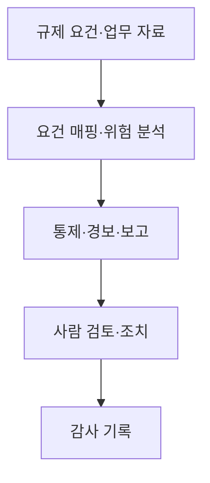
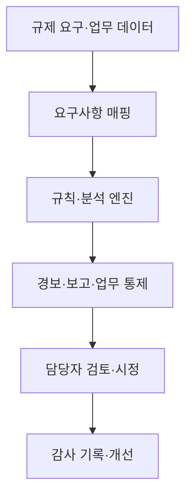

## 30초 인출

레그테크는 규제 대상 조직이 기술을 활용해 규제 준수와 관련 업무를 효율적으로 수행하도록 돕는 접근이다. 자동화 결과에도 규제 해석·통제·책임은 필요하다.

핵심 용어

- RegTech: 규제 요구의 이행을 돕는 기술·서비스다.
- SupTech: 감독기관이 감독·검사 업무에 기술을 활용하는 접근이다.
- AML: 자금세탁 위험을 식별·관리하는 통제와 절차다.
- e-KYC: 전자적 수단으로 고객 신원을 확인하는 절차다.

## 1교시 예상문제 (10점)

---

레그테크의 개념과 주요 활용을 설명하시오. (예상)

---

## 1교시 10점 답안

### 1. 정의·목적
- 정의: 레그테크는 기술로 규제 준수 관련 업무를 지원·자동화하는 접근이다.
- 목적: 규제 요건의 확인·이행·보고를 효율적이고 추적 가능하게 수행한다.

### 2. 처리 흐름

### 3. 활용 기술
| 기술 | 활용 |
|---|---|
| NLP·문서 처리 | 규정·정책 문서 탐색과 분류 지원 |
| 규칙 엔진·ML | 통제 검사·이상 징후 분류 |
| API·RPA | 시스템 간 자료 연계와 반복 업무 보조 |

### 4. 유의점
기술이 법령 해석과 책임 판단을 대신하지 않는다. 규칙·모델의 변경과 판단 근거를 추적해야 한다.

**제언:** 자동 판단에는 담당자 검토·예외처리·감사 이력을 연결한다.

---

## 2~4교시 예상문제 (25점)

---

레그테크(RegTech)의 개념, 주요 기술, 도입 효과 및 활성화 방안을 설명하시오.

---

## 2~4교시 25점 답안

### Ⅰ. 개념과 대상
레그테크는 금융 등 규제 대상 조직의 규제 준수 업무에 기술을 적용하는 접근이다. 감독기관이 감독·검사에 기술을 활용하는 섭테크(SupTech)와 구분한다.

| 접근 | 이용 주체 | 목적 |
|---|---|---|
| RegTech | 규제 대상 조직 | 준수 업무와 통제 수행 |
| SupTech | 감독기관 | 감독·검사 업무 지원 |
| FinTech | 금융 서비스 제공자 | 금융 서비스·업무 혁신 |

### Ⅱ. 주요 기술·처리 흐름

문서 분석, 데이터 표준화, 규칙 엔진, 이상 탐지, API·RPA가 적용될 수 있다. 규제 변경은 권위 있는 원문과 담당자 검토를 통해 시스템 규칙에 반영한다.

### Ⅲ. 효과·도입 조건
| 기대 효과 | 필요한 조건 |
|---|---|
| 반복 점검·보고 부담 완화 | 데이터 품질·업무 표준화 |
| 위험 신호의 신속한 식별 | 오탐·누락 관리와 담당자 검토 |
| 변경 이력·감사 추적 | 규칙·모델 버전과 근거 기록 |
| 조직 간 자료 연계 | 보안·접근통제·상호운용성 |

### Ⅳ. 기술적 제언
| 문제 | 해결 방안 |
|---|---|
| 모든 규제 판단을 초기에 자동화하면 예외·해석 업무까지 규칙에 과도하게 묶일 수 있음 | 반복적이고 판정 기준이 명확한 확인부터 자동화하고, 해석이 필요한 예외는 담당자 검토 대상으로 남겨 단계적으로 넓힌다. |

---

## 출제 이력과 검증 출처

- 120회 3교시 2번: 레그테크(RegTech)의 개념, 주요 기술, 도입 효과 및 활성화 방안.
- [영국 FCA RegTech 개요](https://www.fca.org.uk/firms/innovation/regtech)
