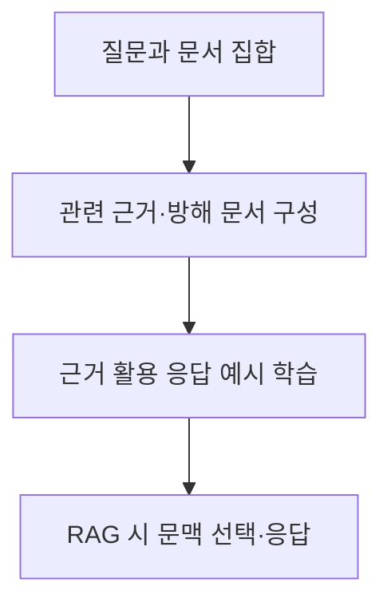
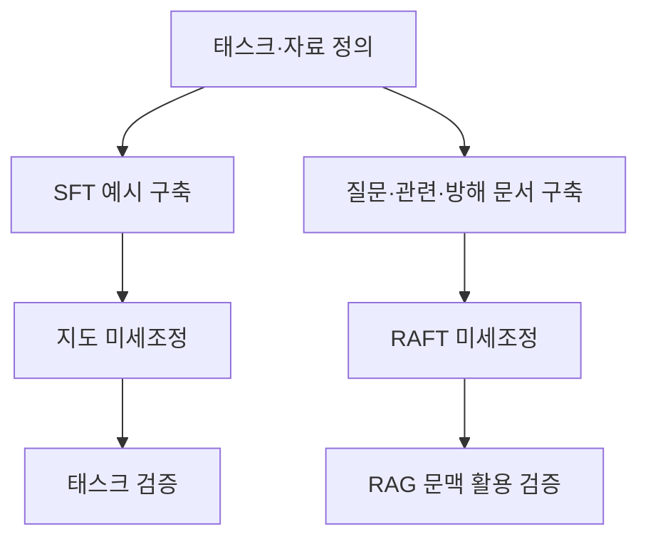

## 30초 인출

파인튜닝은 사전학습 모델을 추가 데이터로 학습해 특정 과제나 도메인에 맞추는 방법이다. RAFT는 검색된 근거와 방해 문서를 활용해 RAG 환경의 응답 능력을 조정하는 학습 방식이다.

핵심 용어

- SFT: 입력과 기대 응답 예시로 모델의 출력 행동을 추가 학습한다.
- LoRA: 기존 가중치는 고정하고 저랭크 추가 파라미터를 학습하는 PEFT 방법이다.
- RAFT: 관련 문서와 방해 문서를 포함한 검색 문맥에서 근거를 활용하도록 학습하는 방법이다.
- RAG: 외부 문서를 검색해 생성 모델의 입력 문맥에 제공하는 구조다.

## 1교시 예상문제 (10점)

---

파인튜닝과 RAG의 목적·작동 방식 차이를 설명하시오. (예상)

---

## 1교시 10점 답안

### 1. 정의·목적
- 정의: 파인튜닝은 사전학습 모델을 추가 데이터로 학습해 특정 태스크에 적응시키는 방법이다.
- 목적: 업무별 출력 형식·태스크 수행 방식 등을 개선한다.

### 2. 방식 비교
| 구분 | 파인튜닝 | RAG |
|---|---|---|
| 지식 반영 | 학습을 통해 가중치에 반영 | 외부 자료를 검색해 문맥으로 제공 |
| 갱신 | 재학습·어댑터 갱신 필요 | 검색 색인·자료 갱신 |
| 적합한 용도 | 태스크·형식·행동 적응 | 변경되는 사실·근거 제공 |

### 3. RAFT 흐름

### 4. 유의점
파인튜닝만으로 최신 사실을 자동 갱신하지 않으며, RAG도 검색·생성 오류가 가능하다.

**제언:** 지식 갱신 요구는 검색으로, 반복되는 출력 행동 요구는 미세조정으로 해결한다.

---

## 2~4교시 예상문제 (25점)

---

일반 파인튜닝 학습 파이프라인과 RAFT 기반 학습 파이프라인을 비교하여 설명하시오.

---

## 2~4교시 25점 답안

### Ⅰ. 목적과 학습 자료
일반 파인튜닝은 목적 태스크의 학습 예시로 모델 행동을 조정한다. RAFT는 검색 증강 환경을 전제로 관련 근거와 방해 문서를 포함한 자료에서 정답 근거를 선택하도록 학습한다.

| 구분 | 일반 SFT | RAFT |
|---|---|---|
| 학습 입력 | 지시·질문과 기대 응답 | 질문, 관련 문서, 방해 문서, 근거 응답 |
| 학습 초점 | 태스크·형식·응답 행동 | 문맥 중 근거 활용과 방해 문서 무시 |
| 실행 환경 | 모델 단독 또는 다른 구성과 결합 | 추론 시 검색 문서 제공을 전제 |

### Ⅱ. 파이프라인 비교

### Ⅲ. 평가와 적용
| 평가 영역 | 확인 방법 |
|---|---|
| 정답·태스크 성능 | 별도 질문 집합에서 정확도·형식 준수 확인 |
| 근거 활용 | 검색 문서가 답변을 뒷받침하는지 검증 |
| 방해 문서 대응 | 무관·오류 문서가 섞인 조건에서 비교 |
| 운영 적합성 | 검색 품질·모델 비용·자료 갱신 주기 평가 |

RAFT는 검색기가 잘못된 문서를 찾는 문제를 자동 해결하지 않는다. 데이터에 포함된 근거와 방해 문서의 품질이 중요하며, 실제 검색 분포와 평가셋이 맞아야 한다.

### Ⅳ. 기술적 제언
| 문제 | 해결 방안 |
|---|---|
| 모델이 근거 문서 대신 사전 지식으로 답함 | 근거 인용·근거 기반 평가를 두고 학습·검증 문맥을 점검한다. |
| 실제 검색 결과가 학습 데이터와 다름 | 운영 검색 자료의 분포를 반영해 평가하고 검색기 품질을 별도로 개선한다. |

---

## 출제 이력과 검증 출처

- 139회 2교시 2번: 일반 파인튜닝 학습 파이프라인과 RAFT 기반 학습 파이프라인 비교.
- [RAFT 논문](https://arxiv.org/abs/2403.10131)
