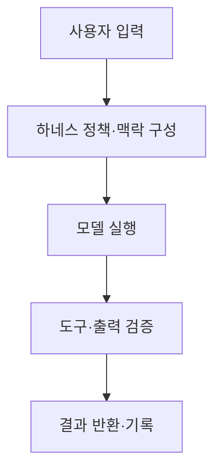
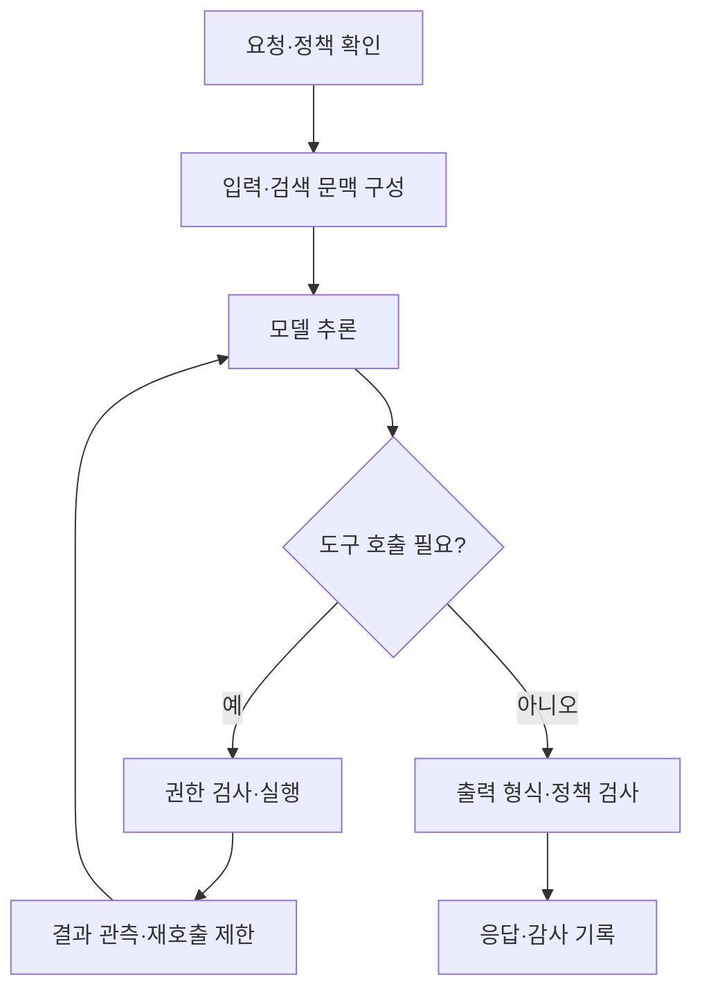

## 30초 인출

하네스 엔지니어링은 모델 주위의 실행 환경·도구·상태·검증 절차를 설계해 AI 작업을 통제하는 시스템 작업이다. 프롬프트 작성은 그 구성 요소 중 하나다.

핵심 용어

- 하네스: 모델에 입력·도구·실행 권한을 제공하고 결과를 처리하는 런타임 구성이다.
- 가드레일: 정해진 정책에 따라 입력·도구 동작·출력을 점검하는 통제다.
- 회귀 평가: 변경 전후 같은 과제에서 동작과 품질 변화를 비교하는 시험이다.

## 1교시 예상문제 (10점)

---

프롬프트 엔지니어링과 하네스 엔지니어링을 비교하시오.

---

## 1교시 10점 답안

### 1. 정의·목적
- 정의: 프롬프트 엔지니어링은 입력 지시·예시·맥락을 설계하고, 하네스 엔지니어링은 모델 실행을 둘러싼 소프트웨어 환경을 설계한다.
- 목적: 프롬프트는 모델 응답을 유도하고, 하네스는 도구·상태·검증·예외처리를 통제한다.

### 2. 비교
| 구분 | 프롬프트 엔지니어링 | 하네스 엔지니어링 |
|---|---|---|
| 주 대상 | 지시문·예시·맥락 | 실행 흐름·도구·상태·검증 |
| 변경 방법 | 프롬프트 수정·평가 | 시스템 코드와 정책 구성 변경 |
| 범위 | 모델 입력 설계 | 입력부터 도구 실행·출력까지 |

### 3. 구성 흐름

### 4. 유의점
하네스가 확률적 모델을 완전히 결정론적으로 만들지는 않는다. 검증과 예외처리를 통해 실패 영향을 줄인다.

**제언:** 프롬프트와 실행 하네스를 함께 평가하고 인터페이스·실패 처리를 명시한다.

---

## 2~4교시 예상문제 (25점)

---

프롬프트 엔지니어링과 하네스 엔지니어링의 개념·구성·관리 범위를 비교하고, 신뢰성 있는 AI 시스템을 위한 적용 방안을 설명하시오.

---

## 2~4교시 25점 답안

### Ⅰ. 개념과 범위
프롬프트 엔지니어링은 모델 입력을 구성하는 작업이며, 하네스 엔지니어링은 모델 실행과 주변 도구·검증·상태 관리를 포함하는 런타임 설계다.

| 구분 | 프롬프트 엔지니어링 | 하네스 엔지니어링 |
|---|---|---|
| 설계 대상 | 지시·예시·문맥 | 실행 권한·도구·상태·오류 처리 |
| 적용 범위 | 입력 텍스트 중심 | 요청부터 결과 검증·기록까지 |
| 품질 관리 | 프롬프트별 응답 평가 | 시스템 통합·회귀·보안 평가 |

### Ⅱ. 하네스 처리 구조

### Ⅲ. 신뢰성 확보 방안
| 통제 영역 | 적용 |
|---|---|
| 입력 | 스키마 검증, 비밀정보 최소화, 악성 입력 검토 |
| 실행 | 도구별 최소 권한, 횟수·시간 제한, 승인 게이트 |
| 출력 | 형식 검사, 근거·정책 검사, 실패 시 안전한 처리 |
| 변경 관리 | 회귀 평가셋과 배포 전 비교, 버전 기록 |

### Ⅳ. 기술적 제언
| 문제 | 해결 방안 |
|---|---|
| 프롬프트만 고쳐도 도구 오용·출력 오류가 남음 | 권한·스키마·오류 처리·회귀 시험을 하네스에 구현한다. |
| 하네스 제약이 실제 품질을 보장한다고 오해함 | 의도된 사용 맥락에서 실패 사례와 시스템 전체를 지속 평가한다. |

---

## 출제 이력과 검증 출처

- 140회 1교시 13번: 프롬프트 엔지니어링과 하네스 엔지니어링 비교.
- [OpenAI Harness Engineering](https://openai.com/index/harness-engineering/)
