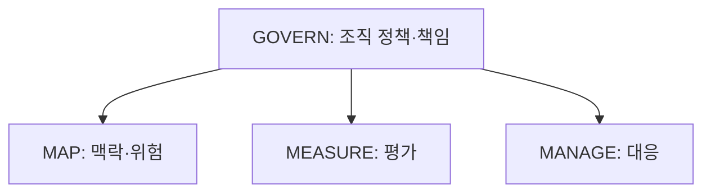
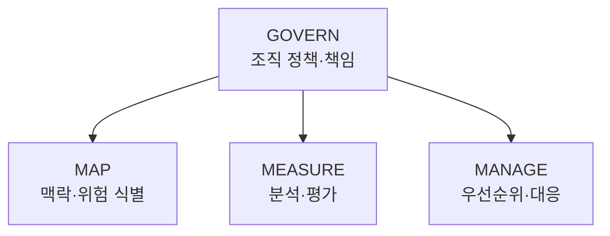

## 30초 인출

NIST AI RMF는 조직이 AI 위험을 식별하고 관리하도록 돕는 자발적 프레임워크다. GOVERN을 전반에 두고 MAP·MEASURE·MANAGE 기능으로 위험을 다룬다.

핵심 용어

- GOVERN: 역할·정책·위험관리 문화를 세우고 다른 기능을 뒷받침한다.
- MAP: 시스템 맥락과 잠재 위험을 파악한다.
- MEASURE: 위험을 분석·평가하고 증거를 기록한다.
- MANAGE: 위험 우선순위를 정하고 대응·모니터링한다.

## 1교시 예상문제 (10점)

---

NIST AI RMF의 개념, 4가지 핵심 기능과 신뢰 가능한 AI의 특성을 설명하시오.

---

## 1교시 10점 답안

### 1. 정의·목적
- 정의: AI RMF는 AI 시스템의 위험을 관리하기 위한 NIST의 자발적 위험관리 프레임워크다.
- 목적: AI 개발·배포·이용 전반에서 신뢰성과 책임 있는 운영을 돕는다.

### 2. 핵심 기능
| 기능 | 요점 |
|---|---|
| GOVERN | 정책·역할·위험관리 기반 |
| MAP | 사용 맥락·위험 식별 |
| MEASURE | 위험 분석·평가 |
| MANAGE | 위험 대응·우선순위·모니터링 |

### 3. 상호작용

화살표는 GOVERN이 세 위험관리 기능의 조직적 기반임을 뜻한다. MAP·MEASURE·MANAGE 사이에 고정된 순서를 나타내지는 않는다.

### 4. 신뢰성 특성
유효성·신뢰성, 안전성, 보안·회복탄력성, 책임성·투명성, 설명·해석 가능성, 프라이버시 향상, 공정성 및 유해 편향 관리가 주요 특성이다.

**제언:** 위험 수준과 사용 맥락에 맞는 측정·대응 활동을 문서화한다.

---

## 2~4교시 예상문제 (25점)

---

NIST AI RMF의 개념과 4가지 핵심 기능, 7가지 신뢰 가능한 특성을 설명하시오.

---

## 2~4교시 25점 답안

### Ⅰ. 목적과 적용
AI RMF는 AI 시스템을 설계·개발·배포·사용하는 조직이 위험을 관리하고 신뢰 가능한 AI를 지원하도록 제공된 자발적 프레임워크다.

| 적용 원칙 | 의미 |
|---|---|
| 맥락 기반 | 목적·이해관계자·운용 환경에 맞춰 위험 식별 |
| 반복 관리 | 설계부터 운영까지 평가와 대응 갱신 |
| 문서화 | 역할·근거·측정·조치 기록 |

### Ⅱ. 네 가지 핵심 기능

화살표는 GOVERN이 나머지 세 기능을 뒷받침한다는 뜻이다. MAP·MEASURE·MANAGE는 상황에 따라 반복·연계되며 정해진 단방향 절차가 아니다.

NIST는 AI RMF 1.0의 개정을 진행 중이라고 안내하므로 실제 적용 시 최신 공식 자료를 확인한다.

### Ⅲ. 신뢰 가능한 특성
| 특성 | 요점 |
|---|---|
| 유효하고 신뢰할 수 있음 | 목적에 맞는 성능·일관성 |
| 안전함 | 사람·재산·환경 위해를 줄임 |
| 보안·회복탄력성 | 공격·장애에 대응 |
| 책임성·투명성 | 책임 주체와 시스템 정보를 제공 |
| 설명·해석 가능성 | 결과와 한계를 이해할 수 있게 함 |
| 프라이버시 향상 | 개인정보 보호를 설계·운영에 반영 |
| 공정성·편향 관리 | 편향과 부당한 차이를 식별·대응 |

### Ⅳ. 기술적 제언
| 문제 | 해결 방안 |
|---|---|
| 프레임워크 적용이 체크리스트로만 끝남 | 각 기능을 조직의 실제 역할·평가·시정 절차에 연결한다. |
| 지표 하나로 신뢰성을 판단함 | 사용 맥락별 복수 특성과 상충 관계를 측정·기록한다. |

---

## 출제 이력과 검증 출처

- 138회 1교시 1번: AI RMF의 개념, 4가지 핵심 구조, 7가지 신뢰 가능한 특성.
- [NIST AI RMF 1.0](https://www.nist.gov/publications/artificial-intelligence-risk-management-framework-ai-rmf-10)
- [NIST AI RMF Core](https://airc.nist.gov/airmf-resources/airmf/5-sec-core/)
