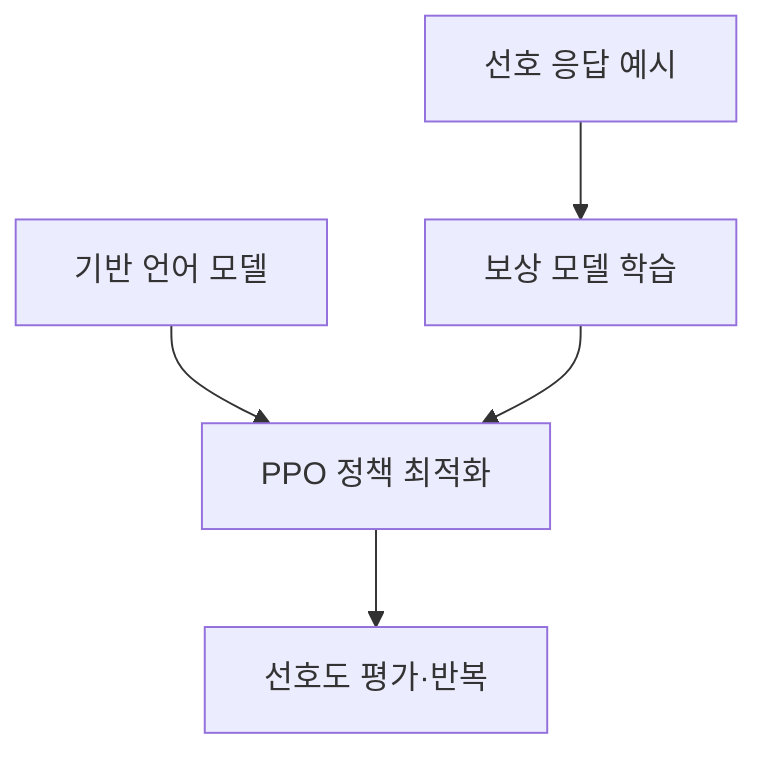
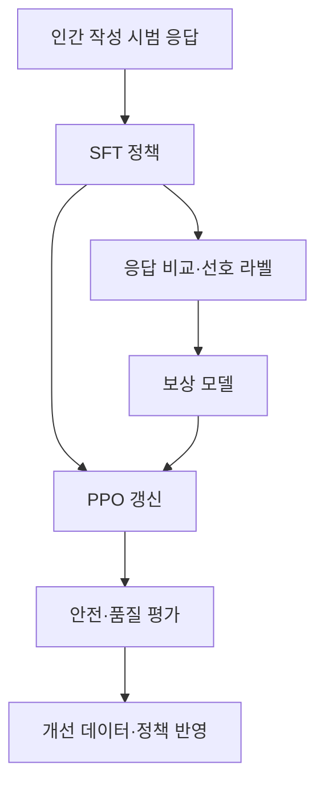

## 30초 인출

RLHF는 사람의 선호 평가를 이용해 언어 모델을 조정하는 학습 접근이다. 일반적인 PPO 기반 흐름은 지도 미세조정, 선호 보상 모델 학습, 강화학습 최적화로 구성된다.

핵심 용어

- 선호 데이터: 같은 입력에 대한 응답을 사람이 비교·순위화한 자료다.
- 보상 모델: 응답의 선호 점수를 예측하도록 학습한 모델이다.
- PPO: 정책을 보상에 맞게 갱신하는 강화학습 알고리즘이다.
- DPO: 선호 응답쌍을 직접 이용해 정책을 최적화하는 방법이다.

## 1교시 예상문제 (10점)

---

RLHF의 개념과 일반적인 학습 절차를 설명하시오. (예상)

---

## 1교시 10점 답안

### 1. 정의·목적
- 정의: RLHF는 인간 선호 피드백을 이용해 언어 모델의 응답 정책을 조정하는 방법이다.
- 목적: 지시 수행과 응답 선호를 모델 행동에 반영한다.

### 2. 학습 절차

### 3. 주요 구성
| 구성 | 역할 |
|---|---|
| SFT 모델 | 선호 학습의 초기 정책 |
| 보상 모델 | 비교 선호를 점수화 |
| PPO | 보상을 반영해 정책 갱신 |
| 참조 정책 | 과도한 정책 변화를 제어하는 데 활용 가능 |

### 4. 한계
선호 라벨은 평가자·지침의 편향을 반영할 수 있고, 보상 모델의 점수를 과도하게 최적화할 위험이 있다.

**제언:** 평가 지침·데이터를 점검하고 독립 평가와 안전 시험을 병행한다.

---

## 2~4교시 예상문제 (25점)

---

인공지능(AI) 리스크에 대하여 다음을 설명하시오. (LLM 모델 정렬 및 안전성 확보 기술)

---

## 2~4교시 25점 답안

### Ⅰ. 정렬 목표와 방법
정렬은 모델 행동을 사용자 의도·안전 정책과 맞추기 위한 학습·평가 활동이다. RLHF는 대표적 방법 중 하나이며, 지도 미세조정·선호 최적화·안전 평가가 함께 사용될 수 있다.

| 방법 | 특징 |
|---|---|
| SFT | 지시와 기대 응답 예시로 행동 학습 |
| RLHF | 사람 선호 데이터와 보상 기반 최적화 |
| DPO 등 선호 학습 | 선호 쌍을 이용해 정책을 직접 조정 |
| 안전 평가 | 거절·유해 출력·강건성 시험 |

### Ⅱ. PPO 기반 RLHF 절차

InstructGPT의 전형적 방식은 SFT 후 선호 비교 데이터로 보상 모델을 만들고 PPO로 정책을 최적화한다. 모든 정렬 시스템이 이 구성을 그대로 쓰는 것은 아니다.

### Ⅲ. 효과·한계와 검증
| 영역 | 내용 |
|---|---|
| 기대 효과 | 지시·선호에 대한 응답 품질 개선 가능 |
| 편향 | 평가자 집단·지침의 편향이 반영될 수 있음 |
| 보상 해킹 | 보상 점수는 높지만 실제 품질이 낮은 응답이 나올 수 있음 |
| 안전성 | 학습 후에도 공격·오용·과잉 거절 평가 필요 |

DPO와 같은 방법은 보상 모델·PPO 구성과 다른 최적화 방식을 쓰므로 적용 자원과 데이터 요구를 비교한다.

### Ⅳ. 기술적 제언
| 문제 | 해결 방안 |
|---|---|
| 보상 모델·정책 최적화의 복잡도가 실제 개선 폭보다 커질 수 있음 | 먼저 SFT 기준선을 확립하고, 선호 기반 추가 학습은 업무별 평가에서 남은 개선 요구가 확인된 경우에 한해 적용한다. |

---

## 출제 이력과 검증 출처

- 139회 2교시 1번: AI 리스크 중 LLM 모델 정렬 및 안전성 확보 기술.
- [InstructGPT 논문](https://arxiv.org/abs/2203.02155)
- [Direct Preference Optimization 논문](https://arxiv.org/abs/2305.18290)
