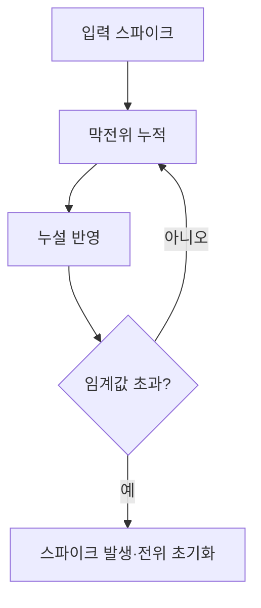
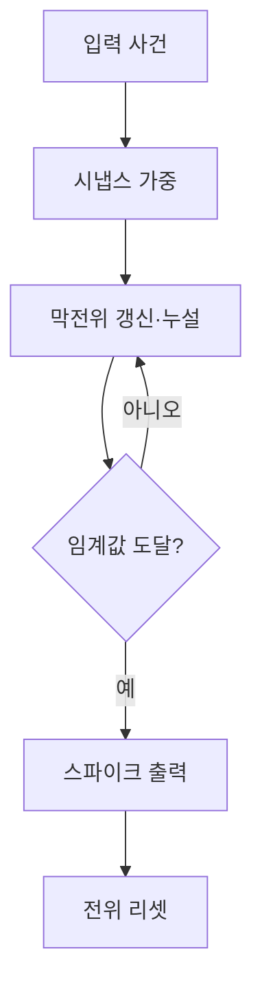

## 30초 인출

스파이킹 신경망(SNN)은 시간에 따라 발생하는 스파이크 사건으로 정보를 표현하는 신경망이다. 뉴런의 막전위가 입력을 누적하고 임계값을 넘으면 스파이크를 발생시킨다.

핵심 용어

- 스파이크: 뉴런이 임계 조건을 만족할 때 발생시키는 이산 신호다.
- LIF: 입력을 누적하고 누설시키며 임계값에서 발화·초기화하는 뉴런 모델이다.
- 뉴로모픽 하드웨어: 신경망의 이벤트 기반 처리에 맞춰 설계된 계산 하드웨어다.
- 대리 기울기: 불연속 발화 함수 대신 근사 기울기를 사용해 학습하는 기법이다.

## 1교시 예상문제 (10점)

---

스파이킹 신경망(SNN)의 개념과 동작 원리를 설명하시오.

---

## 1교시 10점 답안

### 1. 정의·목적
- 정의: SNN은 시간·빈도에 따른 스파이크 신호로 정보를 처리하는 신경망이다.
- 목적: 시간 정보를 반영하는 신경 처리와 이벤트 기반 연산에 활용한다.

### 2. LIF 동작

### 3. ANN과 비교
| 구분 | 일반 ANN | SNN |
|---|---|---|
| 정보 표현 | 연속값 활성화 | 시간에 따른 스파이크 |
| 계산 방식 | 층·텐서 연산 중심 | 이벤트 발생 중심으로 구성 가능 |
| 학습 | 미분 가능한 활성화 기반 | 대리 기울기 등 별도 학습법 활용 |

### 4. 유의점
SNN이 항상 전력이나 지연에서 우수한 것은 아니다. 인코딩·학습·하드웨어 구현과 과제에 따라 성능이 달라진다.

**제언:** 대상 과제와 하드웨어에서 정확도·에너지·지연을 비교 측정한다.

---

## 2~4교시 예상문제 (25점)

---

스파이킹 신경망과 뉴로모픽 칩의 구조·동작 원리를 설명하고, 학습 방법과 적용 시 고려사항을 기술하시오. (예상)

---

## 2~4교시 25점 답안

### Ⅰ. SNN 구조
SNN은 뉴런의 상태와 스파이크 발생 시점을 이용해 정보를 처리한다. LIF 모델은 막전위 누적, 누설, 임계값 발화로 동작을 설명하는 대표적 모델이다.

| 요소 | 역할 |
|---|---|
| 시냅스 | 입력 스파이크를 가중해 전달 |
| 막전위 | 입력 영향을 시간에 따라 누적 |
| 임계값 | 발화 여부를 결정 |
| 리셋·누설 | 발화 후 상태 초기화 및 시간 감쇠 |

### Ⅱ. 뉴런 처리와 뉴로모픽 실행

뉴로모픽 하드웨어는 이벤트 중심 처리를 지원하도록 설계될 수 있다. 다만 실제 효율은 하드웨어·자료 표현·네트워크와 응용에 따라 달라진다.

### Ⅲ. 학습과 적용
| 접근 | 설명 | 유의점 |
|---|---|---|
| 대리 기울기 | 발화 함수의 불연속성을 근사해 역전파 | 근사 함수·학습 안정성 조정 |
| ANN-to-SNN 변환 | 학습된 ANN을 스파이킹 형태로 변환 | 시간 단계·정확도·지연 평가 |
| 이벤트 입력 | 변화 이벤트를 직접 처리 | 센서·인코딩에 적합한지 확인 |

### Ⅳ. 기술적 제언
| 문제 | 해결 방안 |
|---|---|
| 이벤트 기반 입력의 특성이 없는 과업에 SNN을 도입하면 구현 이점이 제한될 수 있음 | 사건의 시간 정보가 중요한 과업을 우선 대상으로 삼고, 해당 센서·하드웨어에서 기존 ANN 기준선과 비교한다. |

---

## 출제 이력과 검증 출처

- 126회 1교시: 스파이킹 신경망(SNN).
- 128회 1교시: 뉴로모픽 칩과 SNN의 동작 원리.
- [Surrogate Gradient Learning 논문](https://arxiv.org/abs/1901.09948)
