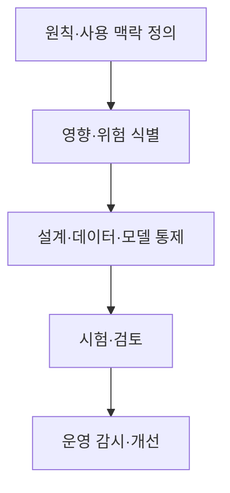
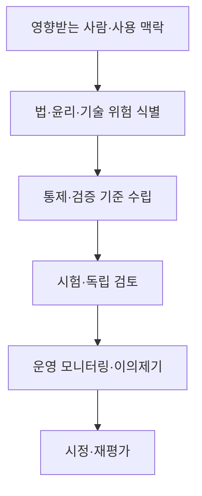

## 30초 인출

인공지능 윤리는 AI의 개발·활용에서 인간의 권리와 사회적 책임을 지키기 위한 원칙과 실천 기준이다. 원칙을 데이터·모델·운영 통제로 구체화한다.

핵심 용어

- 인간 존엄성: AI가 인간의 권리·자율성·안전을 존중해야 한다는 원칙이다.
- 사회 공공선: AI가 사회 구성원의 안녕과 공익에 기여해야 한다는 원칙이다.
- 기술 합목적성: AI의 개발·활용이 정당한 목적과 의도에 맞아야 한다는 원칙이다.
- 윤리 영향평가: 시스템이 사람과 사회에 미칠 영향을 살피고 대응을 정하는 절차다.

## 1교시 예상문제 (10점)

---

AI 윤리의 개념과 주요 원칙을 설명하시오. (예상)

---

## 1교시 10점 답안

### 1. 정의·목적
- 정의: AI 윤리는 AI의 개발·활용에서 지켜야 할 가치와 책임 기준이다.
- 목적: 기술의 편익을 높이면서 권리 침해·차별·위해를 예방한다.

### 2. 국가 AI 윤리기준
| 기본 원칙 | 핵심 |
|---|---|
| 인간 존엄성 | 인간의 권리와 자율성 존중 |
| 사회 공공선 | 사회 구성원 전체의 이익과 약자 고려 |
| 기술 합목적성 | AI 목적·수단·활용의 정당성 확보 |

### 3. 적용 흐름

### 4. 유의점
윤리 원칙만으로 충분하지 않으므로 책임자·평가 기준·이의제기와 시정 절차를 정한다.

**제언:** 원칙을 측정 가능한 검토 항목과 운영 책임으로 연결한다.

---

## 2~4교시 예상문제 (25점)

---

AI 시스템의 법적 이슈, 윤리적 문제, 기술적 문제와 해결 방안을 설명하시오. (예상)

---

## 2~4교시 25점 답안

### Ⅰ. 원칙과 문제 유형
AI 윤리는 개발·배포·이용 과정에서 사람의 권리와 사회적 영향을 검토하는 규범적 기준이다. 국가 AI 윤리기준은 인간 존엄성, 사회 공공선, 기술 합목적성을 기본 원칙으로 둔다.

| 문제 유형 | 예 |
|---|---|
| 법·제도 | 개인정보 처리, 책임 배분, 권리 구제 |
| 윤리 | 차별·불공정, 자율성 침해, 취약집단 영향 |
| 기술 | 편향 데이터, 불투명한 출력, 보안 취약점 |

### Ⅱ. 위험 관리 흐름

### Ⅲ. 대응 방안
| 이슈 | 대응 |
|---|---|
| 차별·편향 | 데이터 대표성·집단별 성능 평가, 이의제기 절차 |
| 개인정보·자율성 | 최소 수집, 목적 제한, 사용자 선택·통제 |
| 안전·보안 | 위협 분석, 적대적 시험, 권한·접근 통제 |
| 책임·투명성 | 역할 배정, 결과·한계 안내, 기록·감사 |

### Ⅳ. 기술적 제언
| 문제 | 해결 방안 |
|---|---|
| 윤리 검토가 문서 승인에 머물고 영향받는 사람의 경험을 반영하지 못함 | 설계 단계에 이용자·영향 집단의 검토를 포함하고, 실제 운영에서 제기된 이의와 피해 사례를 정기 검토 안건으로 삼는다. |

---

## 출제 이력과 검증 출처

- 124회 4교시 6번: AI 윤리 필요성·정책 동향 및 윤리 정책 수립 고려사항.
- 134회 3교시 3번: AI 시스템의 법적·윤리적·기술적 문제와 해결 방안.
- [국가 AI 윤리기준 요약(경제정책자료)](https://eiec.kdi.re.kr/policy/materialView.do?num=207674&topic=)
