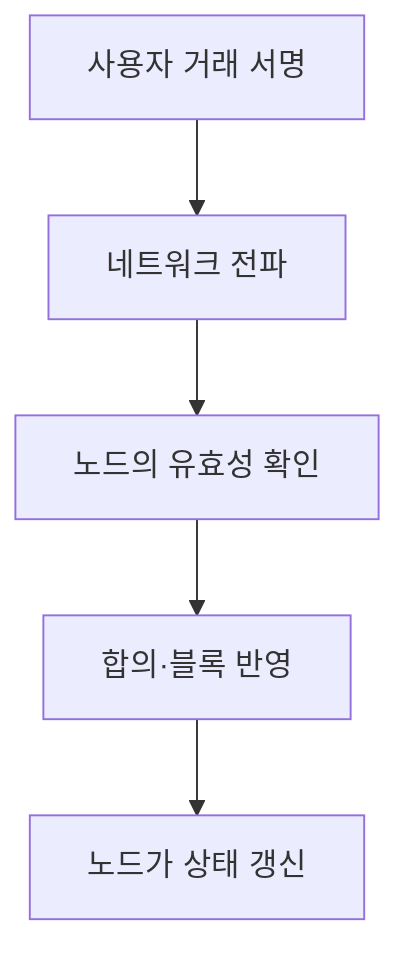
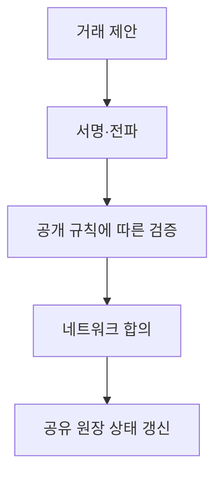

## 30초 인출

퍼블릭 블록체인은 참여·검증 규칙이 공개되어 누구나 정해진 프로토콜에 따라 이용할 수 있는 분산 원장이다. 참여 개방성과 검증 가능성을 얻는 대신 합의·확장성·개인정보 측면을 고려한다.

핵심 용어

- 무허가형: 네트워크 운영 주체의 사전 승인을 받지 않고 공개 규칙에 따라 참여할 수 있는 구조다.
- 합의: 여러 노드가 유효한 거래 순서와 상태를 결정하는 절차다.
- 스마트 계약: 블록체인 실행 환경에서 조건에 따라 동작하는 프로그램이다.
- 가스: 거래·계산 실행에 필요한 자원을 측정·가격화하는 방식이다.

## 1교시 예상문제 (10점)

---

퍼블릭 블록체인의 개념과 주요 특성을 설명하시오. (예상)

---

## 1교시 10점 답안

### 1. 정의·목적
- 정의: 퍼블릭 블록체인은 공개 참여 규칙에 따라 여러 노드가 공동으로 원장을 검증·갱신하는 네트워크다.
- 목적: 단일 관리자를 전제로 하지 않고 거래와 상태의 검증을 가능하게 한다.

### 2. 처리 흐름

### 3. 주요 특성
| 특성 | 의미 |
|---|---|
| 공개 검증 | 규칙에 따라 누구나 거래·상태를 확인 가능 |
| 분산 운영 | 여러 노드가 원장과 검증에 참여 |
| 합의 | 프로토콜에 따라 유효한 상태를 결정 |
| 투명성 | 공개된 데이터는 네트워크 이용자가 열람 가능할 수 있음 |

### 4. 유의점
원장에 기록된 데이터는 공개·추적 가능할 수 있으므로 개인정보나 기밀정보를 직접 기록하지 않도록 설계한다.

**제언:** 공개할 데이터와 오프체인에 둘 데이터를 구분하고 합의·운영 비용을 평가한다.

---

## 2~4교시 예상문제 (25점)

---

퍼블릭 블록체인과 프라이빗 블록체인의 차이를 참여 권한·합의·운영 측면에서 비교 설명하시오.

---

## 2~4교시 25점 답안

### Ⅰ. 개념과 운영 목적
퍼블릭 블록체인은 공개 규칙으로 참여를 개방하는 구조이고, 프라이빗 블록체인은 신원과 정책으로 참여자·권한을 제한하는 구조다.

| 구분 | 퍼블릭 | 프라이빗 |
|---|---|---|
| 참여 | 공개 규칙에 따른 개방형 | 허가된 참여자 중심 |
| 검증·합의 | 공개 프로토콜과 네트워크 합의 | 회원 정책과 구성된 합의 |
| 데이터 열람 | 공개 범위에 따라 투명성 높음 | 접근 정책으로 가시성 제한 가능 |
| 운영 | 분산 참여자 거버넌스 | 조직·컨소시엄 거버넌스 |

### Ⅱ. 거래 처리

### Ⅲ. 장단점·적용
| 관점 | 퍼블릭 | 프라이빗 |
|---|---|---|
| 강점 | 공개 검증·개방 참여 | 권한·업무 규칙 조정 용이 |
| 고려점 | 처리량·수수료·공개 정보 관리 | 운영자 신뢰·참여기관 간 거버넌스 |
| 적용 예 | 공개 디지털 자산·공개 검증 | 기관 간 제한된 업무 공유 |

어느 방식도 자동으로 완전한 탈중앙성·보안·개인정보 보호를 보장하지 않는다. 목적과 위협 모델에 맞춰 권한·키 관리·합의·업그레이드 책임을 정한다.

### Ⅳ. 기술적 제언
| 문제 | 해결 방안 |
|---|---|
| 공개형·허가형 중 선택 기준이 기술 유행이나 처리 성능에 치우침 | 참여자 신뢰 모델, 검증 공개 범위와 변경 권한을 먼저 합의한 뒤 그 요구에 맞는 네트워크 유형을 선택한다. |

---

## 출제 이력과 검증 출처

- 124회 4교시 5번: 퍼블릭·프라이빗 블록체인의 차이 비교.
- [Ethereum 기술 소개](https://ethereum.org/developers/docs/intro-to-ethereum/)
