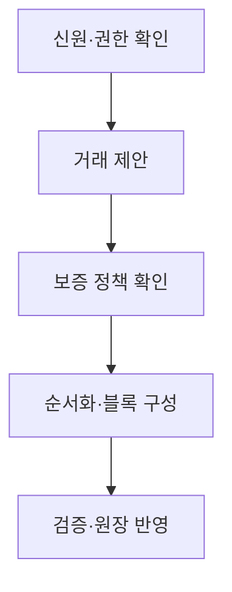
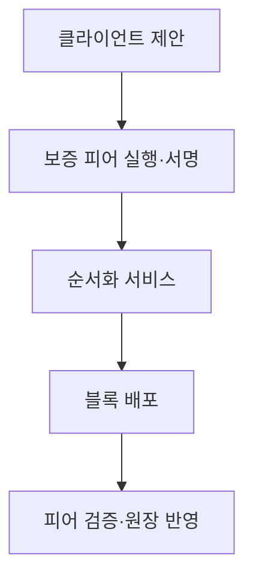

## 30초 인출

프라이빗 블록체인은 신원 확인과 정책을 통해 참여자·권한을 제한하는 분산 원장이다. 여러 기관 간 거래 기록을 공유할 수 있지만, 거버넌스와 접근 통제가 핵심이다.

핵심 용어

- 허가형 네트워크: 참여자와 작업 권한을 정책으로 통제하는 분산 네트워크다.
- MSP: Hyperledger Fabric에서 조직·참여자 신원을 정책에 연결하는 구성이다.
- 채널: Fabric 네트워크 안에서 조직 집합이 별도 원장을 공유하는 논리적 구분이다.
- 체인코드: Fabric에서 업무 규칙을 구현하는 스마트 계약 프로그램이다.

## 1교시 예상문제 (10점)

---

프라이빗 블록체인의 개념과 주요 특성을 설명하시오. (예상)

---

## 1교시 10점 답안

### 1. 정의·목적
- 정의: 프라이빗 블록체인은 허가된 참여자와 정책에 따라 원장을 갱신하는 분산 원장이다.
- 목적: 조직 간 공유 기록에 접근 제어와 공동 검증을 제공한다.

### 2. Fabric 참여 흐름

### 3. 특징
| 항목 | 내용 |
|---|---|
| 참여 | 신원과 가입 정책으로 통제 |
| 접근 | 역할·채널 등으로 범위 설정 가능 |
| 합의 | 네트워크 설정과 위협 모델에 맞게 선택 |
| 거버넌스 | 운영·변경 책임을 참여기관이 정함 |

### 4. 유의점
허가형 구조는 공개 네트워크보다 운영 권한이 제한되므로, 참여자 간 신뢰와 책임·장애 대응 절차를 정해야 한다.

**제언:** 신원·권한·운영정책과 합의 구성을 함께 설계한다.

---

## 2~4교시 예상문제 (25점)

---

퍼블릭(Public) 블록체인과 프라이빗(Private) 블록체인의 차이점을 비교하여 설명하시오.

---

## 2~4교시 25점 답안

### Ⅰ. 개념과 비교
프라이빗 블록체인은 참여 조직과 권한을 정책으로 제한하는 원장 네트워크다. 퍼블릭 체인과의 차이는 개방 여부뿐 아니라 거버넌스·검증·데이터 접근 정책에도 있다.

| 구분 | 퍼블릭 | 프라이빗 |
|---|---|---|
| 참여 | 공개 프로토콜 기반 | 허가된 기관·사용자 |
| 권한 | 공개 규칙에 따라 수행 | 신원·역할·정책으로 제한 |
| 운영 | 분산 네트워크 거버넌스 | 참여기관 간 합의·관리 |
| 데이터 | 공개 범위가 넓을 수 있음 | 채널·정책 등으로 접근 범위 조정 |

### Ⅱ. Fabric 구성·거래 처리

| 구성 | 역할 |
|---|---|
| MSP | 신원과 조직 소속 확인 |
| 피어 | 체인코드 실행·보증·원장 유지 |
| 순서화 서비스 | 거래 순서 결정 및 블록 배포 |
| 채널·체인코드 | 원장 공유 범위와 업무 규칙 구성 |

Fabric에서 채널은 참여 조직이 별도 원장을 공유하는 경계이며, 세부 데이터 기밀성은 정책·프라이빗 데이터 기능 등으로 추가 설계한다.

### Ⅲ. 적용·거버넌스
| 적용 고려 | 확인 내용 |
|---|---|
| 업무 적합성 | 여러 기관이 공유 원장을 필요로 하는지 |
| 신뢰 구조 | 단일 DB·공동 데이터베이스 대비 장점 |
| 데이터 보호 | 접근 정책, 암호화, 보유·삭제 요구 |
| 운영 | 회원 추가·탈퇴, 장애 복구, 변경 승인 |

### Ⅳ. 기술적 제언
| 문제 | 해결 방안 |
|---|---|
| 기관 간 권한·거래 데이터의 가시성 충돌 | 역할·채널·프라이빗 데이터 정책을 업무 경계에 맞춘다. |
| 기술 운영보다 거버넌스 합의가 지연됨 | 가입·변경·분쟁·장애 대응 책임을 사전에 문서화한다. |

---

## 출제 이력과 검증 출처

- 124회 4교시 5번: 퍼블릭·프라이빗 블록체인의 차이 비교.
- [Hyperledger Fabric 네트워크 구조](https://hyperledger-fabric.readthedocs.io/en/latest/network/network.html)
- [Hyperledger Fabric MSP](https://hyperledger-fabric.readthedocs.io/en/latest/membership/membership.html)
