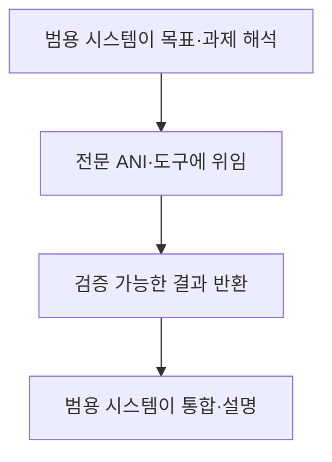
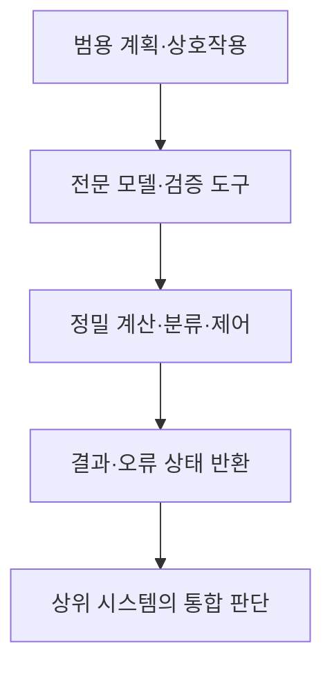

## 30초 인출

인공일반지능(AGI)은 다양한 과제에 걸친 범용 능력을 뜻하지만, 통일된 정의와 단일 평가 기준은 없다. 전문 AI(ANI)는 범용 시스템과 함께 정밀하고 검증 가능한 기능을 맡을 수 있다.

핵심 용어

- ANI: 특정 과제나 제한된 범위의 목적에 맞춰 설계·평가되는 인공지능이다.
- AGI: 다양한 인지 과제에 걸쳐 높은 일반성을 보이는 AI를 가리키는 논의상의 개념이다.
- 범용성: 여러 과제·환경에 능력을 적용하고 새로운 과제로 전이하는 정도다.
- AGI 수준 프레임워크: 성능의 깊이와 적용 범위의 넓이로 진전을 설명하려는 분류 제안이다.

## 1교시 예상문제 (10점)

---

AGI(Artificial General Intelligence) 측면에서 ANI(Artificial Narrow Intelligence)의 필요성을 설명하시오.

---

## 1교시 10점 답안

### 1. 정의·목적
- 정의: ANI는 범위가 정해진 과제를 수행하는 특화 AI이고, AGI는 광범위한 과제에 일반화하는 능력을 가리키는 개념이다.
- 목적: ANI는 정밀하고 검증 가능한 전문 기능을 제공해 범용 시스템을 보완한다.

### 2. 역할 비교
| 관점 | ANI의 기여 |
|---|---|
| 정밀 연산 | 계산기·최적화기 등 결정론적 도구 제공 |
| 신뢰성 | 범위가 정해진 검증·제어 기능 수행 |
| 효율 | 과업별 작은 모델·도구로 비용·지연 조정 |

### 3. 협업 흐름

### 4. 유의점
현재 과제 성능만으로 범용 지능을 단정할 수 없다. 요구 성능·적용 범위·오류 영향을 구분해 평가한다.

**제언:** 범용 모델과 전문 도구의 역할을 나누고 결과 검증을 유지한다.

---

## 2~4교시 예상문제 (25점)

---

ANI와 AGI의 개념을 비교하고, AGI 논의에서 전문 AI의 역할과 평가 시 고려사항을 설명하시오. (예상)

---

## 2~4교시 25점 답안

### Ⅰ. 개념과 범위
ANI는 범위가 제한된 과제에서 기능하도록 설계·평가되는 시스템을 뜻한다. AGI는 폭넓은 과제에서 일반성을 갖는 시스템을 가리키지만, 연구·기관별 정의와 평가 기준이 다르다.

| 관점 | ANI | AGI 개념 |
|---|---|---|
| 과제 범위 | 특정 기능·도메인 | 다양한 인지 과제 |
| 평가 | 정의된 과제 지표 | 범위·성능·전이 능력 등 복수 기준 필요 |
| 현황 | 실제 시스템에 널리 적용 | 정의·평가가 계속 논의 중 |

### Ⅱ. ANI의 보완 역할

| 전문 기능 | 필요한 이유 |
|---|---|
| 정밀 계산·최적화 | 수치 정확성과 재현성이 중요한 과제 |
| 센서·제어 모듈 | 실시간·안전 제약이 있는 작업 |
| 규칙 검증기 | 정답·형식·정책 위반을 판정 |

도해는 범용 AI가 실재한다는 주장이 아니라, 범용 시스템과 전문 도구를 조합하는 설계 예시다.

### Ⅲ. 평가와 한계
DeepMind의 Levels of AGI는 성능 수준과 과제 범위의 폭을 나눠 진전을 설명하는 프레임워크 제안이다. 이는 합의된 단일 표준이나 AGI 달성 인증 체계가 아니다.

| 분류 축 | 확인 질문 |
|---|---|
| 성능의 깊이 | 정의된 과제에서 어느 수준으로 수행하는가 |
| 능력의 폭 | 서로 다른 과제와 새 상황에 얼마나 적용되는가 |

평가에서는 과제 다양성, 새로운 상황으로의 전이, 신뢰성, 인간 감독과 실패 영향을 함께 본다.

### Ⅳ. 기술적 제언
| 문제 | 해결 방안 |
|---|---|
| 특정 벤치마크 성과를 일반 지능으로 확대 해석함 | 과제 범위·전이 조건·실패 유형을 공개하고 독립 평가를 병행한다. |
| 범용 모델에 전문 기능까지 맡겨 오류가 커짐 | 검증 가능한 전문 모듈에 과업을 위임하고 결과·권한 경계를 둔다. |

---

## 출제 이력과 검증 출처

- 135회 1교시 13번: AGI 측면에서 ANI의 필요성.
- [Google DeepMind, Levels of AGI](https://deepmind.google/research/publications/66938/)
