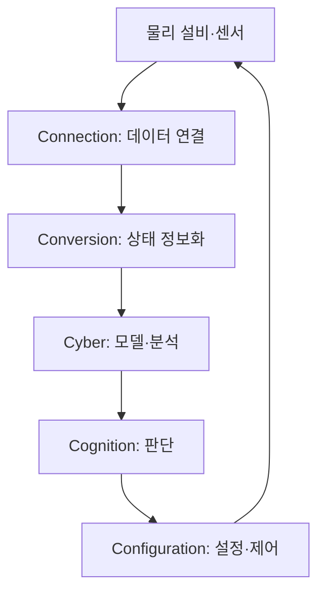
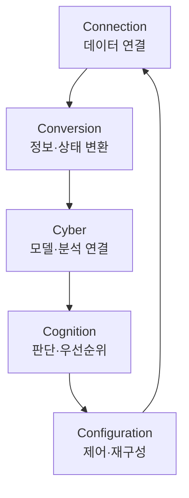

## 30초 인출

가상물리시스템(CPS)은 계산·통신 요소와 물리 요소가 상호작용하며 동작하는 시스템이다. 센서 관측과 계산 결과가 제어로 이어지고, 물리 결과를 다시 측정한다.

핵심 용어

- CPS: 디지털·물리 요소가 통합되어 기능을 수행하는 시스템이다.
- 폐루프 제어: 센서로 상태를 측정하고 제어한 뒤 결과를 다시 측정하는 방식이다.
- 5C 아키텍처: 제조 CPS 구축을 위해 연결·전환·사이버·인지·구성 단계를 제안한 아키텍처다.
- 디지털 트윈: 특정 물리 대상·과정과 데이터를 연계한 가상 표현이다.

## 1교시 예상문제 (10점)

---

가상물리시스템(Cyber Physical System)의 구축 절차를 설명하시오.

---

## 1교시 10점 답안

### 1. 정의·목적
- 정의: CPS는 계산·통신 시스템과 물리 시스템이 상호작용하는 시스템이다.
- 목적: 물리 상태를 데이터로 파악하고 분석 결과를 제어·운영에 반영한다.

### 2. 5C 구축 절차
| 단계 | 주요 내용 |
|---|---|
| Connection | 센서·설비 데이터를 연결·수집 |
| Conversion | 데이터를 정보로 변환하고 상태를 분석 |
| Cyber | 사이버 공간의 모델·시스템에 연결 |
| Cognition | 분석 결과를 해석하고 의사결정 지원 |
| Configuration | 결과를 설비·프로세스 설정에 반영 |

### 3. 피드백 흐름

### 4. 유의점
5C는 제조 CPS를 설계하는 한 가지 제안 구조이며 모든 CPS의 필수 표준은 아니다. 제어 지연·안전·보안 요구를 시스템별로 정의한다.

**제언:** 물리 안전 요구와 데이터·제어 경로를 함께 설계하고 단계별로 검증한다.

---

## 2~4교시 예상문제 (25점)

---

CPS의 구성과 5C 기반 구축 절차를 설명하고, 안전한 실시간 운용을 위한 고려사항을 기술하시오. (예상)

---

## 2~4교시 25점 답안

### Ⅰ. 개념과 구성
CPS는 물리 시스템과 계산·통신 구성요소가 결합되어 상호작용하는 시스템이다.

| 구성 | 기능 |
|---|---|
| 물리 공정 | 실제 설비·환경·대상 |
| 센서·통신 | 상태 관측과 데이터 전달 |
| 계산·모델 | 상태 분석·예측·의사결정 지원 |
| 액추에이터 | 제어 명령을 물리 동작으로 반영 |

### Ⅱ. 5C 구축 절차

5C는 연결된 설비 데이터에서 상태 정보를 만들고 분석·판단을 거쳐 설정에 반영하는 제조용 설계 제안이다. 실제 제어는 안전 요구와 조직의 승인 범위에 따라 자동화 수준을 정한다.

### Ⅲ. 구축·운영 고려사항
| 영역 | 확인 사항 |
|---|---|
| 실시간성 | 관측·계산·통신·제어의 허용 지연 |
| 안전 | 이상 상태 시 안전한 정지·수동 전환 |
| 보안 | IT·OT 경계, 인증·권한, 업데이트·복구 |
| 데이터 품질 | 센서 오류·시간 동기화·결측 처리 |
| 검증 | 시뮬레이션과 현장 시험의 결과 차이 |

### Ⅳ. 기술적 제언
| 문제 | 해결 방안 |
|---|---|
| CPS 구축이 관제에서 폐루프 자동제어로 너무 빨리 확대될 수 있음 | 먼저 상태 가시화와 운영자 권고 단계에서 데이터·모델을 검증하고, 안전 승인 뒤 제한 공정에서 자동 제어를 확대한다. |

---

## 출제 이력과 검증 출처

- 120회 1교시 6번: 가상물리시스템의 구축 절차.
- [NIST CPS Framework 개요](https://www.nist.gov/publications/framework-cyber-physical-systems-volume-1-overview)
- [5C 아키텍처 원 논문](https://www.sciencedirect.com/science/article/pii/S221384631400025X)
