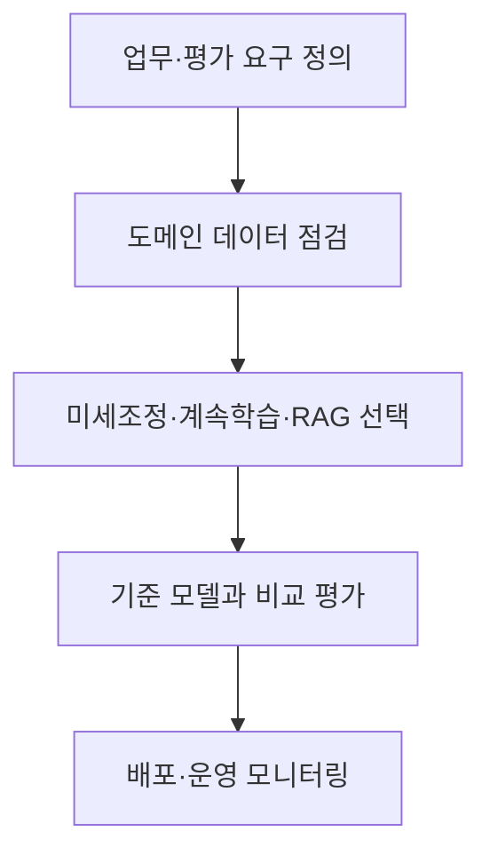
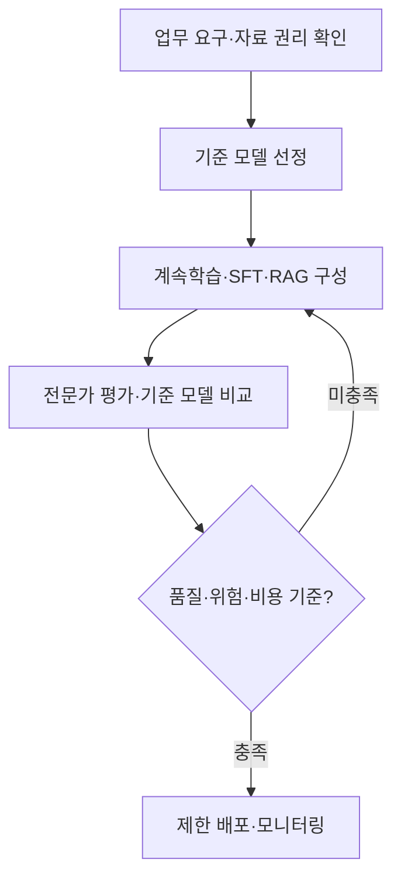

## 30초 인출

도메인 특화 언어모델(DSLM)은 특정 산업·업무의 용어와 과제에 맞춰 구성·학습된 언어 모델이다. 계속 사전학습·미세조정·검색을 조합할 수 있으나 단일 구축 방식이나 품질 우위가 정해져 있지는 않다.

핵심 용어

- 도메인 코퍼스: 특정 산업·업무에서 사용하는 문서와 텍스트 자료다.
- 계속 사전학습: 사전학습 모델을 추가 말뭉치로 학습하는 절차다.
- 도메인 SFT: 업무 지시·응답 예시로 모델을 추가 미세조정하는 방법이다.
- RAG: 최신·근거 문서를 검색해 모델 입력에 제공하는 구조다.

## 1교시 예상문제 (10점)

---

DSLM의 개념과 범용 언어모델 대비 고려사항을 설명하시오. (예상)

---

## 1교시 10점 답안

### 1. 정의·목적
- 정의: DSLM은 특정 도메인의 자료·용어·업무 과제에 맞춰 적응된 언어 모델이다.
- 목적: 전문 분야에서 요구되는 지식·용어·출력 방식을 개선한다.

### 2. 구축 접근
| 접근 | 활용 |
|---|---|
| 계속 사전학습 | 도메인 말뭉치의 언어 패턴 반영 |
| 지시 미세조정 | 특정 업무·형식에 맞춘 응답 학습 |
| RAG | 변경되는 사실·근거를 외부 검색으로 제공 |

### 3. 선택 흐름

### 4. 유의점
전문화가 정확도·보안·비용 개선을 자동 보장하지 않는다. 데이터 권리·품질·대표성과 일반 능력의 변화를 평가한다.

**제언:** 도입 목적에 맞는 기준 모델과 평가셋을 두고 구축 방식을 비교한다.

---

## 2~4교시 예상문제 (25점)

---

DSLM의 개념과 구축 방법을 설명하고, 범용 언어모델과 비교한 장점·한계 및 적용 방안을 기술하시오. (예상)

---

## 2~4교시 25점 답안

### Ⅰ. 개념과 필요성
DSLM은 특정 도메인의 언어·지식·과제에 적응시킨 언어 모델이다. 전문 자료가 풍부하거나 업무 형식이 반복되는 상황에서 후보가 될 수 있다.

| 요구 | 모델 적용 방향 |
|---|---|
| 전문 용어·패턴 | 도메인 데이터 기반 계속 사전학습 또는 미세조정 |
| 반복되는 출력 행동 | 도메인 SFT·PEFT |
| 최신 근거·자료 출처 | RAG 또는 검색 시스템 결합 |

### Ⅱ. 구축·평가 흐름

도메인 토크나이저 추가는 선택적 설계이며 항상 필요한 단계는 아니다. 기존 모델의 구조·토크나이저와 학습 자료에 따라 효과를 검증한다.

### Ⅲ. 범용 모델과 비교
| 항목 | DSLM | 범용 모델 |
|---|---|---|
| 학습·적응 초점 | 특정 분야·업무 | 폭넓은 과제 |
| 장점 가능성 | 전문 용어·업무 적합성 향상 | 다양한 분야의 폭넓은 기능 |
| 한계 가능성 | 데이터 범위 밖 일반화, 재학습·유지 비용 | 전문 지식 부족·업무별 적응 필요 |
| 운영 보완 | RAG·상위 모델 전달·업데이트 | 도메인 자료·도구 결합 |

### Ⅳ. 기술적 제언
| 문제 | 해결 방안 |
|---|---|
| 도메인 특화가 실제 업무 성과를 높이는지 일반 모델과 비교하기 어려움 | 전문 질의와 일반 회귀 질의를 함께 둔 평가셋을 먼저 만들고, 기준 모델보다 개선되는 업무에서만 특화 모델을 채택한다. |

---

## 출제 이력과 검증 출처

- 원문에 미출제로 기록되어 있어 예상 문항으로 구성함.
- [BloombergGPT 논문](https://arxiv.org/abs/2303.17564)
