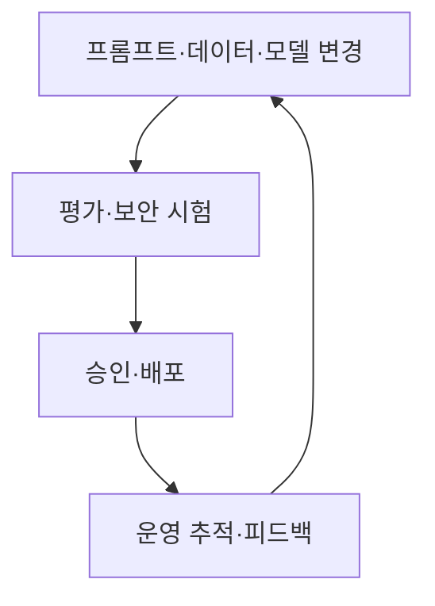
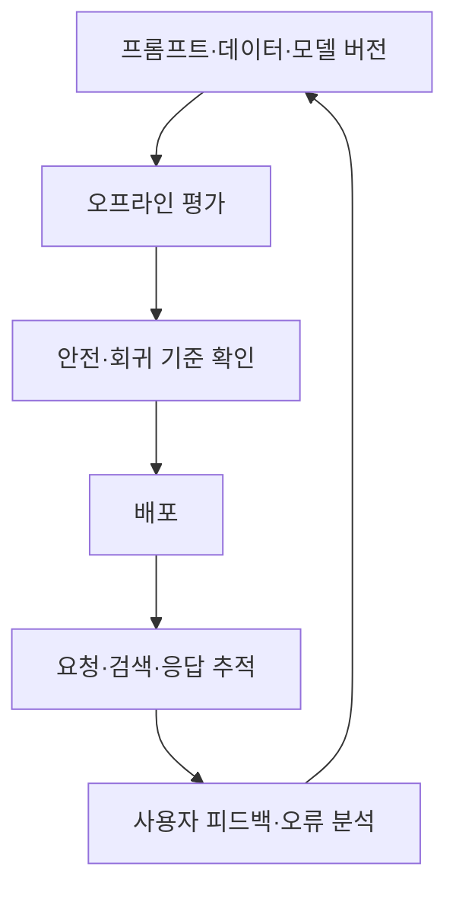

## 30초 인출

LLMOps는 LLM 기반 기능을 개발·평가·배포·운영하는 반복 가능한 절차와 도구를 다룬다. 프롬프트·검색·모델 출력의 품질과 비용·지연을 함께 추적한다.

핵심 용어

- 평가셋: 모델이나 응용 동작을 반복 비교하기 위해 구성한 과제·기준 자료다.
- 추적(Tracing): 요청에서 모델·검색·도구 호출까지의 처리 단계를 기록한다.
- 회귀 평가: 변경 전후의 품질·동작을 같은 시험으로 비교한다.
- LLM-as-a-Judge: 언어 모델을 평가 보조자로 사용하되 사람 평가와 함께 검증하는 방식이다.

## 1교시 예상문제 (10점)

---

LLMOps의 개념과 MLOps 대비 주요 관리 항목을 설명하시오. (예상)

---

## 1교시 10점 답안

### 1. 정의·목적
- 정의: LLMOps는 LLM 기능의 개발부터 배포·운영까지 품질·비용·안전을 관리하는 운영 체계다.
- 목적: 생성형 AI 응용의 변경·평가·배포를 재현 가능하게 한다.

### 2. 관리 흐름

### 3. MLOps와 차이
| 항목 | MLOps | LLMOps |
|---|---|---|
| 공통 | 모델·데이터 버전, 배포·모니터링 | 동일 |
| 추가 초점 | 학습 파이프라인·모델 지표 | 프롬프트·검색·생성 품질·토큰 비용 |

### 4. 유의점
자동 평가나 모델 판정은 편향·불일치가 있을 수 있어 중요한 평가에는 사람 검토를 더한다.

**제언:** 평가셋과 배포 기준을 정의하고 프롬프트·모델 변경을 추적한다.

---

## 2~4교시 예상문제 (25점)

---

LLMOps의 개념과 전통 MLOps 대비 차이, 주요 구성요소 및 관측성 구축 방안을 설명하시오. (예상)

---

## 2~4교시 25점 답안

### Ⅰ. 개념과 관리 범위
LLMOps는 LLM이 포함된 서비스를 개발·평가·배포·관찰하는 운영 방법이다. MLOps의 모델·데이터 관리에 더해 프롬프트, 검색 문맥, 출력 평가와 사용량 추적을 다룬다.

| 관리 대상 | 예 |
|---|---|
| 입력 구성 | 프롬프트 템플릿·검색 자료 버전 |
| 응답 품질 | 정확성·근거성·안전성 평가 |
| 서비스 운영 | 지연·오류·토큰·비용 측정 |
| 변경 관리 | 회귀 시험·배포 승인·롤백 |

### Ⅱ. 개발부터 운영까지

### Ⅲ. 평가와 관측성
| 요소 | 확인 정보 |
|---|---|
| 추적 | 입력·검색·도구 호출·모델 출력의 단계 관계 |
| 품질 | 정답·근거성·검색 회수·정책 위반 |
| 성능 | 오류율·응답 지연·처리량 |
| 비용 | 토큰 사용량·외부 호출량·캐시 효과 |

민감정보가 포함될 수 있는 프롬프트·출력의 로깅은 목적·보유기간·접근 권한을 제한한다. 모델 판정은 평가 보조로 사용하고 기준 사례로 주기적으로 교정한다.

### Ⅳ. 기술적 제언
| 문제 | 해결 방안 |
|---|---|
| 프롬프트·검색 변경으로 품질이 회귀함 | 버전 관리와 대표 평가셋을 CI 단계에 연결해 기준 미달 배포를 차단한다. |
| 장애 원인과 비용이 추적되지 않음 | 단계별 트레이스·품질·지연·토큰 지표를 수집하고 민감정보를 최소화한다. |

---

## 출제 이력과 검증 출처

- 원문에 미출제로 기록되어 있어 예상 문항으로 구성함.
- [OpenTelemetry GenAI semantic conventions](https://github.com/open-telemetry/semantic-conventions-genai)
