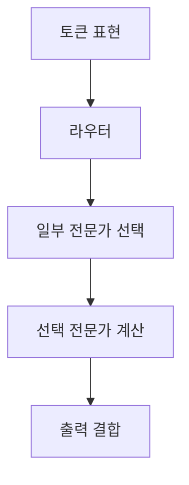
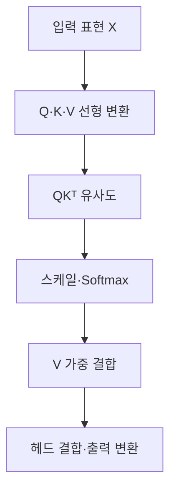

## 30초 인출

트랜스포머는 어텐션으로 토큰 간 관계를 처리하는 신경망 구조다. 위치 정보를 더한 토큰 표현에서 Q·K·V를 계산해 문맥 표현을 만들고, 피드포워드 계층에서 변환한다.

핵심 용어

- 셀프 어텐션: 같은 입력 시퀀스의 토큰들이 서로의 표현을 참조해 문맥을 계산한다.
- Q·K·V: Query는 조회 기준, Key는 비교 대상, Value는 가중 결합할 정보를 표현한다.
- 멀티헤드 어텐션: 여러 어텐션 계산을 병렬 수행하고 결합하는 방식이다.
- 위치 인코딩: 순서 정보를 토큰 표현에 반영하는 방법이다.

## 1교시 예상문제 (10점)

---

트랜스포머(Transformer)와 MoE(Mixture of Experts)를 설명하시오.

---

## 1교시 10점 답안

### 1. 정의·목적
- 정의: 트랜스포머는 셀프 어텐션을 사용해 시퀀스의 문맥을 계산하는 신경망이며, MoE는 라우터가 일부 전문가를 선택하는 구조다.
- 목적: 트랜스포머는 토큰 간 관계를 처리하고, MoE는 조건부 희소 연산으로 전문가를 확장한다.

### 2. 트랜스포머 어텐션
| 연산 | 기능 |
|---|---|
| Q·K 내적 | 토큰 간 관련도 계산 |
| Softmax | 관련도 점수 정규화 |
| V 가중합 | 문맥 표현 생성 |

### 3. MoE 결합

### 4. 유의점
MoE는 활성 연산을 줄일 수 있지만 라우팅·통신·메모리 비용이 있다. 트랜스포머의 어텐션과 MoE는 서로 다른 구성요소이며 함께 사용될 수 있다.

**제언:** 구조 비교 시 품질뿐 아니라 실제 연산·메모리·통신 비용을 함께 본다.

---

## 2~4교시 예상문제 (25점)

---

트랜스포머의 주요 구성요소와 셀프 어텐션 처리 과정을 설명하고, 긴 시퀀스 처리 시의 계산 특성과 개선 방안을 기술하시오. (예상)

---

## 2~4교시 25점 답안

### Ⅰ. 구조와 구성
트랜스포머는 어텐션과 위치 정보, 피드포워드 변환을 쌓아 시퀀스 표현을 학습하는 구조다.

| 구성 | 역할 |
|---|---|
| 토큰 임베딩 | 입력 토큰을 벡터로 표현 |
| 위치 정보 | 토큰 순서 반영 |
| 어텐션 | 문맥 내 토큰 관계 계산 |
| 피드포워드·잔차·정규화 | 표현 변환과 학습 안정화 |

### Ⅱ. 셀프 어텐션

기본 어텐션은 $Attention(Q,K,V)=softmax(QK^T/\sqrt{d_k})V$로 표현된다. 여러 헤드를 결합해 서로 다른 관계 표현을 학습한다.

### Ⅲ. 구성 변형과 계산 특성
| 구조·특성 | 설명 |
|---|---|
| 인코더-디코더 | 입력 표현과 출력 생성을 함께 구성 |
| 디코더 전용 | 자기회귀 언어 생성에 활용 |
| 셀프 어텐션 비용 | 표준 전역 어텐션은 시퀀스 길이에 따라 점수 행렬 계산량·메모리가 대체로 제곱 규모로 증가 |
| 추론 캐시 | 자기회귀 생성에서 이전 Key·Value를 재사용할 수 있음 |

메모리 효율적 커널은 중간 행렬 저장을 줄일 수 있지만 표준 어텐션의 기본 복잡도 자체를 선형으로 바꾸지는 않는다.

### Ⅳ. 기술적 제언
| 문제 | 해결 방안 |
|---|---|
| 긴 입력이 필요한 서비스에서 전체 어텐션이 항상 최선인지 판단하기 어려움 | 실제 시퀀스 길이와 하드웨어를 기준으로 전체 어텐션, 메모리 효율 커널, 희소 변형의 품질·자원 비용을 비교해 선택한다. |

---

## 출제 이력과 검증 출처

- 137회 1교시 7번: 트랜스포머와 MoE를 설명하는 문항.
- [Attention Is All You Need](https://arxiv.org/abs/1706.03762)
